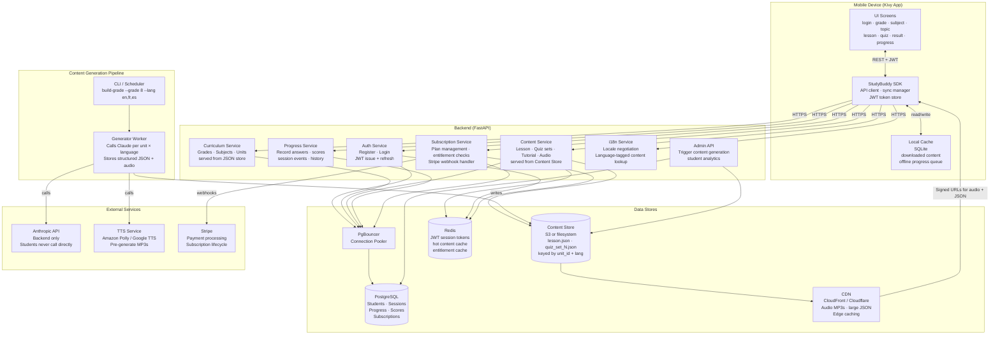
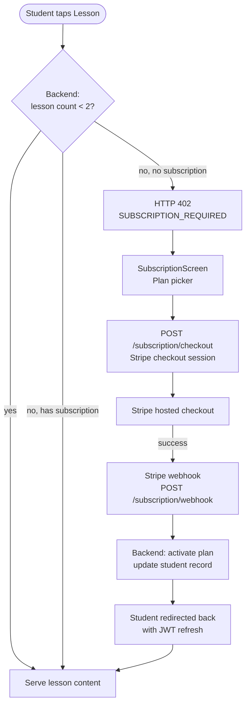
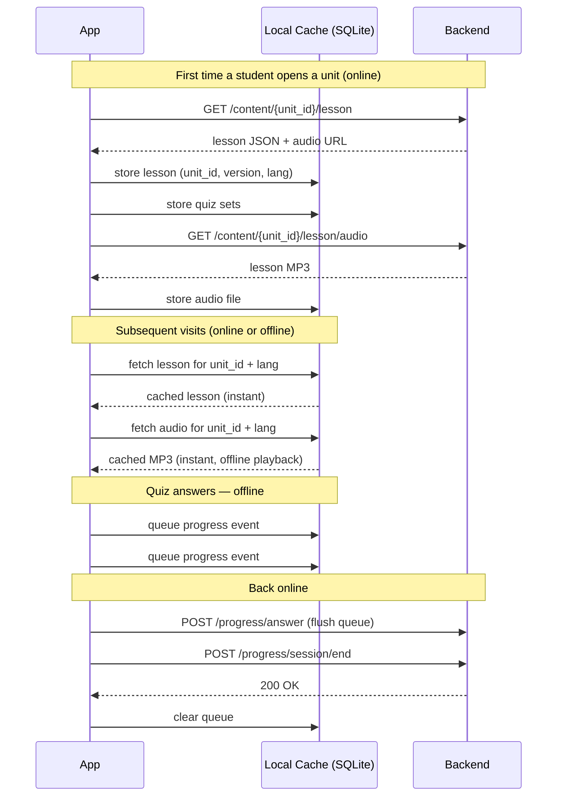

# StudyBuddy OnDemand — Architecture

**Version:** 0.2.0 (Design Phase — Feature Expansion)
**Last updated:** 2026-03-23
**Requirements tracking:** [REQUIREMENTS.md](REQUIREMENTS.md)
**Companion docs:** [REQUIREMENTS.md](REQUIREMENTS.md) · [BACKEND_ARCHITECTURE.md](BACKEND_ARCHITECTURE.md)

---

## Background & Motivation

The Free edition (studybuddy_free) validated the product concept but exposed two architectural limits:

- **Performance** — every lesson and quiz is generated live on the device via the Anthropic API. On a mobile connection this takes 5–10 seconds per request and is prone to timeouts for longer responses.
- **Value to the student** — requiring the student to supply and manage their own Anthropic API key creates a registration barrier that most students cannot clear.

The OnDemand architecture eliminates both by moving all AI interaction to a backend pipeline and delivering pre-generated content to the app.

---

## System Overview



---

## Content Generation Pipeline

This is the cornerstone of the OnDemand architecture. All Claude API calls happen here — offline, before students use the app — so students receive instant content.


**Why 3 quiz sets per unit?** A student who retakes a topic after review sees a different set of questions. Sets rotate randomly on each attempt.

**When to run the pipeline:**
- At initial deployment for all supported grades × all supported languages
- When curriculum JSON files are updated
- When Claude prompt quality is improved (regenerate selectively by grade/unit/language)
- When a new language is added (regenerate only the new language column)

---

## Subscription Model

### Tiers

| Tier | Access | Price |
|---|---|---|
| Free | 2 lessons (any unit, any subject) | $0 |
| Monthly | All lessons + quizzes, all grades | TBD |
| Annual | Same as Monthly + priority support | TBD (discounted) |

### Free Tier Gating Rules

- **Entitlement check happens on the backend**, not on the mobile app. The mobile app never decides access on its own.
- A student's `lessons_accessed` count is tracked in PostgreSQL per student.
- After 2 distinct lesson views, `GET /content/{unit_id}/lesson` returns HTTP 402 with a `SUBSCRIPTION_REQUIRED` payload.
- Quiz access follows lesson access: a student can take the quiz for a unit they have viewed.
- The mobile app listens for HTTP 402 and transitions to `SubscriptionScreen`.
- Free lesson count resets never — the 2 lessons are a permanent trial, not a daily/weekly limit.

### Subscription Flow



### Payment Integration (Stripe)

- **Checkout:** `POST /subscription/checkout` creates a Stripe Checkout Session; returns a URL. Mobile opens URL in an in-app browser or system browser.
- **Webhook:** Stripe sends events to `POST /subscription/webhook`. Backend validates signature, updates `subscriptions` table.
- **Events handled:** `checkout.session.completed`, `customer.subscription.updated`, `customer.subscription.deleted`, `invoice.payment_failed`.
- The Stripe secret key and webhook signing secret live only in backend environment variables.

---

## Multi-Language Support

### Supported Languages

| Code | Language |
|---|---|
| `en` | English |
| `fr` | French |
| `es` | Spanish |

### Architecture Decisions

- **Content is pre-generated per language.** The pipeline calls Claude once per language per unit. There is no runtime translation.
- **Content Store keys include language:** `{unit_id}/lesson_en.json`, `{unit_id}/lesson_fr.json`, `{unit_id}/lesson_es.json`.
- **Locale is set at registration** and stored in the student profile. Students can change it in Settings.
- **The backend negotiates locale:** `GET /content/{unit_id}/lesson` reads the student's locale from the JWT payload and serves the matching file. If a language file is missing, falls back to `en`.
- **UI strings are separate from content.** App UI labels (button text, navigation, error messages) are translated via a static `i18n/` dictionary bundled in the app — not generated by Claude.
- **Quiz questions and answers are language-matched.** Each `quiz_set_N_{lang}.json` contains questions, answer choices, and explanations in the target language.

### Locale in JWT

JWT payload includes `locale`:
```json
{"student_id": "uuid", "grade": 8, "locale": "fr", "exp": 1234567890}
```

The pipeline prompt builders receive a `lang` parameter and instruct Claude to respond entirely in that language at the student's grade level.

---

## Text-to-Speech (Lessons Read Aloud)

### Design

- **Pre-generated audio, not runtime TTS.** The pipeline generates an MP3 file for each lesson in each language. Students tap a play button to stream or play the cached file.
- **TTS provider:** Amazon Polly (primary) or Google Cloud TTS — both support English, French, and Spanish at educational reading pace. Provider is configurable via `TTS_PROVIDER` in pipeline `config.py`.
- **Audio stored in Content Store** alongside lesson JSON: `{unit_id}/lesson_{lang}.mp3`.
- **Mobile playback:** Kivy's `SoundLoader` can play MP3s. The audio file is downloaded to local SQLite cache alongside lesson JSON. Once cached, playback is offline.
- **Backend delivery:** `GET /content/{unit_id}/lesson/audio` returns a signed URL (S3) or a streaming response (filesystem). The mobile app downloads to the local cache directory.

### Pipeline Step

```python
# pipeline/build_unit.py (sketch)
text = lesson_data["synopsis"] + " " + " ".join(lesson_data["key_concepts"])
audio_bytes = tts_client.synthesize(text, lang=lang, voice=TTS_VOICES[lang])
content_store.write(f"{unit_id}/lesson_{lang}.mp3", audio_bytes)
```

### TTS Voice Configuration

| Language | Amazon Polly Voice | Google TTS Voice |
|---|---|---|
| English | Joanna (female) | en-US-Standard-C |
| French | Céline | fr-FR-Standard-C |
| Spanish | Penélope | es-ES-Standard-A |

Voices are configurable in `pipeline/config.py`. Educational reading rate: 90% of default speed.

---

## Experiment Visualization

### Purpose

Some curriculum units include hands-on laboratory experiments (e.g. `G8-SCI-001` — Integrated Science). For these units, the app displays an interactive experiment guide that walks the student through the procedure with step-by-step visual aids.

### Detection

The pipeline checks the `assessments.labs` field in the grade curriculum JSON:
```json
{
  "unit_id": "G8-SCI-001",
  "assessments": {
    "labs": ["Measuring density of solids and liquids"]
  }
}
```
If `assessments.labs` is non-empty, the pipeline generates `experiment_{lang}.json`.

### Experiment JSON Schema

```json
{
  "unit_id": "G8-SCI-001",
  "experiment_title": "Measuring Density of Solids and Liquids",
  "materials": ["Graduated cylinder", "Balance scale", "Water", "Rock sample"],
  "safety_notes": ["Wear safety goggles", "Handle glass carefully"],
  "steps": [
    {
      "step_number": 1,
      "instruction": "Fill the graduated cylinder to the 50 mL mark with water.",
      "diagram_hint": "graduated cylinder with water level at 50 mL line",
      "expected_observation": "Meniscus curves downward at exactly 50 mL"
    }
  ],
  "questions": [
    {
      "question": "What happens to the water level when you add the rock?",
      "answer": "The water level rises by a volume equal to the volume of the rock."
    }
  ],
  "conclusion_prompt": "Calculate the density using mass ÷ volume. What did you find?"
}
```

### Visualization Component (Mobile)

- `ExperimentScreen` renders the experiment guide as a vertical step-by-step card list.
- Each step card shows: instruction text, a `diagram_hint` rendered as an SVG or ASCII diagram, and an `expected_observation` shown after student confirms they are ready.
- Navigation: Previous / Next step buttons + progress indicator.
- Accessed from `SubjectScreen` via an "🔬 Experiment" button (only shown when `experiment_{lang}.json` exists for the unit).
- Fully offline after first download — experiment JSON is cached alongside lesson JSON.

### Pipeline Prompt

The experiment visualization prompt instructs Claude to:
1. Extract the lab procedure from the curriculum context.
2. Break it into discrete, observable steps (5–10 steps).
3. Provide a `diagram_hint` string describing a simple diagram for each step (rendered client-side or as ASCII art).
4. Generate 2–3 comprehension questions at the end.

---

## Student Flow (Updated)


---

## Offline Strategy



---

## API Design

All endpoints require `Authorization: Bearer <jwt>` except `/auth/*` and `/subscription/webhook`.

### Auth

| Method | Endpoint | Body | Returns |
|---|---|---|---|
| POST | `/auth/register` | `{name, email, password, grade, locale, dob?}` | `{token, student_id}` |
| POST | `/auth/login` | `{email, password}` | `{token, student_id}` |
| POST | `/auth/refresh` | — | `{token}` |
| POST | `/auth/forgot-password` | `{email}` | `200` (always; no email enumeration) |
| POST | `/auth/reset-password` | `{token, new_password}` | `{token, student_id}` |
| PATCH | `/student/profile` | `{name?, locale?, grade?}` | `{student}` |
| DELETE | `/auth/account` | — | `200` (GDPR erasure) |

### Curriculum

| Method | Endpoint | Returns |
|---|---|---|
| GET | `/curriculum` | List of available grades with subject counts |
| GET | `/curriculum/{grade}` | Full subject + unit tree for grade |

### Content

| Method | Endpoint | Returns |
|---|---|---|
| GET | `/content/{unit_id}/lesson` | Synopsis + key concepts JSON (locale from JWT) |
| GET | `/content/{unit_id}/lesson/audio` | Signed URL or stream of lesson MP3 |
| GET | `/content/{unit_id}/quiz` | One quiz set (8 questions, rotated, locale from JWT) |
| GET | `/content/{unit_id}/practice` | Practice test set (locale from JWT) |
| GET | `/content/{unit_id}/tutorial` | Remediation content (locale from JWT) |
| GET | `/content/{unit_id}/experiment` | Experiment visualization JSON (locale from JWT; 404 if no lab) |

### Content (additional)

| Method | Endpoint | Body | Returns |
|---|---|---|---|
| POST | `/content/{unit_id}/report` | `{category, message?}` | `200` |
| GET | `/app/version` | — | `{min_version, latest_version}` |

### Progress

| Method | Endpoint | Body | Returns |
|---|---|---|---|
| POST | `/progress/session` | `{unit_id, grade, subject}` | `{session_id}` |
| POST | `/progress/answer` | `{session_id, question_id, answer, correct, ms_taken}` | `200` |
| POST | `/progress/session/end` | `{session_id, score, duration_s, completed}` | `200` |
| GET | `/progress/student` | — | Full history + scores |
| GET | `/progress/unit/{unit_id}` | — | Attempts + best score for unit |

### Subscription

| Method | Endpoint | Body | Returns |
|---|---|---|---|
| GET | `/subscription/status` | — | `{plan, valid_until, lessons_accessed}` |
| POST | `/subscription/checkout` | `{plan: "monthly"\|"annual"}` | `{checkout_url}` |
| POST | `/subscription/webhook` | Stripe event body | `200` |
| DELETE | `/subscription` | — | `200` (cancel at period end) |

### School & Teacher

| Method | Endpoint | Body | Returns |
|---|---|---|---|
| POST | `/schools/register` | `{school_name, contact_email, country}` | `{school_id, teacher_id}` |
| GET | `/schools/{school_id}` | — | School profile |
| POST | `/schools/{school_id}/teachers/invite` | `{email, name}` | `200` |
| POST | `/schools/{school_id}/enrolment` | `{student_emails: [...]}` | `{enrolled, already_enrolled, not_found}` |
| DELETE | `/schools/{school_id}/enrolment/{student_email}` | — | `200` |
| GET | `/schools/{school_id}/enrolment` | — | Roster with enrolment status |

### Curriculum

| Method | Endpoint | Body | Returns |
|---|---|---|---|
| POST | `/curriculum/upload` | multipart XLSX or `{grade, units: [...]}` JSON | `{curriculum_id, status, errors}` |
| GET | `/curriculum/{curriculum_id}` | — | Curriculum metadata + unit list |
| PUT | `/curriculum/{curriculum_id}/activate` | — | `200` (activates, archives previous) |
| POST | `/curriculum/pipeline/trigger` | `{curriculum_id, lang?, force?}` | `{job_id}` |
| GET | `/curriculum/pipeline/{job_id}/status` | — | `{status, built, failed, progress_pct}` |
| GET | `/curriculum/template` | — | XLSX template file download |

### Analytics

| Method | Endpoint | Returns |
|---|---|---|
| POST | `/analytics/lesson/start` | `{unit_id, curriculum_id}` → `{view_id}` |
| POST | `/analytics/lesson/end` | `{view_id, duration_s, audio_played, experiment_viewed}` → `200` |
| GET | `/analytics/student/me` | Student's own metrics (scores, time, attempts) |
| GET | `/analytics/school/{school_id}/class` | Aggregate class metrics per unit |
| GET | `/analytics/unit/{unit_id}/summary` | Platform-wide metrics for a unit (admin only) |

### Feedback

| Method | Endpoint | Body | Returns |
|---|---|---|---|
| POST | `/feedback` | `{category, unit_id?, message, rating?}` | `{feedback_id}` |
| GET | `/admin/feedback` | — | Paginated feedback list with filters |

---

## Data Models

### Student
```json
{
  "student_id": "uuid",
  "name": "string",
  "email": "string",
  "grade": 8,
  "locale": "en",
  "created_at": "ISO8601",
  "subscription": "free | monthly | annual",
  "lessons_accessed": 0,
  "school_id": "uuid | null",
  "enrolled_at": "ISO8601 | null"
}
```

### Subscription
```json
{
  "subscription_id": "uuid",
  "student_id": "uuid",
  "plan": "monthly | annual",
  "status": "active | cancelled | past_due",
  "stripe_customer_id": "cus_xxx",
  "stripe_subscription_id": "sub_xxx",
  "current_period_end": "ISO8601"
}
```

### Session
```json
{
  "session_id": "uuid",
  "student_id": "uuid",
  "unit_id": "G8-MATH-001",
  "curriculum_id": "uuid",
  "grade": 8,
  "subject": "Mathematics",
  "started_at": "ISO8601",
  "ended_at": "ISO8601",
  "score": 7,
  "total_questions": 8,
  "completed": true,
  "attempt_number": 1,
  "passed": true
}
```

### Progress Answer
```json
{
  "answer_id": "uuid",
  "session_id": "uuid",
  "question_id": "string",
  "student_answer": 2,
  "correct_answer": 1,
  "correct": false,
  "ms_taken": 12400
}
```

### Stripe Event (dedup + audit log)
```json
{
  "stripe_event_id": "evt_xxx",
  "event_type": "checkout.session.completed",
  "processed_at": "ISO8601",
  "outcome": "ok | error",
  "error_detail": "string | null"
}
```

### Content Report
```json
{
  "report_id": "uuid",
  "unit_id": "G8-MATH-001",
  "student_id": "uuid",
  "category": "wrong_answer | confusing | inappropriate | other",
  "message": "string | null",
  "reported_at": "ISO8601",
  "reviewed": false
}
```

### School
```json
{
  "school_id": "uuid",
  "name": "Springfield High School",
  "contact_email": "admin@sphs.edu",
  "country": "US",
  "enrolment_code": "SPHS-2026",
  "status": "pending | active | suspended",
  "created_at": "ISO8601"
}
```

### Teacher
```json
{
  "teacher_id": "uuid",
  "school_id": "uuid",
  "name": "string",
  "email": "string",
  "role": "teacher | school_admin",
  "created_at": "ISO8601"
}
```

### Curriculum
```json
{
  "curriculum_id": "uuid | default-{year}-g{grade}",
  "school_id": "uuid | null",
  "year": 2026,
  "grade": 8,
  "name": "Grade 8 STEM 2026",
  "source_type": "default | xlsx_upload | ui_form",
  "status": "draft | building | active | archived | failed",
  "restrict_access": false,
  "created_by": "teacher_id | null",
  "created_at": "ISO8601",
  "activated_at": "ISO8601 | null"
}
```

### Curriculum Unit
```json
{
  "unit_id": "string",
  "curriculum_id": "uuid",
  "subject": "Mathematics",
  "unit_name": "Algebra – Linear Equations",
  "objectives": ["Solve linear equations", "Graph functions"],
  "has_lab": false,
  "lab_description": "string | null",
  "sequence": 1,
  "content_status": "pending | built | failed"
}
```

### School Enrolment
```json
{
  "enrolment_id": "uuid",
  "school_id": "uuid",
  "student_email": "string",
  "student_id": "uuid | null",
  "added_by_teacher_id": "uuid",
  "added_at": "ISO8601",
  "status": "pending | active | removed"
}
```

### Lesson View
```json
{
  "view_id": "uuid",
  "student_id": "uuid",
  "unit_id": "string",
  "curriculum_id": "uuid",
  "started_at": "ISO8601",
  "ended_at": "ISO8601 | null",
  "duration_s": 0,
  "audio_played": false,
  "experiment_viewed": false
}
```

### Feedback
```json
{
  "feedback_id": "uuid",
  "student_id": "uuid",
  "category": "content | ux | general",
  "unit_id": "string | null",
  "curriculum_id": "uuid | null",
  "message": "string",
  "rating": "1-5 | null",
  "submitted_at": "ISO8601",
  "reviewed": false
}
```

### Content (stored in Content Store, keyed by unit_id)
```
{unit_id}/
  lesson_en.json          ← synopsis + key concepts (English)
  lesson_fr.json          ← synopsis + key concepts (French)
  lesson_es.json          ← synopsis + key concepts (Spanish)
  lesson_en.mp3           ← TTS audio (English)
  lesson_fr.mp3           ← TTS audio (French)
  lesson_es.mp3           ← TTS audio (Spanish)
  quiz_set_1_en.json      ← 8 questions, set 1 (English)
  quiz_set_1_fr.json      ← 8 questions, set 1 (French)
  quiz_set_1_es.json      ← 8 questions, set 1 (Spanish)
  quiz_set_2_{lang}.json
  quiz_set_3_{lang}.json
  tutorial_{lang}.json    ← remediation content
  experiment_{lang}.json  ← experiment guide (only if unit has labs)
  meta.json               ← generated_at, model_version, content_version, langs_built
```

---

## Security Controls

### Rate Limiting

Apply at the reverse proxy or FastAPI middleware layer. Do not rely on the database for enforcement.

| Endpoint group | Limit |
|---|---|
| `POST /auth/login`, `POST /auth/register` | 10 req / min per IP |
| `POST /auth/forgot-password` | 5 req / min per IP |
| Content endpoints (`/content/*`) | 100 req / min per student JWT |
| Stripe webhook (`/subscription/webhook`) | No rate limit (Stripe IPs only via allowlist) |

### Account Lockout

After 5 consecutive failed login attempts for the same email, the account is locked for 15 minutes. A failed attempt counter is stored in Redis with a 15-minute TTL, reset on successful login.

### JWT Key Rotation

- JWT header includes a `kid` (key ID) field.
- The backend maintains up to 2 active signing keys simultaneously.
- Old tokens signed with the previous key remain valid until they expire naturally.
- Rotation procedure: generate new key → deploy with both keys active → wait for old tokens to expire → remove old key.

### CORS Policy

The backend sets an explicit CORS allowlist:
- Mobile app: communicates via native HTTPS (no browser origin; not subject to CORS).
- Admin dashboard: allowed origin set via `ALLOWED_ORIGINS` env var.
- Default: deny all origins not in allowlist.

### Secrets Management

| Secret | Storage |
|---|---|
| `ANTHROPIC_API_KEY` | Backend env var (pipeline only) |
| `JWT_SECRET` | Backend env var; use secrets manager in production |
| `STRIPE_SECRET_KEY` | Backend env var; use secrets manager in production |
| `STRIPE_WEBHOOK_SECRET` | Backend env var |
| `TTS_API_KEY` | Pipeline env var |
| `DATABASE_URL` | Backend env var; use secrets manager in production |

In production, source all secrets from AWS Secrets Manager, HashiCorp Vault, or equivalent. Never commit secrets to git.

### Redis Security

- Enable Redis `requirepass` authentication.
- Enable `AOF` persistence (append-only file) so a Redis restart does not invalidate all active sessions.
- Configure `maxmemory-policy allkeys-lru` to prevent unbounded growth.
- Redis stores only `student_id`-keyed data — no raw passwords, no card data, no PII beyond student_id.

### Input Validation

All request bodies are defined as Pydantic models. FastAPI validates automatically and returns HTTP 422 on schema violations. Never pass raw request data to a database query; use SQLAlchemy ORM exclusively (no raw SQL strings with f-string interpolation).

### Stripe Webhook Integrity

The `/subscription/webhook` handler must call `stripe.Webhook.construct_event(payload, sig_header, STRIPE_WEBHOOK_SECRET)` and reject with HTTP 400 if it raises `stripe.error.SignatureVerificationError`. Log the `stripe_event_id` to a `stripe_events` table for deduplication and audit.

---

## Compliance & Privacy

### COPPA (Children's Online Privacy Protection Act)

This product serves students in Grades 5–12, which includes children under 13. COPPA applies for US distribution.

- At registration, collect the student's date of birth (or grade as a proxy for age).
- If age < 13, collect a **parent/guardian email address** and send a consent request.
- Account activation is blocked until parental consent is confirmed.
- Store a `parental_consent` record (guardian email, consent timestamp, IP) in PostgreSQL.
- Do not collect any information beyond name, email, grade, and locale from minors without verifiable parental consent.

### GDPR (EU General Data Protection Regulation)

- **Right to erasure:** `DELETE /auth/account` must delete all PII and progress records associated with the student within 30 days. Stripe data is handled via Stripe's customer deletion API.
- **Data minimisation:** collect only name, email, grade, locale. No location, no device ID, no behavioural fingerprinting.
- **Consent at registration:** display a privacy policy link and require explicit acceptance before account creation.
- **Data retention:** progress records are retained for the lifetime of the account, then anonymised (strip `student_id`) after account deletion.

### Payment Data

The backend never stores card numbers, CVV, or bank account details. Stripe handles all payment data. The backend stores only `stripe_customer_id` and `stripe_subscription_id` to reference Stripe objects.

### Password Reset Token Security

- Reset tokens are single-use UUIDs stored in Redis with a 1-hour TTL.
- Consuming a token deletes it immediately.
- After account lockout, password reset is the only path to re-enable login.

---

## Observability & Monitoring

### Structured Logging

All backend components use structured JSON logging. Log entries include:
```json
{"timestamp": "ISO8601", "level": "INFO", "component": "content", "student_id": "uuid", "unit_id": "G8-MATH-001", "action": "lesson_served", "locale": "fr", "duration_ms": 45}
```
Never log passwords, JWT tokens, Stripe keys, or raw payment data. Backend logs go to stdout, captured by the container runtime and forwarded to a log aggregation platform (CloudWatch, ELK, Loki, or equivalent).

### Error Tracking

Integrate Sentry in both the backend and mobile app:
- Backend: `sentry-sdk[fastapi]` captures unhandled exceptions with request context (endpoint, student_id if authenticated).
- Mobile: `sentry-sdk` captures unhandled exceptions and offline queues crash reports for upload on next launch.
- Strip PII from Sentry events before transmission.

### Health Check

`GET /health` is a deep health check that reports the status of every dependency:

```json
{
  "status": "ok",
  "checks": {
    "db": "ok",
    "redis": "ok",
    "content_store": "ok"
  },
  "version": "0.2.0"
}
```

If any check fails, the endpoint returns HTTP 503. Use this as the readiness probe in container orchestration.

### Metrics

Expose a `/metrics` endpoint (Prometheus format) or push to Datadog/CloudWatch. Key metrics:

| Metric | Type | Labels |
|---|---|---|
| `http_request_duration_seconds` | histogram | endpoint, method, status |
| `content_cache_hits_total` | counter | layer (redis/disk) |
| `entitlement_checks_total` | counter | result (allowed/402) |
| `pipeline_units_built_total` | counter | grade, lang, status |
| `stripe_webhook_events_total` | counter | event_type, outcome |
| `progress_events_queued` (mobile) | gauge | — |

### Alerting

| Alert | Condition | Severity |
|---|---|---|
| Backend down | `/health` fails 3 consecutive checks (60-second intervals) | Critical |
| Error rate spike | 5xx rate > 1% of requests over 5 minutes | High |
| Pipeline failure | Pipeline run exits non-zero | High |
| Stripe webhook drop | Webhook delivery rate < 95% in 30 minutes | High |
| Content staleness | `meta.json` `generated_at` is older than curriculum JSON `mtime` by > 7 days | Medium |
| Redis eviction spike | `evicted_keys` rate > 100/min | Medium |

### Performance Targets

Performance targets (SLOs) are defined in [BACKEND_ARCHITECTURE.md](BACKEND_ARCHITECTURE.md#performance-targets-slos).

### Pipeline Run Report

On completion, `build_grade.py` emits a JSON summary:
```json
{
  "grade": 8,
  "langs": ["en", "fr", "es"],
  "total_units": 40,
  "built": 40,
  "skipped": 0,
  "failed": 0,
  "tokens_used": 185000,
  "estimated_cost_usd": 1.85,
  "duration_s": 1240
}
```

---

## Content Quality Controls

### Schema Validation

After each Claude API call, the pipeline validates the response against a JSON schema before writing to the Content Store:
- **Lesson:** `synopsis` (string, non-empty) + `key_concepts` (array, length ≥ 3)
- **Quiz set:** exactly 8 questions, each with `question`, `choices` (array of 4), `correct_answer` (0–3 int), `explanation`
- **Tutorial:** `explanation` (string) + `worked_examples` (array, length ≥ 1)
- **Experiment:** `steps` (array, length 5–10), each with `step_number`, `instruction`, `diagram_hint`, `expected_observation`

If validation fails, the pipeline retries up to 3 times before marking the unit as failed and logging the error. Failed units are written to a `pipeline_failures.json` report.

### Model Pinning

The pipeline config specifies an exact Claude model ID:
```python
# pipeline/config.py
CLAUDE_MODEL = "claude-sonnet-4-6"  # pin explicitly — do not use "latest"
```
Changing this value is a deliberate act. After a model upgrade, run the pipeline in a staging Content Store and compare output quality before promoting to production.

### Human Review Gate (Phase 7+)

In Phase 7, the Admin Dashboard exposes a review queue. The pipeline writes to a `staging/` path in the Content Store. An admin promotes units to `live/` after review. Until Phase 7, the pipeline writes directly to `live/`.

### Student Content Reports

`POST /content/{unit_id}/report` accepts a report category (`wrong_answer`, `confusing`, `inappropriate`, `other`) and an optional message. Reports are stored in a `content_reports` table. The Admin Dashboard surfaces units exceeding a report threshold.

---

## Multi-Tenancy & Curriculum Model

### Overview

The platform supports two curriculum modes that coexist:

| Mode | Who controls it | Scope |
|---|---|---|
| **Default** | Platform operator | All unaffiliated students; one set per grade per year |
| **School / Custom** | Teacher or school admin | Students enrolled with that school only |

Every curriculum — default or custom — is assigned a `curriculum_id`. All content generation and delivery is keyed by `curriculum_id`, not by grade number. This makes the two modes architecturally identical from the pipeline and content service perspective.

### Curriculum Resolution (per student request)

```
student JWT → school_id (nullable)
  if school_id:
    look up active curriculum for (school_id, grade, year)
    if found → use school curriculum_id
  if no school_id or no active curriculum:
    use default curriculum_id for (grade, current_year)
```

### Content Store Paths

```
{CONTENT_STORE_PATH}/
  {curriculum_id}/          ← same structure for default and school curricula
    {unit_id}/
      lesson_en.json
      lesson_fr.json
      lesson_es.json
      lesson_en.mp3
      quiz_set_1_en.json
      …
      meta.json
```

Default curriculum IDs follow the pattern `default-{year}-g{grade}` (e.g. `default-2026-g8`). School curriculum IDs are UUIDs.

---

## School & Teacher Management

### Roles

| Role | Who | Can do |
|---|---|---|
| `teacher` | Registered educator | Upload curriculum, manage student roster, view class analytics |
| `school_admin` | Designated admin at a school | All teacher actions + manage teachers in the school |
| `platform_admin` | Operator | Manage all schools, trigger pipeline, view all analytics |

Teachers and school admins authenticate separately from students. Their JWT payload includes `{"role": "teacher"|"school_admin", "school_id": "uuid", "teacher_id": "uuid"}`.

### School Registration Flow


For Phase 8, auto-approve schools (no manual review step) to keep implementation lean. A `status` field is reserved for future gating.

### Teacher Registration

Once a school is active, additional teachers can be invited:
- `POST /schools/{school_id}/teachers/invite` — school_admin sends invite email
- Invited teacher sets password via a one-time token link (same mechanism as password reset)

---

## Curriculum Upload & Management

### Two Upload Methods

**Method A — XLSX Upload**

The teacher downloads a template XLSX file and fills it in:

```
Sheet: Grade_8
| Subject     | Unit Name                  | Unit Code       | Objectives (pipe-separated)          | Has Lab | Lab Description              |
|-------------|----------------------------|-----------------|--------------------------------------|---------|------------------------------|
| Mathematics | Algebra – Linear Equations | MATH-LIN-001    | Solve linear equations|Graph lines   | No      |                              |
| Science     | Measuring Density          | SCI-DEN-001     | Apply density formula|Use equipment  | Yes     | Measure density of solids    |
```

One sheet per grade (tab name = `Grade_5`, `Grade_6`, … `Grade_12`). Sheets for grades not being configured are left empty. The backend parses each sheet into the same JSON structure as the default curriculum files.

**Method B — UI Form**

The teacher uses a web form (Admin Dashboard, Phase 9+) to add subjects and units individually. Internally this produces the same JSON structure as Method A.

### Upload Processing Flow


### Curriculum Versioning

A school can have multiple curricula per grade per year — `draft`, `active`, or `archived`. Only one curriculum per `(school_id, grade, year)` can be `active` at a time. Activating a new curriculum archives the previous one. Students mid-session complete their session against the curriculum they started with (same `content_version` mechanic).

### Default Curriculum Per Year

The operator seeds a default curriculum for each grade + year from the existing `data/grade*_stem.json` files. These are loaded at deploy time for each new year:

```bash
python pipeline/seed_default.py --year 2026 --grade 8 --lang en,fr,es
```

This creates a curriculum record with `id = default-2026-g8`, `school_id = null`, and runs the standard pipeline.

### XLSX Template Columns

| Column | Required | Notes |
|---|---|---|
| `Subject` | Yes | e.g. Mathematics, Science, Technology |
| `Unit Name` | Yes | Human-readable unit title |
| `Unit Code` | No | Auto-generated as `{SUBJECT_ABBR}-{SEQ}` if blank |
| `Objectives` | Yes | Pipe-separated list; minimum 2 objectives |
| `Has Lab` | No | `Yes` or `No`; default `No` |
| `Lab Description` | If Has Lab = Yes | One-line description used in experiment prompt |

---

## Student–School Association

### Enrolment Methods

**Teacher-led (roster upload):**
The teacher uploads a CSV or enters a list of student email addresses. These are stored as `pending` enrolment records. When a student with a matching email registers or logs in, their account is linked to the school automatically.

**Student-led (school code):**
Each school has a short `enrolment_code` (e.g. `SPHS-2026`). During registration, a student can optionally enter this code to join a school.

### Association Rules

- A student can be enrolled in **at most one school** at a time.
- If a student's email appears in multiple schools' rosters, the first confirmed enrolment wins; subsequent ones require the student to explicitly switch.
- Un-enrolled students (no school association) see the default curriculum for their grade and the current year.
- When a student transfers schools, their progress history is retained; new sessions use the new school's curriculum.

### Access Restriction

A school can set `restrict_access = true` on a curriculum. When enabled:
- Only enrolled students can access that curriculum.
- Unenrolled students who somehow obtain a `unit_id` from the school's curriculum receive HTTP 403.
- Unenrolled students fall back to the default curriculum automatically.

---

## Extended Analytics

### Time-on-Topic

Every lesson view and quiz attempt is timed at the backend. The mobile app sends start/end events; the backend records them even if the events arrive out of order (offline queue).

**Lesson view lifecycle:**
1. Student opens unit → `POST /analytics/lesson/start` → `{view_id}`
2. Student leaves unit → `POST /analytics/lesson/end` → `{view_id, duration_s, audio_played, experiment_viewed}`

**Quiz attempt lifecycle:**
Already tracked via `POST /progress/session` / `POST /progress/session/end`. The `attempt_number` field is added (see Data Models).

### Analytics Computed Metrics

| Metric | Granularity | Use |
|---|---|---|
| Mean time-on-lesson | Per unit, per subject, per grade | Identify dense units |
| Mean time-per-quiz-attempt | Per unit | Identify complex quizzes |
| Mean attempts-to-pass | Per unit | Flag units needing remediation |
| Pass rate (first attempt) | Per unit | Content quality signal |
| Improvement trajectory | Per student × unit | Track learning gain across attempts |
| Completion rate | Per student, per class | Engagement signal |
| Audio play rate | Per lesson | TTS utility signal |

### Teacher Analytics View

`GET /analytics/school/{school_id}/class?grade=8&subject=Mathematics` returns aggregate metrics per unit for the teacher's class — useful for identifying which topics the whole class is struggling with.

### Student Analytics View

`GET /analytics/student/me` returns the student's own metrics: units attempted, best scores, time spent, attempt counts. Shown on the student's Progress screen.

---

## Student Feedback

### Feedback Categories

| Category | Trigger | Examples |
|---|---|---|
| `content` | Button on lesson or quiz screen | "Wrong answer in quiz", "Explanation is confusing" |
| `ux` | Button in Settings or after quiz | "Text is too small", "Button doesn't work" |
| `general` | Dedicated Feedback screen | "I wish there were more examples", "Love the audio!" |

### Feedback Flow

- A **"Give Feedback"** button is accessible from the lesson screen, the result screen, and the Settings screen.
- The feedback form collects: category, optional `unit_id` (auto-filled on lesson/quiz screens), a free-text message (max 500 characters), and an optional rating (1–5 stars for content and UX categories).
- Submitted via `POST /feedback`.
- Feedback is stored in the `feedback` table and surfaced in the Admin Dashboard.
- No student is required to provide feedback; it is always optional.
- Rate-limited to 5 feedback submissions per student per hour to prevent spam.

---

## Technology Stack

| Layer | Technology | Rationale |
|---|---|---|
| Mobile app | Python + Kivy (existing) | Reuse Free edition codebase; one tree → Android + iOS |
| Backend API | FastAPI + uvicorn (Python) | Same language as app; async-native; auto-generates OpenAPI docs |
| Process manager | gunicorn | Manages uvicorn worker processes; graceful reload |
| Database | PostgreSQL | Relational; good for progress/session/subscription queries |
| Async PostgreSQL driver | asyncpg | Fastest Python PostgreSQL driver; native async; replaces synchronous ORM for hot paths |
| Connection pooler | PgBouncer | Transaction-mode pooling in front of PostgreSQL; prevents connection exhaustion |
| Content Store | Filesystem (Phase 1–3), S3 (Phase 4+) | Start simple; migrate to S3 for scale |
| CDN | CloudFront / Cloudflare | Sits in front of S3; serves audio MP3s and large JSON at edge; no API server bandwidth cost |
| Cache | Redis | JWT token store; hot content cache; entitlement cache; Celery broker |
| In-process cache | cachetools TTLCache | Zero-cost LRU+TTL per worker; no network hop for curriculum tree and JWT keys |
| Background tasks | Celery + Redis broker | Mature; retry/backoff; task routing; Beat scheduler for nightly jobs |
| Circuit breaker | circuitbreaker library | Wraps all external API calls (Stripe, Anthropic, TTS, SES) |
| Content pipeline | Python CLI scripts | Runs Claude API calls offline; same prompts.py as Free edition |
| Auth | JWT (python-jose) | Stateless; works offline between refreshes |
| Payments | Stripe | Industry standard; hosted checkout removes PCI scope |
| TTS | Amazon Polly / Google Cloud TTS | Both support en/fr/es; pre-generate at pipeline time |
| i18n (UI strings) | Static dict bundled in app | No runtime API; offline; simple to maintain |
| Deployment | Docker Compose (dev) / ECS or K8s (prod) | Reproducible environments; horizontal scaling in production |
| CI | GitHub Actions | Tests + lint on push; pipeline dry-run on PR |

---

## Phased Implementation Plan

### Phase 1 — Backend Foundation
**Goal:** Students can register and browse the curriculum without any Claude API calls on-device.

- FastAPI project skeleton with health check
- PostgreSQL schema: `students`, `sessions`
- `POST /auth/register` (includes `locale` field), `POST /auth/login`, `POST /auth/refresh`
- `GET /curriculum`, `GET /curriculum/{grade}` (serves existing JSON files)
- Mobile app: replace local registration flow with backend auth; include language selection at registration
- JWT storage on device (keystore / secure file); locale included in JWT payload
- Configure PgBouncer in Docker Compose; asyncpg connection pools
- asyncpg and aioredis pools initialised in FastAPI lifespan context manager (once per worker)

**Milestone:** Student registers with language preference, logs in, and browses grade/subject/topic — all served from backend, no Anthropic calls.

---

### Phase 2 — Content Pipeline + Delivery (English)
**Goal:** Lessons and quizzes load instantly from pre-generated English content.

- Content generation CLI: `build-grade --grade N --lang en` iterates all units, calls Claude, stores JSON
- `GET /content/{unit_id}/lesson`, `GET /content/{unit_id}/quiz`
- Content Store: local filesystem (easily swapped to S3)
- Mobile app: SubjectScreen and QuizScreen call content endpoints instead of Claude directly
- Local SQLite cache on device: cache content by `unit_id + content_version + lang`
- Entitlement middleware: track `lessons_accessed`; return HTTP 402 after 2 for free-tier students
- `SubscriptionScreen` stub (no real payment yet — shows "Coming soon" or manual activation)
- Set up Redis L2 caching for entitlement and content; nginx rate limiting
- In-process L1 TTLCache for curriculum tree and JWT keys (cachetools)

**Milestone:** Full lesson + quiz flow with instant English content. No Anthropic API key required by student.

---

### Phase 3 — Progress Tracking
**Goal:** All quiz activity is recorded server-side.

- Progress Service: session, answer, session/end endpoints
- Mobile app: post progress events after each answer and on session end
- `GET /progress/student` — student can see their own history
- Result screen shows backend-confirmed score

**Milestone:** A student can reinstall the app and see their full quiz history.

---

### Phase 4 — Offline Sync + Multi-language + TTS
**Goal:** App works on spotty connections; French and Spanish content available; lessons read aloud.

- Local SQLite progress event queue on device
- Sync manager: flush queue on app foreground / network restore
- Content freshness check: compare `content_version + lang` in cache vs. backend; re-download if stale
- Pipeline extended: `--lang fr,es` generates French and Spanish content alongside English
- Mobile: Settings screen adds language picker; switches locale and clears content cache
- TTS pipeline step: generate `lesson_{lang}.mp3` for each lesson
- `GET /content/{unit_id}/lesson/audio` endpoint
- Mobile: "🔊 Listen" button on SubjectScreen; downloads and plays MP3; cached for offline
- Configure CloudFront CDN in front of S3; pre-signed URL generation for audio
- Cache-Control headers set on S3 objects (lesson JSON: 1 hr, MP3: 24 hr)

**Milestone:** Student can switch to French or Spanish and hear lessons read aloud, even offline after first download.

---

### Phase 5 — Subscription + Payments
**Goal:** Revenue model live; students can upgrade to paid plan.

- PostgreSQL `subscriptions` table
- `POST /subscription/checkout` — creates Stripe Checkout Session
- `POST /subscription/webhook` — handles Stripe lifecycle events
- `GET /subscription/status` — returns plan + entitlement state
- Mobile: `SubscriptionScreen` with plan cards, Stripe checkout in-app browser, confirmation screen
- Entitlement cache in Redis: subscription status cached per student for 5 minutes

**Milestone:** Student on free tier hits the paywall, subscribes via Stripe, and immediately accesses all content.

---

### Phase 6 — Experiment Visualization
**Goal:** Lab-bearing units show an interactive experiment guide.

- Pipeline: detect `assessments.labs` in curriculum JSON; generate `experiment_{lang}.json` for those units
- `GET /content/{unit_id}/experiment` endpoint (404 if no lab)
- Mobile: `ExperimentScreen` — step-by-step card layout with diagram hints
- "🔬 Experiment" button on SubjectScreen, visible only when experiment content exists
- Experiment content cached alongside lesson JSON

**Milestone:** A Grade 8 Science student can walk through a guided density experiment with step-by-step instructions.

---

### Phase 7 — Admin Dashboard + Analytics
**Goal:** Operator can manage content and see student activity.

- Admin API: content build status, regenerate single unit/language, list students, view aggregate scores
- Subscription analytics: MRR, churn, conversion rate (free → paid)
- Identify high-struggle units across all students (questions with >60% wrong rate)
- Simple web dashboard (FastAPI + Jinja2 templates or React)

**Milestone:** Operator can see which topics students struggle with most, which language content is missing, and trigger targeted content regeneration.

---

### Phase 8 — School & Teacher Registration + Curriculum Upload
**Goal:** A school or teacher can register, upload their own STEM curriculum, and trigger content generation for it.

- PostgreSQL schema: `schools`, `teachers`, `school_enrolments`, `curricula`, `curriculum_units`
- `POST /schools/register` — school creates account; auto-approve in Phase 8
- Teacher auth: separate JWT with `role` and `school_id`; reuse password reset + invite flow
- XLSX template download: `GET /curriculum/template`
- XLSX upload: `POST /curriculum/upload` — parse, validate, store as `curriculum_units` rows; return errors per row
- UI form upload: same endpoint with JSON body
- `POST /curriculum/pipeline/trigger` — kicks off content generation for a custom curriculum
- Pipeline extended: accepts `curriculum_id` parameter; reads units from DB instead of local JSON file
- Content Store path: `{curriculum_id}/{unit_id}/…` (same layout as default)
- `GET /curriculum/pipeline/{job_id}/status` — polling endpoint for pipeline progress

**Milestone:** A teacher can register, upload a Grade 8 STEM syllabus via XLSX, trigger generation, and receive an email when content is ready.

---

### Phase 9 — Student–School Association + Curriculum Routing
**Goal:** Enrolled students see their school's curriculum; all others see the default.

- `POST /schools/{school_id}/enrolment` — teacher uploads student email roster
- Student registration: if email matches a `pending` enrolment record → auto-link to school; set `student.school_id`
- Student registration: optional `enrolment_code` field for student-led join
- Curriculum resolver middleware: on every `/content/*` request, resolve `curriculum_id` from (student.school_id, grade, year) or fall back to default
- `restrict_access` enforcement: HTTP 403 if school curriculum has `restrict_access = true` and student is not enrolled
- `PUT /curriculum/{curriculum_id}/activate` — activates curriculum, archives previous active one
- Mobile: Settings screen shows enrolled school name; "Leave school" option

**Milestone:** Enrolled students see their school's units. Unenrolled students see the default. A teacher can confirm which students have joined.

---

### Phase 10 — Extended Analytics + Student Feedback
**Goal:** Detailed time-on-topic and attempt tracking; student feedback collected and visible to teachers and admins.

- PostgreSQL schema: `lesson_views`, `feedback`
- Add `attempt_number`, `curriculum_id`, `passed` to `sessions` table (Alembic migration)
- `POST /analytics/lesson/start` and `POST /analytics/lesson/end` — record lesson view duration
- `GET /analytics/student/me` — student's own metrics (scores, time, attempt counts, improvement)
- `GET /analytics/school/{school_id}/class` — teacher's class aggregate per unit
- `GET /analytics/unit/{unit_id}/summary` — platform-wide metrics (admin only)
- Struggle flag: surface units where mean-attempts-to-pass > 2 or pass-rate < 50%
- `POST /feedback` — rate-limited to 5/student/hour
- `GET /admin/feedback` — paginated + filterable by category, unit, date
- Mobile: "Give Feedback" button on lesson, result, and Settings screens
- Mobile: Progress screen shows student's own analytics (time spent, attempts, scores)
- Admin Dashboard: feedback review panel + analytics visualisations

**Milestone:** A teacher can see which units their class is struggling with and how long students are spending. Students can report content issues. Admin can review and act on feedback.

---

## Improvements Over the Original Proposal

The following were added beyond the initial specification:

1. **3 quiz sets per unit** — prevents identical questions on retake; rotated randomly
2. **Content versioning** (`meta.json`) — allows selective regeneration without disrupting in-progress students
3. **Offline-first sync** — progress events queued locally, flushed on reconnect
4. **Per-answer logging** — enables adaptive difficulty and struggle analytics in Phase 7
5. **Grade gating** — backend controls which grades are visible per student; natural upgrade path
6. **JWT refresh** — sessions stay alive across days without re-login
7. **Shared `prompts.py`** — content pipeline reuses the same grade-aware prompt builders as the Free edition
8. **Subscription service** — freemium model: 2 free lessons, then monthly/annual paid via Stripe
9. **Multi-language** — English, French, Spanish; pre-generated per language at pipeline time; locale in JWT
10. **Text-to-speech** — lesson audio pre-generated (Amazon Polly / Google TTS); offline playback
11. **Experiment visualization** — lab units get an interactive step-by-step experiment guide

---

## UX Comparison

| Experience | Free Edition | OnDemand Edition |
|---|---|---|
| Registration | Name + Anthropic API key | Name + email + password + language |
| Lesson load time | 5–10 s (live Claude call) | Instant (pre-generated cache) |
| Quiz load time | 5–10 s + truncation risk | Instant |
| Offline use | None | Full lesson + quiz + audio from local cache |
| Progress after reinstall | Lost | Restored from backend |
| Cost to student | Pay-per-token to Anthropic | 2 free lessons, then subscription |
| Multi-device | Not supported | Supported (progress syncs) |
| Languages | English only | English, French, Spanish |
| Lessons read aloud | No | Yes (TTS audio, offline after download) |
| Lab experiments | Not supported | Interactive experiment guide for lab units |
| Teacher/parent visibility | None | Available in Phase 7 |
