# StudyBuddy OnDemand — Architecture

**Version:** 0.2.0 (Design Phase — Feature Expansion)
**Last updated:** 2026-03-23
**Requirements tracking:** [REQUIREMENTS.md](REQUIREMENTS.md)
**Companion docs:** [REQUIREMENTS.md](REQUIREMENTS.md) · [BACKEND_ARCHITECTURE.md](BACKEND_ARCHITECTURE.md)

---

## Background & Motivation

The Free edition (studybuddy_free) validated the product concept but exposed two architectural limits:

- **Performance** — every lesson and quiz is generated live on the device via the Anthropic API. On a mobile connection this takes 5–10 seconds per request and is prone to timeouts for longer responses.
- **Value to the student** — requiring the student to supply and manage their own Anthropic API key creates a registration barrier that most students cannot clear.

The OnDemand architecture eliminates both by moving all AI interaction to a backend pipeline and delivering pre-generated content to the app.

### System Context (C4 Level 1)

Who interacts with the system and which external services it depends on.

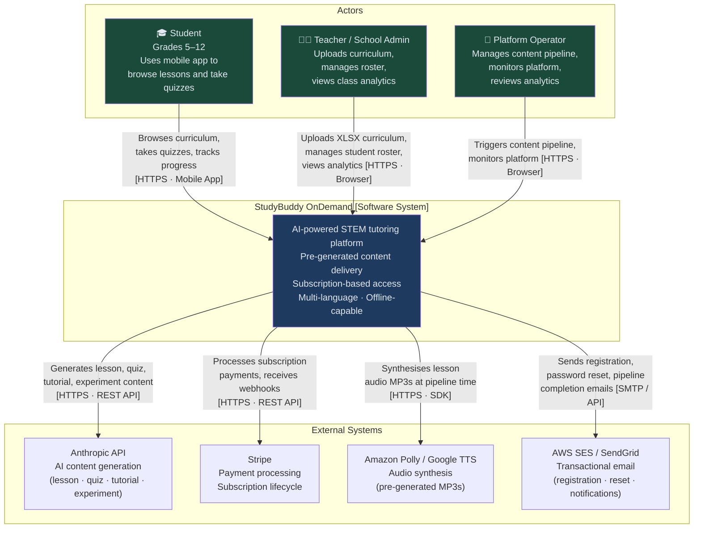

---

## System Overview

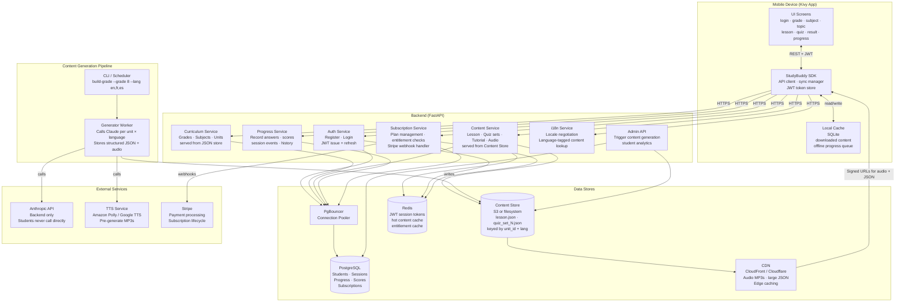

### Container Diagram (C4 Level 2)

The major deployable units and how they communicate.

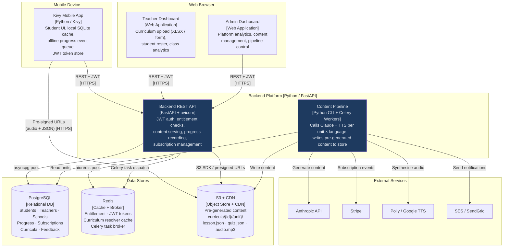

### Backend Component Diagram (C4 Level 3)

Internal structure of the FastAPI backend: services, middleware, and shared core.

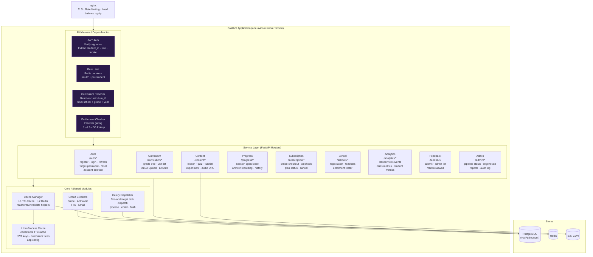

---

## Content Generation Pipeline

This is the cornerstone of the OnDemand architecture. All Claude API calls happen here — offline, before students use the app — so students receive instant content.


**Why 3 quiz sets per unit?** A student who retakes a topic after review sees a different set of questions. Sets rotate randomly on each attempt.

**When to run the pipeline:**
- At initial deployment for all supported grades × all supported languages
- When curriculum JSON files are updated
- When Claude prompt quality is improved (regenerate selectively by grade/unit/language)
- When a new language is added (regenerate only the new language column)

---

## Subscription Model

### Tiers

| Tier | Access | Price |
|---|---|---|
| Free | 2 lessons (any unit, any subject) | $0 |
| Monthly | All lessons + quizzes, all grades | TBD |
| Annual | Same as Monthly + priority support | TBD (discounted) |

### Free Tier Gating Rules

- **Entitlement check happens on the backend**, not on the mobile app. The mobile app never decides access on its own.
- A student's `lessons_accessed` count is tracked in PostgreSQL per student.
- After 2 distinct lesson views, `GET /content/{unit_id}/lesson` returns HTTP 402 with a `SUBSCRIPTION_REQUIRED` payload.
- Quiz access follows lesson access: a student can take the quiz for a unit they have viewed.
- The mobile app listens for HTTP 402 and transitions to `SubscriptionScreen`.
- Free lesson count resets never — the 2 lessons are a permanent trial, not a daily/weekly limit.

### Subscription Flow


### Payment Integration (Stripe)

- **Checkout:** `POST /subscription/checkout` creates a Stripe Checkout Session; returns a URL. Mobile opens URL in an in-app browser or system browser.
- **Webhook:** Stripe sends events to `POST /subscription/webhook`. Backend validates signature, updates `subscriptions` table.
- **Events handled:** `checkout.session.completed`, `customer.subscription.updated`, `customer.subscription.deleted`, `invoice.payment_failed`.
- The Stripe secret key and webhook signing secret live only in backend environment variables.

---

## Multi-Language Support

### Supported Languages

| Code | Language |
|---|---|
| `en` | English |
| `fr` | French |
| `es` | Spanish |

### Architecture Decisions

- **Content is pre-generated per language.** The pipeline calls Claude once per language per unit. There is no runtime translation.
- **Content Store keys include language:** `{unit_id}/lesson_en.json`, `{unit_id}/lesson_fr.json`, `{unit_id}/lesson_es.json`.
- **Locale is set at registration** and stored in the student profile. Students can change it in Settings.
- **The backend negotiates locale:** `GET /content/{unit_id}/lesson` reads the student's locale from the JWT payload and serves the matching file. If a language file is missing, falls back to `en`.
- **UI strings are separate from content.** App UI labels (button text, navigation, error messages) are translated via a static `i18n/` dictionary bundled in the app — not generated by Claude.
- **Quiz questions and answers are language-matched.** Each `quiz_set_N_{lang}.json` contains questions, answer choices, and explanations in the target language.

### Locale in JWT

JWT payload includes `locale`:
```json
{"student_id": "uuid", "grade": 8, "locale": "fr", "exp": 1234567890}
```

The pipeline prompt builders receive a `lang` parameter and instruct Claude to respond entirely in that language at the student's grade level.

---

## Text-to-Speech (Lessons Read Aloud)

### Design

- **Pre-generated audio, not runtime TTS.** The pipeline generates an MP3 file for each lesson in each language. Students tap a play button to stream or play the cached file.
- **TTS provider:** Amazon Polly (primary) or Google Cloud TTS — both support English, French, and Spanish at educational reading pace. Provider is configurable via `TTS_PROVIDER` in pipeline `config.py`.
- **Audio stored in Content Store** alongside lesson JSON: `{unit_id}/lesson_{lang}.mp3`.
- **Mobile playback:** Kivy's `SoundLoader` can play MP3s. The audio file is downloaded to local SQLite cache alongside lesson JSON. Once cached, playback is offline.
- **Backend delivery:** `GET /content/{unit_id}/lesson/audio` returns a signed URL (S3) or a streaming response (filesystem). The mobile app downloads to the local cache directory.

### Pipeline Step

```python
# pipeline/build_unit.py (sketch)
text = lesson_data["synopsis"] + " " + " ".join(lesson_data["key_concepts"])
audio_bytes = tts_client.synthesize(text, lang=lang, voice=TTS_VOICES[lang])
content_store.write(f"{unit_id}/lesson_{lang}.mp3", audio_bytes)
```

### TTS Voice Configuration

| Language | Amazon Polly Voice | Google TTS Voice |
|---|---|---|
| English | Joanna (female) | en-US-Standard-C |
| French | Céline | fr-FR-Standard-C |
| Spanish | Penélope | es-ES-Standard-A |

Voices are configurable in `pipeline/config.py`. Educational reading rate: 90% of default speed.

---

## Experiment Visualization

### Purpose

Some curriculum units include hands-on laboratory experiments (e.g. `G8-SCI-001` — Integrated Science). For these units, the app displays an interactive experiment guide that walks the student through the procedure with step-by-step visual aids.

### Detection

The pipeline checks the `assessments.labs` field in the grade curriculum JSON:
```json
{
  "unit_id": "G8-SCI-001",
  "assessments": {
    "labs": ["Measuring density of solids and liquids"]
  }
}
```
If `assessments.labs` is non-empty, the pipeline generates `experiment_{lang}.json`.

### Experiment JSON Schema

```json
{
  "unit_id": "G8-SCI-001",
  "experiment_title": "Measuring Density of Solids and Liquids",
  "materials": ["Graduated cylinder", "Balance scale", "Water", "Rock sample"],
  "safety_notes": ["Wear safety goggles", "Handle glass carefully"],
  "steps": [
    {
      "step_number": 1,
      "instruction": "Fill the graduated cylinder to the 50 mL mark with water.",
      "diagram_hint": "graduated cylinder with water level at 50 mL line",
      "expected_observation": "Meniscus curves downward at exactly 50 mL"
    }
  ],
  "questions": [
    {
      "question": "What happens to the water level when you add the rock?",
      "answer": "The water level rises by a volume equal to the volume of the rock."
    }
  ],
  "conclusion_prompt": "Calculate the density using mass ÷ volume. What did you find?"
}
```

### Visualization Component (Mobile)

- `ExperimentScreen` renders the experiment guide as a vertical step-by-step card list.
- Each step card shows: instruction text, a `diagram_hint` rendered as an SVG or ASCII diagram, and an `expected_observation` shown after student confirms they are ready.
- Navigation: Previous / Next step buttons + progress indicator.
- Accessed from `SubjectScreen` via an "🔬 Experiment" button (only shown when `experiment_{lang}.json` exists for the unit).
- Fully offline after first download — experiment JSON is cached alongside lesson JSON.

### Pipeline Prompt

The experiment visualization prompt instructs Claude to:
1. Extract the lab procedure from the curriculum context.
2. Break it into discrete, observable steps (5–10 steps).
3. Provide a `diagram_hint` string describing a simple diagram for each step (rendered client-side or as ASCII art).
4. Generate 2–3 comprehension questions at the end.

---

## Student Flow (Updated)

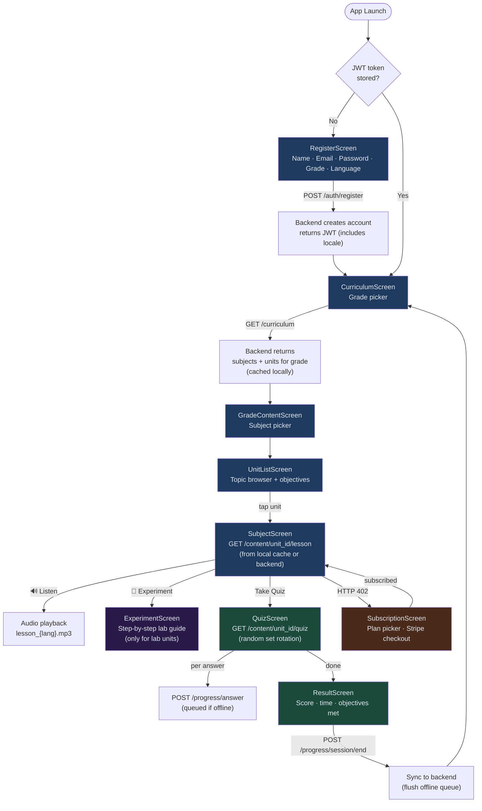

---

## Offline Strategy

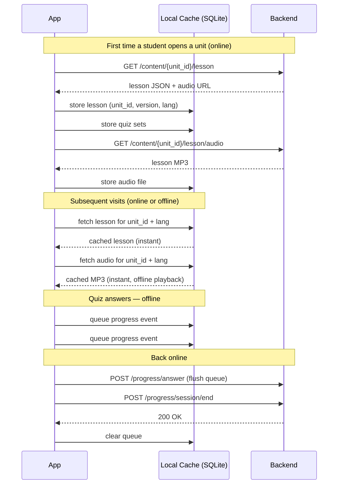

---

## Authentication Architecture

### Two-Track Auth Model

Authentication is split by user type. Students and teachers use an external provider (Auth0). Internal product team members — developers, testers, product admins, and super admins — use a local credential store within the application.

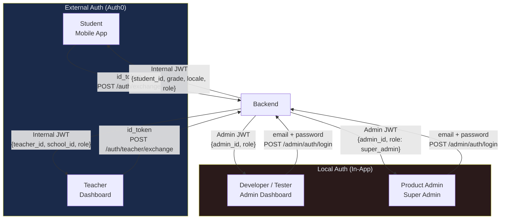

### Track 1 — External Auth (Students & Teachers)

Auth0 handles credential storage, email verification, brute-force protection, and password reset email delivery. The backend never stores a password hash for students or teachers.

**Token Exchange Flow:**

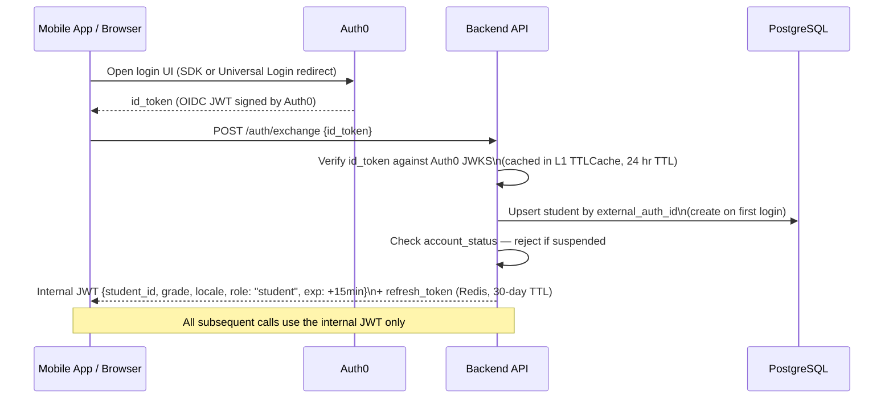

- `POST /auth/teacher/exchange` — same flow; issues `{teacher_id, school_id, role}` JWT
- `POST /auth/refresh` — exchanges refresh token for new internal JWT; no Auth0 call needed
- **Password reset** — triggered by `POST /auth/forgot-password`, which calls Auth0 Management API to send the reset email. Auth0 handles the entire email-link-form flow. No reset tokens stored in our DB for external-auth users.
- **No passwords stored** — `password_hash` column is absent from `students` and `teachers` tables. Auth0 is the single source of credential truth for these users.

### Track 2 — Local Auth (Internal Product Team)

Internal users are stored in the `admin_users` table. Authentication is fully self-contained; no external provider dependency.

| Role | Description |
|---|---|
| `developer` | Engineering team; read access to all admin endpoints |
| `tester` | QA team; can trigger content regeneration and view all data |
| `product_admin` | Can activate/deactivate accounts, manage schools |
| `super_admin` | Full access; can manage admin users |

- `POST /admin/auth/login` → bcrypt verify (in thread pool executor) → admin JWT signed with `ADMIN_JWT_SECRET` (separate from student/teacher secret)
- `POST /admin/auth/forgot-password` → one-time reset token stored in Redis (TTL 1 hr) → email link → `POST /admin/auth/reset-password`
- Account lockout: 5 failed attempts → 15-minute Redis-backed cooldown (same pattern as existing rate limiting)
- TOTP / MFA: optional field `totp_secret` in `admin_users`; enforced at `super_admin` level (Phase 7+)

### Account Status Lifecycle

All user types — students, teachers, schools — carry an `account_status` field.

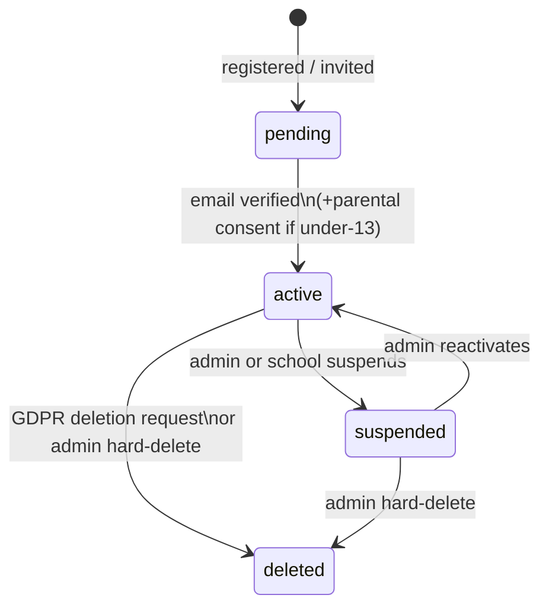

| Status | Access |
|---|---|
| `pending` | Login allowed; content blocked (must verify first) |
| `active` | Full access per entitlement |
| `suspended` | JWT rejected with `403 Forbidden`; added to Redis `suspended:{id}` set |
| `deleted` | Soft-deleted; PII anonymised on 30-day GDPR schedule; JWT always rejected |

**Suspension JWT revocation:** on suspension, `student_id` / `teacher_id` is added to Redis key `suspended:{id}` with **no TTL**. The key persists until the account is explicitly reactivated — at which point the key is deleted via `DEL suspended:{id}`. Auth middleware checks this set immediately after signature verification — zero DB queries on hot path. Do not set a TTL on suspension keys; a 15-min TTL would silently restore access without any admin action.

**Auth0 sync on suspension:** a Celery task calls Auth0 Management API `PATCH /api/v2/users/{external_auth_id}` with `{"blocked": true}`. This prevents re-login even if the internal JWT has expired. Our `account_status` is authoritative; Auth0 sync is best-effort.

---

## RBAC System

Role-Based Access Control governs every endpoint. Roles are encoded in the JWT `role` claim. Permissions are a **static in-code mapping** — no DB lookup on the hot path. Scope (school vs platform) is derived from the JWT `school_id` claim present for teacher/school_admin roles.

### Roles and Scopes

| Role | Auth Track | Scope |
|---|---|---|
| `student` | Auth0 | Own data only |
| `teacher` | Auth0 | Their school's data (`school_id` from JWT) |
| `school_admin` | Auth0 | Their school's data (`school_id` from JWT) |
| `product_admin` | Local (bcrypt) | Platform-wide |
| `super_admin` | Local (bcrypt) | Platform-wide |
| `developer` | Local (bcrypt) | Platform-wide (read + test operations) |
| `tester` | Local (bcrypt) | Platform-wide (read + limited write for testing) |

### Permission Matrix

Permissions use `resource:action` naming. ✓ = granted · ✓(s) = granted within own school only · — = denied.

| Permission | student | teacher | school_admin | product_admin | super_admin | developer | tester |
|---|---|---|---|---|---|---|---|
| `content:read` | ✓ | ✓(s) | ✓(s) | ✓ | ✓ | ✓ | ✓ |
| `content:feedback` | ✓ | — | — | — | — | — | — |
| `review:read` | — | ✓(s) | ✓(s) | ✓ | ✓ | ✓ | ✓ |
| `review:annotate` | — | ✓(s) | ✓(s) | ✓ | ✓ | — | ✓ |
| `review:rate` | — | ✓(s) | ✓(s) | ✓ | ✓ | — | ✓ |
| `review:approve` | — | — | ✓(s) | ✓ | ✓ | — | — |
| `content:publish` | — | — | — | ✓ | ✓ | — | — |
| `content:rollback` | — | — | — | ✓ | ✓ | — | — |
| `content:block` | — | — | ✓(s) | ✓ | ✓ | — | — |
| `content:regenerate` | — | — | — | ✓ | ✓ | — | — |
| `student:manage` | — | ✓(s) | ✓(s) | ✓ | ✓ | — | — |
| `school:manage` | — | — | — | ✓ | ✓ | — | — |
| `admin:manage` | — | — | — | — | ✓ | — | — |

`developer` and `tester` have `review:annotate` / `review:rate` so they can exercise the review workflow in staging without being able to approve or publish.

### Implementation

```python
# backend/src/core/permissions.py

ROLE_PERMISSIONS: dict[str, set[str]] = {
    "student":       {"content:read", "content:feedback"},
    "teacher":       {"content:read", "review:read", "review:annotate",
                      "review:rate", "student:manage"},
    "school_admin":  {"content:read", "review:read", "review:annotate",
                      "review:rate", "review:approve", "content:block",
                      "student:manage"},
    "product_admin": {"content:read", "content:publish", "content:rollback",
                      "content:block", "content:regenerate", "review:read",
                      "review:annotate", "review:rate", "review:approve",
                      "student:manage", "school:manage"},
    "super_admin":   {"*"},   # all permissions
    "developer":     {"content:read", "review:read", "review:rate"},
    "tester":        {"content:read", "review:read", "review:rate", "review:annotate"},
}

def require_permission(permission: str) -> Callable:
    """FastAPI dependency — raises HTTP 403 if JWT role lacks the permission."""
    ...
```

**Scope enforcement:** school-scoped roles (`teacher`, `school_admin`) can only act on resources where `school_id` matches their JWT. The resource's `school_id` is checked inside each endpoint handler — not in a shared middleware — to avoid ambiguity with platform-wide resources (e.g., default curricula).

**No DB round-trips for permission checks.** The `ROLE_PERMISSIONS` map is loaded once at startup. Adding a permission to a role is a code change + deployment, not a DB update.

---

## API Design

All endpoints require `Authorization: Bearer <jwt>` except `/auth/*`, `/admin/auth/*`, and `/subscription/webhook`.

### Standard Response Envelopes

**Error responses** (4xx / 5xx) always use this shape:
```json
{
  "error": "short_snake_case_code",
  "detail": "Human-readable explanation of what went wrong.",
  "correlation_id": "uuid-v4-from-X-Correlation-Id-header"
}
```
The `X-Correlation-Id` header is set on every response (success and error alike). Clients must log it for support requests. Never include stack traces or internal paths in the `detail` field.

**Paginated list responses** always use this shape:
```json
{
  "items": [...],
  "total": 142,
  "page": 1,
  "per_page": 50,
  "pages": 3
}
```
Default `per_page` is 50; maximum is 200. Pass `?page=N&per_page=N` as query parameters.

### Auth — Students (External Provider)

| Method | Endpoint | Body | Returns |
|---|---|---|---|
| POST | `/auth/exchange` | `{id_token}` | `{token, refresh_token, student_id}` |
| POST | `/auth/teacher/exchange` | `{id_token}` | `{token, refresh_token, teacher_id}` |
| POST | `/auth/refresh` | `{refresh_token}` | `{token}` |
| POST | `/auth/logout` | `{refresh_token}` | `200` (deletes refresh token from Redis) |
| POST | `/auth/forgot-password` | `{email}` | `200` (always; triggers Auth0 reset email) |
| PATCH | `/student/profile` | `{name?, locale?, grade?}` | `{student}` |
| DELETE | `/auth/account` | — | `200` (GDPR erasure + Auth0 user deletion) |

### Auth — Internal Product Team (Local)

| Method | Endpoint | Body | Returns |
|---|---|---|---|
| POST | `/admin/auth/login` | `{email, password}` | `{token, admin_id}` |
| POST | `/admin/auth/refresh` | `{refresh_token}` | `{token}` |
| POST | `/admin/auth/forgot-password` | `{email}` | `200` (always) |
| POST | `/admin/auth/reset-password` | `{token, new_password}` | `200` |

### Account Management (product_admin / super_admin only)

| Method | Endpoint | Body | Returns |
|---|---|---|---|
| GET | `/admin/accounts/students` | — `?status=&school_id=&q=&page=` | Paginated student list |
| GET | `/admin/accounts/students/{id}` | — | Student detail |
| PATCH | `/admin/accounts/students/{id}/status` | `{status: active\|suspended}` | `{student}` |
| DELETE | `/admin/accounts/students/{id}` | — | `202` (schedules GDPR deletion) |
| GET | `/admin/accounts/teachers` | — `?status=&school_id=&page=` | Paginated teacher list |
| PATCH | `/admin/accounts/teachers/{id}/status` | `{status: active\|suspended}` | `{teacher}` |
| GET | `/admin/accounts/schools` | — `?status=&page=` | Paginated school list |
| PATCH | `/admin/accounts/schools/{id}/status` | `{status: active\|suspended}` | `{school}` (cascades) |

Suspending a school cascades: all teachers and students belonging to that school are suspended simultaneously via a Celery task. Each is added to the Redis `suspended:{id}` set individually.

### Account Management — School Self-Service (teacher / school_admin)

| Method | Endpoint | Body | Returns |
|---|---|---|---|
| PATCH | `/schools/{school_id}/students/{student_id}/status` | `{status: active\|suspended}` | `{student}` |
| PATCH | `/schools/{school_id}/teachers/{teacher_id}/status` | `{status: active\|suspended}` | `{teacher}` |

### Curriculum

| Method | Endpoint | Returns |
|---|---|---|
| GET | `/curriculum` | List of available grades with subject counts |
| GET | `/curriculum/{grade}` | Full subject + unit tree for grade |

### Content

| Method | Endpoint | Returns |
|---|---|---|
| GET | `/content/{unit_id}/lesson` | Synopsis + key concepts JSON (locale from JWT) |
| GET | `/content/{unit_id}/lesson/audio` | Signed URL or stream of lesson MP3 |
| GET | `/content/{unit_id}/quiz` | One quiz set (8 questions, rotated, locale from JWT) |
| GET | `/content/{unit_id}/practice` | Practice test set (locale from JWT) |
| GET | `/content/{unit_id}/tutorial` | Remediation content (locale from JWT) |
| GET | `/content/{unit_id}/experiment` | Experiment visualization JSON (locale from JWT; 404 if no lab) |

### Content (additional)

| Method | Endpoint | Body | Returns |
|---|---|---|---|
| POST | `/content/{unit_id}/report` | `{category, message?}` | `200` |
| POST | `/content/{unit_id}/feedback/marked` | `{content_type, start_offset, end_offset, marked_text?, feedback_text}` | `200` (student marked-text feedback) |
| GET | `/app/version` | — | `{min_version, latest_version}` |

### Content Review & Approval

Requires admin or teacher JWT. Permission column references `backend/src/core/permissions.py`.

| Method | Endpoint | Body / Params | Returns | Permission |
|---|---|---|---|---|
| GET | `/admin/content/review/queue` | `?curriculum_id=&subject=&status=&page=` | Paginated version list | `review:read` |
| GET | `/admin/content/review/{version_id}` | — | Version detail + annotations | `review:read` |
| POST | `/admin/content/review/{version_id}/open` | — | `{review_id}` | `review:annotate` |
| POST | `/admin/content/review/{version_id}/annotate` | `{unit_id, content_type, start_offset, end_offset, original_text, annotation_type, suggestion_text?}` | `{annotation_id}` | `review:annotate` |
| DELETE | `/admin/content/review/annotations/{annotation_id}` | — | `200` | `review:annotate` |
| GET | `/admin/content/dictionary` | `?word=` | `{definitions, synonyms, alternatives}` | `review:read` |
| POST | `/admin/content/review/{version_id}/rate` | `{language_rating, content_rating, notes?}` | `200` | `review:rate` |
| POST | `/admin/content/review/{version_id}/approve` | `{notes?}` | `200` | `review:approve` |
| POST | `/admin/content/review/{version_id}/reject` | `{reason, regenerate: bool}` | `202` if `regenerate=true` | `review:approve` |
| GET | `/admin/content/versions` | `?curriculum_id=&subject=&page=` | Paginated version history | `review:read` |
| POST | `/admin/content/versions/{version_id}/publish` | — | `200` (archives current live version) | `content:publish` |
| POST | `/admin/content/versions/{version_id}/rollback` | — | `200` (archives current; restores this) | `content:rollback` |
| POST | `/admin/content/block` | `{curriculum_id, subject, school_id?, reason}` | `{block_id}` | `content:block` |
| DELETE | `/admin/content/block/{block_id}` | — | `200` | `content:block` |
| GET | `/admin/content/blocks` | `?curriculum_id=&school_id=&page=` | Paginated active blocks | `review:read` |
| GET | `/admin/content/{unit_id}/feedback/marked` | `?page=` | Paginated student marked-text feedback | `review:read` |

### Progress

| Method | Endpoint | Body | Returns |
|---|---|---|---|
| POST | `/progress/session` | `{unit_id, grade, subject}` | `{session_id}` |
| POST | `/progress/answer` | `{session_id, question_id, answer, correct, ms_taken}` | `200` |
| POST | `/progress/session/end` | `{session_id, score, duration_s, completed}` | `200` |
| GET | `/progress/student` | — | Full history + scores |
| GET | `/progress/unit/{unit_id}` | — | Attempts + best score for unit |

### Subscription

| Method | Endpoint | Body | Returns |
|---|---|---|---|
| GET | `/subscription/status` | — | `{plan, valid_until, lessons_accessed}` |
| POST | `/subscription/checkout` | `{plan: "monthly"\|"annual"}` | `{checkout_url}` |
| POST | `/subscription/webhook` | Stripe event body | `200` |
| DELETE | `/subscription` | — | `200` (cancel at period end) |

### School & Teacher

| Method | Endpoint | Body | Returns |
|---|---|---|---|
| POST | `/schools/register` | `{school_name, contact_email, country}` | `{school_id, teacher_id}` |
| GET | `/schools/{school_id}` | — | School profile |
| POST | `/schools/{school_id}/teachers/invite` | `{email, name}` | `200` |
| POST | `/schools/{school_id}/enrolment` | `{student_emails: [...]}` | `{enrolled, already_enrolled, not_found}` |
| DELETE | `/schools/{school_id}/enrolment/{student_email}` | — | `200` |
| GET | `/schools/{school_id}/enrolment` | — | Roster with enrolment status |

### Curriculum

| Method | Endpoint | Body | Returns |
|---|---|---|---|
| POST | `/curriculum/upload` | multipart XLSX or `{grade, units: [...]}` JSON | `{curriculum_id, status, errors}` |
| GET | `/curriculum/{curriculum_id}` | — | Curriculum metadata + unit list |
| PUT | `/curriculum/{curriculum_id}/activate` | — | `200` (activates, archives previous) |
| POST | `/curriculum/pipeline/trigger` | `{curriculum_id, lang?, force?}` | `{job_id}` |
| GET | `/curriculum/pipeline/{job_id}/status` | — | `{status, built, failed, progress_pct}` |
| GET | `/curriculum/template` | — | XLSX template file download |

### Analytics

| Method | Endpoint | Returns |
|---|---|---|
| POST | `/analytics/lesson/start` | `{unit_id, curriculum_id}` → `{view_id}` |
| POST | `/analytics/lesson/end` | `{view_id, duration_s, audio_played, experiment_viewed}` → `200` |
| GET | `/analytics/student/me` | Student's own metrics (scores, time, attempts) |
| GET | `/analytics/school/{school_id}/class` | Aggregate class metrics per unit |
| GET | `/analytics/unit/{unit_id}/summary` | Platform-wide metrics for a unit (admin only) |

### Feedback

| Method | Endpoint | Body | Returns |
|---|---|---|---|
| POST | `/feedback` | `{category, unit_id?, message, rating?}` | `{feedback_id}` |
| GET | `/admin/feedback` | — | Paginated feedback list with filters |

---

### Reports

All report endpoints require a teacher or school_admin JWT. Students cannot access these endpoints.

| Method | Endpoint | Returns |
|---|---|---|
| GET | `/reports/school/{school_id}/overview?period=7d\|30d\|term` | Class overview summary |
| GET | `/reports/school/{school_id}/unit/{unit_id}?period=7d\|30d\|term` | Unit performance deep-dive |
| GET | `/reports/school/{school_id}/student/{student_id}` | Individual student report card |
| GET | `/reports/school/{school_id}/curriculum-health` | All units ranked by health tier |
| GET | `/reports/school/{school_id}/feedback?unit_id=&category=&reviewed=` | Feedback by unit |
| GET | `/reports/school/{school_id}/trends?period=4w\|12w\|term` | Week-over-week trend data |
| POST | `/reports/school/{school_id}/export` | `{report_type, filters}` → `{download_url}` CSV |
| GET | `/reports/school/{school_id}/alerts` | Active threshold alerts |
| PUT | `/reports/school/{school_id}/alerts/settings` | Configure alert thresholds |
| POST | `/reports/school/{school_id}/digest/subscribe` | Subscribe / update weekly digest settings |
| POST | `/reports/school/{school_id}/refresh` | Trigger on-demand materialized view refresh (school_admin only) |

---

## Data Models

### Student
```json
{
  "student_id": "uuid",
  "name": "string",
  "email": "string",
  "grade": 8,
  "locale": "en",
  "created_at": "ISO8601",
  "subscription": "free | monthly | annual",
  "lessons_accessed": 0,
  "school_id": "uuid | null",
  "enrolled_at": "ISO8601 | null"
}
```

### Subscription
```json
{
  "subscription_id": "uuid",
  "student_id": "uuid",
  "plan": "monthly | annual",
  "status": "active | cancelled | past_due",
  "stripe_customer_id": "cus_xxx",
  "stripe_subscription_id": "sub_xxx",
  "current_period_end": "ISO8601"
}
```

### Session
```json
{
  "session_id": "uuid",
  "student_id": "uuid",
  "unit_id": "G8-MATH-001",
  "curriculum_id": "uuid",
  "grade": 8,
  "subject": "Mathematics",
  "started_at": "ISO8601",
  "ended_at": "ISO8601",
  "score": 7,
  "total_questions": 8,
  "completed": true,
  "attempt_number": 1,
  "passed": true
}
```

### Progress Answer
```json
{
  "answer_id": "uuid",
  "session_id": "uuid",
  "question_id": "string",
  "student_answer": 2,
  "correct_answer": 1,
  "correct": false,
  "ms_taken": 12400
}
```

### Stripe Event (dedup + audit log)
```json
{
  "stripe_event_id": "evt_xxx",
  "event_type": "checkout.session.completed",
  "processed_at": "ISO8601",
  "outcome": "ok | error",
  "error_detail": "string | null"
}
```

### Content Report
```json
{
  "report_id": "uuid",
  "unit_id": "G8-MATH-001",
  "student_id": "uuid",
  "category": "wrong_answer | confusing | inappropriate | other",
  "message": "string | null",
  "reported_at": "ISO8601",
  "reviewed": false
}
```

### School
```json
{
  "school_id": "uuid",
  "name": "Springfield High School",
  "contact_email": "admin@sphs.edu",
  "country": "US",
  "enrolment_code": "SPHS-2026",
  "status": "pending | active | suspended",
  "created_at": "ISO8601"
}
```

### Teacher
```json
{
  "teacher_id": "uuid",
  "school_id": "uuid",
  "name": "string",
  "email": "string",
  "role": "teacher | school_admin",
  "created_at": "ISO8601"
}
```

### Curriculum
```json
{
  "curriculum_id": "uuid | default-{year}-g{grade}",
  "school_id": "uuid | null",
  "year": 2026,
  "grade": 8,
  "name": "Grade 8 STEM 2026",
  "source_type": "default | xlsx_upload | ui_form",
  "status": "draft | building | active | archived | failed",
  "restrict_access": false,
  "created_by": "teacher_id | null",
  "created_at": "ISO8601",
  "activated_at": "ISO8601 | null"
}
```

### Curriculum Unit
```json
{
  "unit_id": "string",
  "curriculum_id": "uuid",
  "subject": "Mathematics",
  "unit_name": "Algebra – Linear Equations",
  "objectives": ["Solve linear equations", "Graph functions"],
  "has_lab": false,
  "lab_description": "string | null",
  "sequence": 1,
  "content_status": "pending | built | failed"
}
```

### School Enrolment
```json
{
  "enrolment_id": "uuid",
  "school_id": "uuid",
  "student_email": "string",
  "student_id": "uuid | null",
  "added_by_teacher_id": "uuid",
  "added_at": "ISO8601",
  "status": "pending | active | removed"
}
```

### Lesson View
```json
{
  "view_id": "uuid",
  "student_id": "uuid",
  "unit_id": "string",
  "curriculum_id": "uuid",
  "started_at": "ISO8601",
  "ended_at": "ISO8601 | null",
  "duration_s": 0,
  "audio_played": false,
  "experiment_viewed": false
}
```

### Feedback
```json
{
  "feedback_id": "uuid",
  "student_id": "uuid",
  "category": "content | ux | general",
  "unit_id": "string | null",
  "curriculum_id": "uuid | null",
  "message": "string",
  "rating": "1-5 | null",
  "submitted_at": "ISO8601",
  "reviewed": false
}
```

### Report Alert Settings
```json
{
  "school_id": "uuid",
  "unit_pass_rate_threshold_pct": 50,
  "feedback_volume_threshold_7d": 3,
  "student_inactive_days": 14,
  "score_drop_threshold_pct": 10,
  "notify_on_new_feedback": true,
  "updated_at": "ISO8601"
}
```

### Digest Subscription
```json
{
  "subscription_id": "uuid",
  "teacher_id": "uuid",
  "school_id": "uuid",
  "email": "string",
  "timezone": "America/Toronto",
  "enabled": true,
  "last_sent_at": "ISO8601 | null"
}
```

### Entity Relationship Diagram

Key relationships between the core data entities.

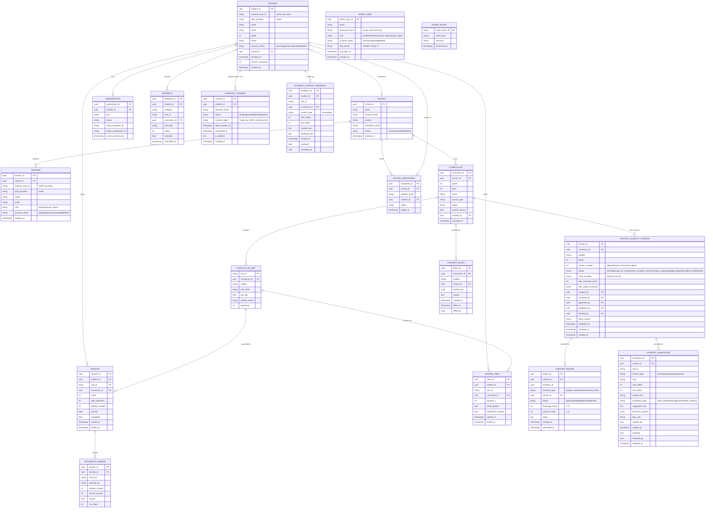

### Content (stored in Content Store, keyed by unit_id)
```
{unit_id}/
  lesson_en.json          ← synopsis + key concepts (English)
  lesson_fr.json          ← synopsis + key concepts (French)
  lesson_es.json          ← synopsis + key concepts (Spanish)
  lesson_en.mp3           ← TTS audio (English)
  lesson_fr.mp3           ← TTS audio (French)
  lesson_es.mp3           ← TTS audio (Spanish)
  quiz_set_1_en.json      ← 8 questions, set 1 (English)
  quiz_set_1_fr.json      ← 8 questions, set 1 (French)
  quiz_set_1_es.json      ← 8 questions, set 1 (Spanish)
  quiz_set_2_{lang}.json
  quiz_set_3_{lang}.json
  tutorial_{lang}.json    ← remediation content
  experiment_{lang}.json  ← experiment guide (only if unit has labs)
  meta.json               ← generated_at, model_version, content_version, langs_built
```

---

## Security Controls

### Rate Limiting

Apply at the reverse proxy or FastAPI middleware layer. Do not rely on the database for enforcement.

| Endpoint group | Limit |
|---|---|
| `POST /auth/login`, `POST /auth/register` | 10 req / min per IP |
| `POST /auth/forgot-password` | 5 req / min per IP |
| Content endpoints (`/content/*`) | 100 req / min per student JWT |
| Stripe webhook (`/subscription/webhook`) | No rate limit (Stripe IPs only via allowlist) |

### Account Lockout

After 5 consecutive failed login attempts for the same email, the account is locked for 15 minutes. A failed attempt counter is stored in Redis with a 15-minute TTL, reset on successful login.

### JWT Key Rotation

- JWT header includes a `kid` (key ID) field.
- The backend maintains up to 2 active signing keys simultaneously.
- Old tokens signed with the previous key remain valid until they expire naturally.
- Rotation procedure: generate new key → deploy with both keys active → wait for old tokens to expire → remove old key.

### CORS Policy

The backend sets an explicit CORS allowlist:
- Mobile app: communicates via native HTTPS (no browser origin; not subject to CORS).
- Admin dashboard: allowed origin set via `ALLOWED_ORIGINS` env var.
- Default: deny all origins not in allowlist.

### Secrets Management

| Secret | Storage | Used By |
|---|---|---|
| `JWT_SECRET` | Backend env var (secrets manager in prod) | Student/teacher JWT signing (HS256, Phase 1) |
| `ADMIN_JWT_SECRET` | Backend env var (separate from JWT_SECRET) | Admin JWT signing; different secret prevents cross-use |
| `DATABASE_URL` | Backend env var (secrets manager in prod) | asyncpg pool |
| `REDIS_URL` | Backend env var | aioredis pool |
| `AUTH0_DOMAIN` | Backend env var | JWKS URL derivation; id_token verification |
| `AUTH0_JWKS_URL` | Backend env var | Explicit JWKS endpoint (cached with 1-hr TTL) |
| `AUTH0_STUDENT_CLIENT_ID` | Backend env var | Validate `aud` claim on student id_tokens |
| `AUTH0_TEACHER_CLIENT_ID` | Backend env var | Validate `aud` claim on teacher id_tokens |
| `AUTH0_MGMT_CLIENT_ID` | Backend env var | Auth0 Management API M2M app |
| `AUTH0_MGMT_CLIENT_SECRET` | Backend env var (secrets manager in prod) | Auth0 Management API M2M app |
| `STRIPE_SECRET_KEY` | Backend env var (secrets manager in prod) | Stripe SDK |
| `STRIPE_WEBHOOK_SECRET` | Backend env var | Webhook signature verification |
| `SENTRY_DSN` | Backend env var | Sentry exception capture |
| `METRICS_TOKEN` | Backend env var | Bearer token for `/metrics` scrape endpoint |
| `ANTHROPIC_API_KEY` | Pipeline env var only | Content generation (never in backend) |
| `TTS_API_KEY` | Pipeline env var only | TTS audio generation |

**JWT Algorithm:** Phase 1 uses HS256 (symmetric). RS256 with `kid` rotation is deferred to Phase 2+ when multi-service token verification is needed.

In production, source all secrets from AWS Secrets Manager, HashiCorp Vault, or equivalent. Never commit secrets to git. `config.py` must call `model_validator` to fail fast at startup if any required secret is absent — no silent defaults.

### Redis Security

- Enable Redis `requirepass` authentication.
- Enable `AOF` persistence (append-only file) so a Redis restart does not invalidate all active sessions.
- Configure `maxmemory-policy allkeys-lru` to prevent unbounded growth.
- Redis stores only `student_id`-keyed data — no raw passwords, no card data, no PII beyond student_id.

### Input Validation

All request bodies are defined as Pydantic models. FastAPI validates automatically and returns HTTP 422 on schema violations. Never pass raw request data to a database query; use SQLAlchemy ORM exclusively (no raw SQL strings with f-string interpolation).

### Stripe Webhook Integrity

The `/subscription/webhook` handler must call `stripe.Webhook.construct_event(payload, sig_header, STRIPE_WEBHOOK_SECRET)` and reject with HTTP 400 if it raises `stripe.error.SignatureVerificationError`. Log the `stripe_event_id` to a `stripe_events` table for deduplication and audit.

---

## Compliance & Privacy

### COPPA (Children's Online Privacy Protection Act)

This product serves students in Grades 5–12, which includes children under 13. COPPA applies for US distribution.

- At registration, collect the student's date of birth (or grade as a proxy for age).
- If age < 13, collect a **parent/guardian email address** and send a consent request.
- Account activation is blocked until parental consent is confirmed.
- Store a `parental_consent` record (guardian email, consent timestamp, IP) in PostgreSQL.
- Do not collect any information beyond name, email, grade, and locale from minors without verifiable parental consent.

### GDPR (EU General Data Protection Regulation)

- **Right to erasure:** `DELETE /auth/account` must delete all PII and progress records associated with the student within 30 days. Stripe data is handled via Stripe's customer deletion API.
- **Data minimisation:** collect only name, email, grade, locale. No location, no device ID, no behavioural fingerprinting.
- **Consent at registration:** display a privacy policy link and require explicit acceptance before account creation.
- **Data retention:** progress records are retained for the lifetime of the account, then anonymised (strip `student_id`) after account deletion.

### Payment Data

The backend never stores card numbers, CVV, or bank account details. Stripe handles all payment data. The backend stores only `stripe_customer_id` and `stripe_subscription_id` to reference Stripe objects.

### Password Reset Token Security

- Reset tokens are single-use UUIDs stored in Redis with a 1-hour TTL.
- Consuming a token deletes it immediately.
- After account lockout, password reset is the only path to re-enable login.

---

## Observability & Monitoring

The backend exposes three complementary observability layers: **metrics** (Prometheus/Grafana), **structured event logs** (JSON to log aggregation), and **error notifications** (Sentry + Alertmanager). These are implemented in two dedicated modules:

- `backend/src/core/observability.py` — Prometheus metric objects, HTTP middleware, `GET /metrics` endpoint, `GET /health` endpoint
- `backend/src/core/events.py` — structured event emitter, audit log writer, correlation ID context

### Observability Stack Architecture

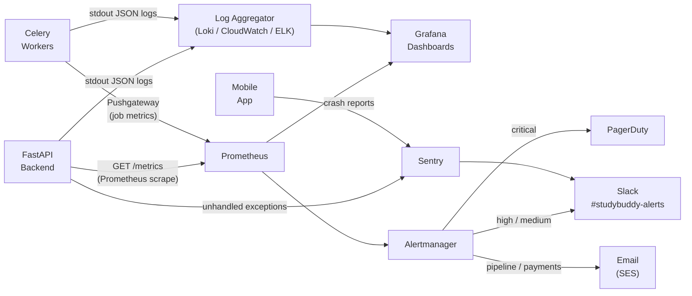

---

### 1. Prometheus Metrics

**Package:** `prometheus-fastapi-instrumentator` (auto HTTP metrics) + `prometheus_client` (custom metrics).

**`GET /metrics`** — Prometheus scrape endpoint. Protected: requires `Authorization: Bearer $METRICS_TOKEN` (env var). Never exposed publicly; nginx blocks it at the edge unless request originates from the Prometheus internal network.

#### HTTP Metrics (auto-instrumented)

| Metric | Type | Labels |
|---|---|---|
| `http_requests_total` | counter | `method`, `endpoint`, `status_code` |
| `http_request_duration_seconds` | histogram | `method`, `endpoint` |

Histogram buckets: `[0.005, 0.01, 0.025, 0.05, 0.1, 0.25, 0.5, 1.0, 2.5, 5.0]`

#### Business Metrics (custom — `backend/src/core/observability.py`)

| Metric | Type | Labels | Purpose |
|---|---|---|---|
| `sb_auth_exchange_total` | counter | `outcome` (success/failure) | Auth0 token exchange success rate |
| `sb_auth_failures_total` | counter | `reason` (invalid_token/suspended/lockout) | Security anomaly detection |
| `sb_content_requests_total` | counter | `content_type`, `cache_layer`, `locale` | Content serving volume |
| `sb_cache_hits_total` | counter | `layer` (L1/L2) | Cache effectiveness |
| `sb_cache_misses_total` | counter | `layer` (L1/L2) | Cache miss rate |
| `sb_entitlement_checks_total` | counter | `result` (allowed/paywall/forbidden) | Freemium conversion funnel |
| `sb_quiz_sessions_total` | counter | `grade`, `subject` | Learning activity volume |
| `sb_quiz_answers_total` | counter | `correct` (true/false) | Pass/fail trends |
| `sb_subscription_events_total` | counter | `event_type`, `outcome` | Payment health |
| `sb_pipeline_units_total` | counter | `grade`, `lang`, `status` (built/skipped/failed) | Pipeline quality |
| `sb_pipeline_duration_seconds` | histogram | `grade`, `lang` | Pipeline performance |
| `sb_pipeline_cost_usd` | histogram | `grade` | Spend tracking |
| `sb_active_students_gauge` | gauge | — | Platform size (updated nightly by Celery Beat) |
| `sb_account_status_changes_total` | counter | `user_type`, `new_status` | Account health |
| `sb_rate_limit_hits_total` | counter | `endpoint` | Abuse detection |

#### Infrastructure Metrics

| Metric | Type | Labels | Source |
|---|---|---|---|
| `sb_db_pool_connections` | gauge | `state` (busy/idle/waiting) | asyncpg pool stats; polled by middleware |
| `sb_redis_memory_bytes` | gauge | — | Redis `INFO memory` polled by Celery Beat |
| `sb_redis_evicted_keys_total` | counter | — | Redis `INFO stats` delta; polled by Celery Beat |
| `sb_celery_queue_depth` | gauge | `queue` (pipeline/io/default) | Redis LLEN; polled every 30 s by Celery Beat |

---

### 2. Grafana Dashboards

Six recommended dashboards. Import via JSON or provision from `docs/grafana/` directory.

| Dashboard | Key Panels | Primary Alert Surface |
|---|---|---|
| **Platform Overview** | Request rate, error rate, p95 latency, active students, subscription count, new registrations | Error rate, latency SLO breaches |
| **Content & Cache** | Cache hit ratio by layer, content requests by type/locale, audio plays, CDN hit rate | Cache hit ratio drop, content errors |
| **Student Activity** | Quiz sessions/hour, pass rate trend, top-10 struggling units, free-to-paid funnel (402-rate) | Pass rate drop, paywall hit spike |
| **Backend Health** | DB pool state, Redis memory/eviction, Celery queue depth, circuit breaker open/closed state | Pool exhaustion, queue backlog, circuit open |
| **Security** | Auth exchange failures, rate-limit hits/min, suspended account access attempts, token errors | Auth failure spike, rate-limit surge |
| **SLO Burn Rate** | p50/p95/p99 per endpoint vs. SLO target (traffic-light status), error budget remaining | Any SLO breach |

---

### 3. Alertmanager Rules

Alert definitions live in `docs/prometheus/alerts.yml`. Notifications route to different channels by severity.

```yaml
groups:
  - name: studybuddy.critical
    rules:
      - alert: BackendDown
        expr: up{job="studybuddy-api"} == 0
        for: 1m
        labels: { severity: critical }
        annotations: { summary: "API server unreachable" }

      - alert: DatabaseUnreachable
        expr: sb_db_pool_connections{state="waiting"} > 5
        for: 2m
        labels: { severity: critical }
        annotations: { summary: "DB pool exhausted — all workers waiting for connections" }

      - alert: RedisDown
        expr: redis_up == 0
        for: 1m
        labels: { severity: critical }
        annotations: { summary: "Redis unreachable — sessions and cache unavailable" }

  - name: studybuddy.high
    rules:
      - alert: HighErrorRate
        expr: |
          rate(http_requests_total{status_code=~"5.."}[5m])
          / rate(http_requests_total[5m]) > 0.01
        for: 5m
        labels: { severity: high }

      - alert: ContentLatencySLOBreach
        expr: |
          histogram_quantile(0.95,
            rate(http_request_duration_seconds_bucket
              {endpoint=~"/content/.*"}[5m])) > 0.2
        for: 5m
        labels: { severity: high }

      - alert: AuthExchangeFailureSpike
        expr: rate(sb_auth_exchange_total{outcome="failure"}[5m]) > 5
        for: 5m
        labels: { severity: high }

      - alert: StripeWebhookErrors
        expr: rate(sb_subscription_events_total{outcome="error"}[15m]) > 0
        for: 5m
        labels: { severity: high }

      - alert: CeleryPipelineBacklog
        expr: sb_celery_queue_depth{queue="pipeline"} > 50
        for: 10m
        labels: { severity: high }

  - name: studybuddy.medium
    rules:
      - alert: RateLimitSurge
        expr: rate(sb_rate_limit_hits_total[5m]) > 50
        for: 5m
        labels: { severity: medium }

      - alert: RedisEvictionSpike
        expr: rate(sb_redis_evicted_keys_total[5m]) > 100
        for: 5m
        labels: { severity: medium }

      - alert: PipelineUnitFailures
        expr: increase(sb_pipeline_units_total{status="failed"}[1h]) > 5
        for: 1m
        labels: { severity: medium }

      - alert: CDNCacheHitRateLow
        expr: cloudfront_cache_hit_rate < 0.80
        for: 15m
        labels: { severity: medium }
```

**Alertmanager routing (`docs/prometheus/alertmanager.yml`):**

```yaml
route:
  group_by: [alertname, severity]
  group_wait: 30s
  group_interval: 5m
  repeat_interval: 4h
  receiver: slack-default
  routes:
    - match: { severity: critical }
      receiver: pagerduty
      continue: true          # also send to Slack
    - match: { severity: critical }
      receiver: slack-critical
    - match: { severity: high }
      receiver: slack-alerts
    - match: { alertname: StripeWebhookErrors }
      receiver: email-payments
    - match: { alertname: PipelineUnitFailures }
      receiver: email-pipeline

receivers:
  - name: pagerduty
    pagerduty_configs:
      - routing_key: $PAGERDUTY_KEY
  - name: slack-critical
    slack_configs:
      - api_url: $SLACK_WEBHOOK_CRITICAL
        channel: "#studybuddy-incidents"
  - name: slack-alerts
    slack_configs:
      - api_url: $SLACK_WEBHOOK_ALERTS
        channel: "#studybuddy-alerts"
  - name: email-payments
    email_configs:
      - to: payments-team@example.com
  - name: email-pipeline
    email_configs:
      - to: content-team@example.com
```

---

### 4. Structured Event Logging

Every action that matters is logged as a structured JSON event. The logger is initialised once per component and emits to stdout (captured by container runtime → log aggregation).

#### Correlation ID

Every inbound HTTP request is assigned a `correlation_id` (UUID) by a FastAPI middleware, stored in a Python `contextvars.ContextVar`. All log entries within the same request automatically include it. Error responses return `X-Correlation-Id` header so users can report it to support.

#### Log Entry Format

```json
{
  "timestamp": "2026-03-23T14:30:00.123Z",
  "level": "INFO",
  "event_category": "content",
  "event_type": "lesson_served",
  "correlation_id": "a1b2c3d4-...",
  "student_id": "uuid",
  "unit_id": "G8-MATH-001",
  "locale": "en",
  "cache_layer": "L2",
  "duration_ms": 23,
  "component": "content"
}
```

Never log: passwords, JWT tokens, Stripe secret keys, Auth0 secrets, raw payment data, or full PII beyond `student_id`.

#### Event Categories and Types

| Category | Event Types | Emitted by |
|---|---|---|
| `auth` | `exchange_success`, `exchange_failure`, `token_refresh`, `forgot_password_triggered`, `account_locked`, `account_suspended_access` | auth service, middleware |
| `content` | `lesson_served`, `quiz_served`, `audio_url_issued`, `cache_hit`, `cache_miss`, `content_not_found` | content service |
| `progress` | `session_open`, `session_end`, `answer_recorded`, `sync_flush_start`, `sync_flush_complete` | progress service |
| `subscription` | `checkout_created`, `payment_succeeded`, `payment_failed`, `subscription_cancelled`, `grace_period_started`, `entitlement_granted`, `entitlement_revoked` | subscription service |
| `pipeline` | `build_started`, `unit_generated`, `unit_skipped`, `unit_failed`, `build_complete`, `spend_cap_abort` | pipeline |
| `security` | `rate_limit_hit`, `invalid_token`, `suspended_account_access`, `brute_force_detected`, `account_lockout` | auth middleware |
| `admin` | `account_status_changed`, `curriculum_activated`, `admin_login`, `gdpr_deletion_scheduled` | admin service |
| `system` | `startup`, `shutdown`, `health_check_failed`, `db_pool_exhausted`, `redis_eviction_spike`, `circuit_breaker_open` | core |

#### Event Logger Usage

```python
# backend/src/core/events.py
from src.core.events import emit_event, write_audit_log

# In content service
await emit_event(
    category="content",
    event_type="lesson_served",
    student_id=student_id,
    unit_id=unit_id,
    locale=locale,
    cache_layer="L2",
    duration_ms=elapsed_ms
)

# In admin service — security-critical actions also write to audit_log table
await write_audit_log(
    event_type="account_status_changed",
    actor_type="product_admin",
    actor_id=admin_id,
    target_type="student",
    target_id=student_id,
    metadata={"old_status": "active", "new_status": "suspended"},
    ip_address=request.client.host
)
```

`emit_event` writes a structured log entry **and** increments the relevant Prometheus counter (e.g., `sb_account_status_changes_total`). This is the single call point — no separate log + metric calls in service code.

---

### 5. Audit Log

Security-critical events are persisted to a tamper-resistant PostgreSQL table in addition to the structured log stream.

```sql
CREATE TABLE audit_log (
    id             bigserial     PRIMARY KEY,
    timestamp      timestamptz   NOT NULL DEFAULT NOW(),
    event_type     text          NOT NULL,
    actor_type     text          NOT NULL,  -- 'product_admin' | 'super_admin' | 'system' | 'student'
    actor_id       uuid,
    target_type    text,                    -- 'student' | 'teacher' | 'school' | 'curriculum'
    target_id      uuid,
    metadata       jsonb,
    ip_address     inet,
    correlation_id text
);

CREATE INDEX ix_audit_log_timestamp   ON audit_log (timestamp DESC);
CREATE INDEX ix_audit_log_target      ON audit_log (target_type, target_id);
CREATE INDEX ix_audit_log_actor       ON audit_log (actor_type, actor_id);
```

Events written to `audit_log`:

| Event | When |
|---|---|
| `account_status_changed` | Any suspension, reactivation, or deletion |
| `gdpr_deletion_scheduled` | `DELETE /auth/account` or admin delete |
| `admin_login` | Successful admin auth |
| `admin_login_failed` | Failed admin auth attempt |
| `admin_password_reset` | Admin reset-password flow completed |
| `curriculum_activated` | School curriculum goes live |
| `school_registration_approved` | New school approved |
| `subscription_plan_changed` | Admin-forced plan change (not Stripe-driven) |
| `rate_limit_exceeded` | IP/student hits rate limit threshold |

Audit log rows are never deleted. PII in `metadata` is anonymised when the associated account is deleted under GDPR.

---

### 6. Error Notifications (Sentry)

Sentry handles unhandled exceptions and provides issue grouping, assignment, and alert rules.

**Backend:** `sentry-sdk[fastapi]` — captures all unhandled exceptions with request context (`endpoint`, `student_id` if authenticated, `correlation_id`). PII is stripped before transmission via Sentry's `before_send` hook.

**Mobile:** `sentry-sdk` — crashes are queued locally and uploaded on next network-connected launch.

**Sentry alert rules (configure in Sentry project settings):**
- New issue first seen → notify `#studybuddy-alerts` Slack
- Issue regression (resolved, then seen again) → notify `#studybuddy-alerts`
- Issue frequency > 10 events in 5 minutes → notify `#studybuddy-incidents` + email on-call

**Integration with Alertmanager:** Sentry Slack notifications go to the same `#studybuddy-alerts` channel as Prometheus alerts, giving a single pane of view for both infrastructure and application errors.

---

### 7. Health Check

`GET /health` — deep check; used as Kubernetes/ECS readiness probe and external uptime monitor.

```json
{
  "status": "ok",
  "version": "1.0.0",
  "checks": {
    "db":            { "status": "ok",   "latency_ms": 3 },
    "redis":         { "status": "ok",   "latency_ms": 1 },
    "content_store": { "status": "ok",   "latency_ms": 12 },
    "auth0_jwks":    { "status": "ok",   "cached": true }
  },
  "timestamp": "2026-03-23T14:30:00Z"
}
```

Returns HTTP 503 if any check fails. The failing check's `status` field is `"error"` with an `error` key containing a safe (non-sensitive) description.

---

### 8. Pipeline Run Report

On completion, `build_grade.py` emits a structured JSON summary to stdout (captured by log aggregation) **and** writes metrics to Prometheus Pushgateway:

```json
{
  "event_category": "pipeline",
  "event_type": "build_complete",
  "grade": 8,
  "langs": ["en", "fr", "es"],
  "total_units": 40,
  "built": 40,
  "skipped": 0,
  "failed": 0,
  "tokens_used": 185000,
  "estimated_cost_usd": 1.85,
  "duration_s": 1240,
  "correlation_id": "uuid"
}
```

If `failed > 0`, a Celery task fires an email to the content team via SES (configurable recipient: `PIPELINE_ALERT_EMAIL` env var).

### Performance Targets

Performance targets (SLOs) are defined in [BACKEND_ARCHITECTURE.md](BACKEND_ARCHITECTURE.md#performance-targets-slos).

---

## Content Quality Controls

### Schema Validation

After each Claude API call, the pipeline validates the response against a JSON schema before writing to the Content Store:
- **Lesson:** `synopsis` (string, non-empty) + `key_concepts` (array, length ≥ 3)
- **Quiz set:** exactly 8 questions, each with `question`, `choices` (array of 4), `correct_answer` (0–3 int), `explanation`
- **Tutorial:** `explanation` (string) + `worked_examples` (array, length ≥ 1)
- **Experiment:** `steps` (array, length 5–10), each with `step_number`, `instruction`, `diagram_hint`, `expected_observation`

If validation fails, the pipeline retries up to 3 times before marking the unit as failed and logging the error. Failed units are written to a `pipeline_failures.json` report.

### Model Pinning

The pipeline config specifies an exact Claude model ID:
```python
# pipeline/config.py
CLAUDE_MODEL = "claude-sonnet-4-6"  # pin explicitly — do not use "latest"
```
Changing this value is a deliberate act. After a model upgrade, run the pipeline in a staging Content Store and compare output quality before promoting to production.

### AlexJS Automated Analysis

Every Claude-generated text asset passes through [AlexJS](https://alexjs.com/) during the pipeline before being committed to the Content Store. AlexJS detects potentially insensitive language: profanity, gendered phrasing, ableist terms, age-related assumptions — critical for educational content aimed at Grades 5–12.

**Pipeline integration:**
```python
# pipeline/alex_checker.py
import subprocess, json

def run_alex(text: str) -> dict:
    """Returns AlexJS report dict. Requires Node.js + alex installed."""
    result = subprocess.run(
        ["npx", "alex", "--stdin", "--reporter", "json"],
        input=text, capture_output=True, text=True, timeout=30
    )
    return json.loads(result.stdout) if result.stdout else {"messages": []}
```

AlexJS runs against lesson synopsis, quiz question text, and tutorial text (after markdown stripping). Results are written to `alex_report.json` in the unit's Content Store directory and aggregated into the subject version record.

**Impact on pipeline status:**
- 0 warnings → `content_subject_version.status: ready_for_review`
- ≥ 1 warnings → `content_subject_version.status: needs_review` (flagged; requires human attention)
- The pipeline does **not** abort on AlexJS warnings — all units proceed to the review queue

**Development bypass:** set `REVIEW_AUTO_APPROVE=true` in `.env`. Marks all new subject versions as `published` immediately. Never set in production.

### Human Review Gate

Content is **not accessible to students** until a `content_subject_versions` record with `status = 'published'` exists for that `(curriculum_id, subject)`. The content entitlement check includes this guard. See [Content Review & Approval System](#content-review--approval-system) for the full workflow.

### Student Content Reports

`POST /content/{unit_id}/report` accepts a report category (`wrong_answer`, `confusing`, `inappropriate`, `other`) and an optional message. Reports are stored in a `content_reports` table. The Admin Dashboard surfaces units exceeding a report threshold.

---

## Content Review & Approval System

### Overview

All AI-generated content passes through a two-stage review before reaching students:

1. **Automated** — AlexJS language analysis during pipeline generation (see [Content Quality Controls](#content-quality-controls))
2. **Human** — Product Administrators and Teachers/School Admins formally review, annotate, rate, and approve content before it is published

The content entitlement endpoint checks `content_subject_versions.status = 'published'` before serving any content. No content is accessible to students until a subject version has been published.

### Versioning Design

Versioning is at **subject level** within a curriculum (e.g., `"Mathematics"` in `default-2026-g8`). A version encompasses all units belonging to that subject.

**Why subject-level, not unit-level?**
A subject is a coherent body of learning material. Approving one unit in isolation could expose partially reviewed content. The subject version is the atomic unit of publication — students see "Mathematics v3", not "unit G8-MATH-003 version 2".

**Constraints:**
- Only **one `published` version** per `(curriculum_id, subject)` at any time
- Publishing a new version atomically archives the current published version
- Version numbers are sequential integers per `(curriculum_id, subject)`, starting at 1

### Content Version Lifecycle

```
[pipeline run]
      │
      ▼
  pending ──(AlexJS clean)──────────────► ready_for_review
      └─(AlexJS warnings)────────────────► needs_review
                                                │
                                      reviewer opens session
                                                │
                                                ▼
                                           in_review
                                                │
                            ┌───────────────────┴──────────────────┐
                        approve                             reject + regenerate
                            │                                       │
                            ▼                                       ▼
                         approved ◄─── pipeline re-runs ─── changes_requested
                            │
                    product_admin publishes
                            │
                            ▼
                         published ◄─────────────────── rollback restores
                            │
              ┌─────────────┴─────────────┐
           block                  new version published
              │                           │
              ▼                           ▼
           blocked                     archived
```

### Review Workflow — Step by Step

1. Pipeline runs → AlexJS analysis → `content_subject_version` record created (`pending` → `ready_for_review` or `needs_review`)
2. Reviewer opens the admin review queue (`GET /admin/content/review/queue`)
3. Reviewer opens a review session (`POST /admin/content/review/{version_id}/open`)
4. Reviewer reads content, annotates words or phrases:
   - `POST /admin/content/review/{version_id}/annotate` — marks a range with an annotation type
   - `GET /admin/content/dictionary?word=...` — fetches definitions and synonyms for suggestions
   - Suggestions are stored in `content_annotations.dictionary_options`
5. Reviewer submits language and content ratings (`POST .../rate`, each 1–5)
6. Reviewer decides:
   - **Approve** → `POST .../approve` → version status → `approved`
   - **Reject with regeneration** → `POST .../reject` with `regenerate: true` → Celery triggers pipeline re-run for flagged units → version status → `changes_requested`
7. Product admin publishes the approved version → `POST /admin/content/versions/{version_id}/publish`
   - Previous published version atomically set to `archived`
   - Redis `content:{curriculum_id}:{subject}:*` keys invalidated
   - CloudFront CDN invalidation issued

### Rollback

`POST /admin/content/versions/{version_id}/rollback`:
- Target version must be `archived`
- Current `published` version set to `archived`
- Target version set to `published`
- L2 Redis cache and CDN invalidated (same as publish)

### Access Block

A block can be applied at any time by a `school_admin`, `product_admin`, or `super_admin`:

```
POST /admin/content/block  { curriculum_id, subject, school_id?, reason }
```

- `school_id` set → affects only students of that school
- `school_id` null → platform-wide, affects all students
- Multiple blocks can coexist; **any active block denies access**
- Lift a block with `DELETE /admin/content/block/{block_id}`

Content endpoint guard (pseudo-code):
```python
if version.status != "published":
    raise HTTPException(404)
if content_block_exists(curriculum_id, subject, school_id=jwt.school_id):
    raise HTTPException(403, "Content temporarily unavailable")
```

### Dictionary / Thesaurus API

When a reviewer annotates a word or phrase, the UI calls:
```
GET /admin/content/dictionary?word={word}
```

The backend queries [Datamuse API](https://www.datamuse.com/api/) (free, no key required) for synonyms and [Merriam-Webster Developer API](https://dictionaryapi.com/) for definitions. Results are returned to the UI and stored in `content_annotations.dictionary_options` — no re-fetch needed on page reload.

```json
{
  "word": "mankind",
  "definitions": ["human beings collectively"],
  "synonyms": ["humanity", "humankind", "people", "human race"],
  "alternatives": ["people", "humans", "everyone"]
}
```

### Student Marked-Text Feedback

Students can select a passage in lesson or quiz content on the mobile app and submit feedback. This feeds into the review queue but does **not** block content access or trigger re-review automatically. A reviewer uses `GET /admin/content/{unit_id}/feedback/marked` to see student-reported passages when preparing an annotation.

### Content Store Changes

AlexJS output is stored alongside generated content:
```
{unit_id}/
  lesson_en.json
  quiz_set_1_en.json
  ...
  alex_report.json          ← AlexJS warnings for all content types in this unit
  meta.json                 ← extended: alex_warnings_count, review_status, version_id
```

Extended `meta.json` fields:
```json
{
  "generated_at": "2026-03-23T17:00:00Z",
  "model": "claude-sonnet-4-6",
  "content_version": "3",
  "langs_built": ["en"],
  "alex_warnings_count": 2,
  "review_status": "needs_review",
  "version_id": "uuid"
}
```

---

## Multi-Tenancy & Curriculum Model

### Overview

The platform supports two curriculum modes that coexist:

| Mode | Who controls it | Scope |
|---|---|---|
| **Default** | Platform operator | All unaffiliated students; one set per grade per year |
| **School / Custom** | Teacher or school admin | Students enrolled with that school only |

Every curriculum — default or custom — is assigned a `curriculum_id`. All content generation and delivery is keyed by `curriculum_id`, not by grade number. This makes the two modes architecturally identical from the pipeline and content service perspective.

### Curriculum Resolution (per student request)

```
student JWT → school_id (nullable)
  if school_id:
    look up active curriculum for (school_id, grade, year)
    if found → use school curriculum_id
  if no school_id or no active curriculum:
    use default curriculum_id for (grade, current_year)
```

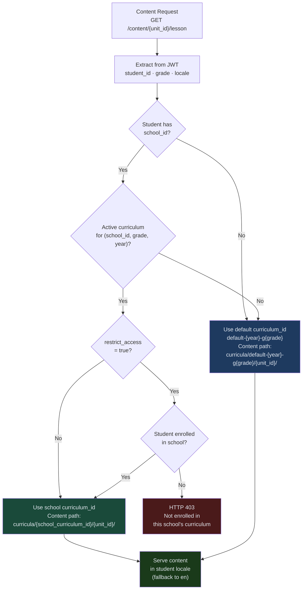

### Content Store Paths

```
{CONTENT_STORE_PATH}/
  {curriculum_id}/          ← same structure for default and school curricula
    {unit_id}/
      lesson_en.json
      lesson_fr.json
      lesson_es.json
      lesson_en.mp3
      quiz_set_1_en.json
      …
      meta.json
```

Default curriculum IDs follow the pattern `default-{year}-g{grade}` (e.g. `default-2026-g8`). School curriculum IDs are UUIDs.

---

## School & Teacher Management

### Roles

| Role | Who | Can do |
|---|---|---|
| `teacher` | Registered educator | Upload curriculum, manage student roster, view class analytics |
| `school_admin` | Designated admin at a school | All teacher actions + manage teachers in the school |
| `platform_admin` | Operator | Manage all schools, trigger pipeline, view all analytics |

Teachers and school admins authenticate separately from students. Their JWT payload includes `{"role": "teacher"|"school_admin", "school_id": "uuid", "teacher_id": "uuid"}`.

### School Registration Flow

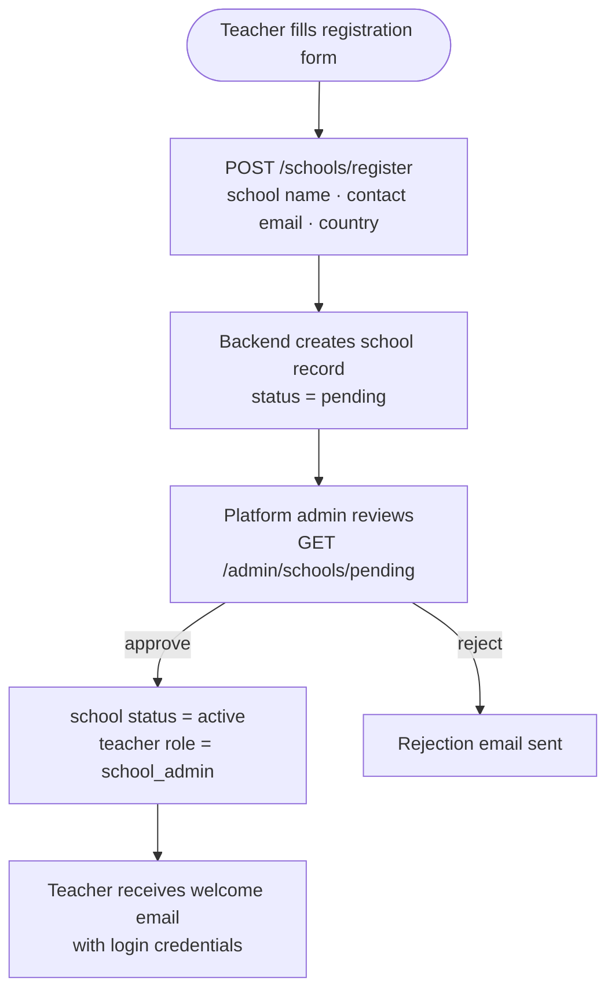

For Phase 8, auto-approve schools (no manual review step) to keep implementation lean. A `status` field is reserved for future gating.

### Teacher Registration

Once a school is active, additional teachers can be invited:
- `POST /schools/{school_id}/teachers/invite` — school_admin sends invite email
- Invited teacher sets password via a one-time token link (same mechanism as password reset)

---

## Curriculum Upload & Management

### Two Upload Methods

**Method A — XLSX Upload**

The teacher downloads a template XLSX file and fills it in:

```
Sheet: Grade_8
| Subject     | Unit Name                  | Unit Code       | Objectives (pipe-separated)          | Has Lab | Lab Description              |
|-------------|----------------------------|-----------------|--------------------------------------|---------|------------------------------|
| Mathematics | Algebra – Linear Equations | MATH-LIN-001    | Solve linear equations|Graph lines   | No      |                              |
| Science     | Measuring Density          | SCI-DEN-001     | Apply density formula|Use equipment  | Yes     | Measure density of solids    |
```

One sheet per grade (tab name = `Grade_5`, `Grade_6`, … `Grade_12`). Sheets for grades not being configured are left empty. The backend parses each sheet into the same JSON structure as the default curriculum files.

**Method B — UI Form**

The teacher uses a web form (Admin Dashboard, Phase 9+) to add subjects and units individually. Internally this produces the same JSON structure as Method A.

### Upload Processing Flow

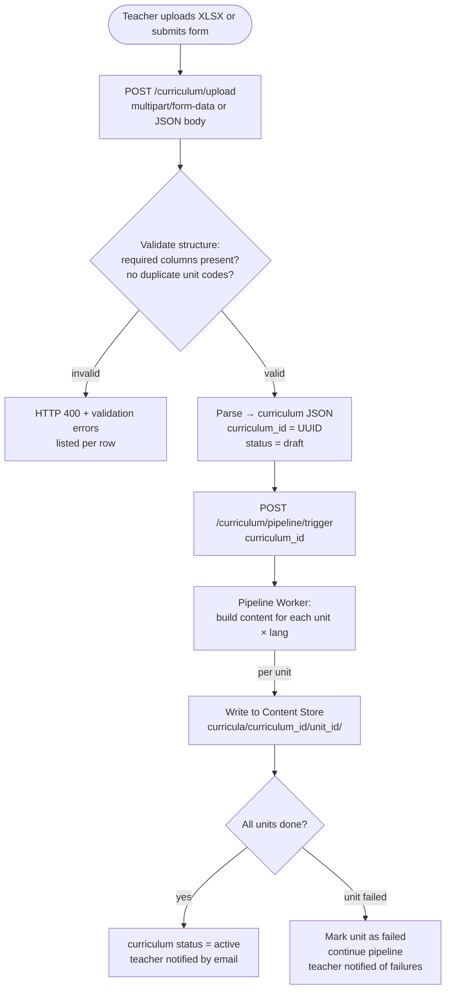

### Curriculum Versioning

A school can have multiple curricula per grade per year — `draft`, `active`, or `archived`. Only one curriculum per `(school_id, grade, year)` can be `active` at a time. Activating a new curriculum archives the previous one. Students mid-session complete their session against the curriculum they started with (same `content_version` mechanic).

### Default Curriculum Per Year

The operator seeds a default curriculum for each grade + year from the existing `data/grade*_stem.json` files. These are loaded at deploy time for each new year:

```bash
python pipeline/seed_default.py --year 2026 --grade 8 --lang en,fr,es
```

This creates a curriculum record with `id = default-2026-g8`, `school_id = null`, and runs the standard pipeline.

### XLSX Template Columns

| Column | Required | Notes |
|---|---|---|
| `Subject` | Yes | e.g. Mathematics, Science, Technology |
| `Unit Name` | Yes | Human-readable unit title |
| `Unit Code` | No | Auto-generated as `{SUBJECT_ABBR}-{SEQ}` if blank |
| `Objectives` | Yes | Pipe-separated list; minimum 2 objectives |
| `Has Lab` | No | `Yes` or `No`; default `No` |
| `Lab Description` | If Has Lab = Yes | One-line description used in experiment prompt |

---

## Student–School Association

### Enrolment Methods

**Teacher-led (roster upload):**
The teacher uploads a CSV or enters a list of student email addresses. These are stored as `pending` enrolment records. When a student with a matching email registers or logs in, their account is linked to the school automatically.

**Student-led (school code):**
Each school has a short `enrolment_code` (e.g. `SPHS-2026`). During registration, a student can optionally enter this code to join a school.

### Association Rules

- A student can be enrolled in **at most one school** at a time.
- If a student's email appears in multiple schools' rosters, the first confirmed enrolment wins; subsequent ones require the student to explicitly switch.
- Un-enrolled students (no school association) see the default curriculum for their grade and the current year.
- When a student transfers schools, their progress history is retained; new sessions use the new school's curriculum.

### Access Restriction

A school can set `restrict_access = true` on a curriculum. When enabled:
- Only enrolled students can access that curriculum.
- Unenrolled students who somehow obtain a `unit_id` from the school's curriculum receive HTTP 403.
- Unenrolled students fall back to the default curriculum automatically.

---

## Extended Analytics

### Time-on-Topic

Every lesson view and quiz attempt is timed at the backend. The mobile app sends start/end events; the backend records them even if the events arrive out of order (offline queue).

**Lesson view lifecycle:**
1. Student opens unit → `POST /analytics/lesson/start` → `{view_id}`
2. Student leaves unit → `POST /analytics/lesson/end` → `{view_id, duration_s, audio_played, experiment_viewed}`

**Quiz attempt lifecycle:**
Already tracked via `POST /progress/session` / `POST /progress/session/end`. The `attempt_number` field is added (see Data Models).

### Analytics Computed Metrics

| Metric | Granularity | Use |
|---|---|---|
| Mean time-on-lesson | Per unit, per subject, per grade | Identify dense units |
| Mean time-per-quiz-attempt | Per unit | Identify complex quizzes |
| Mean attempts-to-pass | Per unit | Flag units needing remediation |
| Pass rate (first attempt) | Per unit | Content quality signal |
| Improvement trajectory | Per student × unit | Track learning gain across attempts |
| Completion rate | Per student, per class | Engagement signal |
| Audio play rate | Per lesson | TTS utility signal |

### Teacher Analytics View

`GET /analytics/school/{school_id}/class?grade=8&subject=Mathematics` returns aggregate metrics per unit for the teacher's class — useful for identifying which topics the whole class is struggling with.

### Student Analytics View

`GET /analytics/student/me` returns the student's own metrics: units attempted, best scores, time spent, attempt counts. Shown on the student's Progress screen.

---

## Student Progress Reports

Students have three self-service report endpoints that power a dedicated Progress section in the mobile app. All data is the student's own — no cross-student data is ever exposed.

### Endpoints

| Method | Path | Description |
|---|---|---|
| GET | `/student/dashboard` | Summary card: streak, completion %, next unit, recent activity |
| GET | `/student/progress` | Full curriculum map with per-unit status badges and pending list |
| GET | `/student/stats?period=7d\|30d\|all` | Usage statistics: time, quiz counts, audio plays, daily activity |

### Report 1 — Progress Dashboard

**Endpoint:** `GET /student/dashboard`

Designed to be the first screen a student sees after login — shows where they are and what to do next.

```json
{
  "summary": {
    "units_completed": 12,
    "quizzes_passed": 10,
    "current_streak_days": 5,
    "total_time_minutes": 320,
    "avg_quiz_score": 78.4
  },
  "subject_progress": [
    {"subject": "Mathematics", "units_total": 8, "units_completed": 3, "pct": 37.5},
    {"subject": "Science",     "units_total": 6, "units_completed": 2, "pct": 33.3}
  ],
  "next_unit": {
    "unit_id": "G8-MATH-004",
    "title": "Algebraic Expressions",
    "subject": "Mathematics",
    "estimated_minutes": 20
  },
  "recent_activity": [
    {"type": "quiz",   "unit_id": "G8-SCI-002",  "title": "Chemical Reactions", "score": 85, "at": "2026-03-22T14:30:00Z"},
    {"type": "lesson", "unit_id": "G8-MATH-003", "title": "Linear Equations",   "at": "2026-03-21T10:00:00Z"}
  ]
}
```

**`next_unit` logic:** first unit in curriculum order with status `not_started` or `needs_retry`; falls back to any `in_progress` unit.

**Performance:** L1/L2 cached (60 s TTL); cache key `dashboard:{student_id}`; invalidated on each `POST /progress/session/end` and on curriculum change.

### Report 2 — Curriculum Progress Map

**Endpoint:** `GET /student/progress`

Shows the complete curriculum with a status badge per unit. Gives the student a clear picture of what is done, what needs a retry, and what is still ahead.

```json
{
  "curriculum_id": "default-2026-g8",
  "pending_count": 12,
  "needs_retry_count": 2,
  "subjects": [
    {
      "subject": "Mathematics",
      "units_total": 8,
      "units_completed": 3,
      "units": [
        {"unit_id": "G8-MATH-001", "title": "Number Systems",       "status": "completed",   "best_score": 90, "attempts": 1, "last_attempt_at": "2026-03-10T09:00:00Z"},
        {"unit_id": "G8-MATH-002", "title": "Fractions & Decimals", "status": "needs_retry", "best_score": 45, "attempts": 2, "last_attempt_at": "2026-03-15T11:00:00Z"},
        {"unit_id": "G8-MATH-003", "title": "Linear Equations",     "status": "in_progress", "best_score": null, "attempts": 0, "last_attempt_at": null},
        {"unit_id": "G8-MATH-004", "title": "Algebraic Expressions","status": "not_started", "best_score": null, "attempts": 0, "last_attempt_at": null}
      ]
    }
  ]
}
```

**Status logic:**

| Status | Condition |
|---|---|
| `completed` | `best_score ≥ QUIZ_PASS_THRESHOLD` (default 60 %) and at least 1 closed session |
| `needs_retry` | At least 1 closed session but `best_score < QUIZ_PASS_THRESHOLD` |
| `in_progress` | An open session exists (started, not yet ended) |
| `not_started` | No sessions for this unit |

**Performance:** backed by materialized view `mv_student_curriculum_progress` (per `student_id × unit_id`); refreshed nightly and on `POST /progress/session/end` via Celery task.

### Report 3 — Usage Statistics

**Endpoint:** `GET /student/stats?period=7d|30d|all`

Gives the student insight into their platform usage — time invested, learning streaks, and day-by-day activity.

```json
{
  "period": "30d",
  "lessons_viewed": 14,
  "quizzes_completed": 12,
  "quizzes_passed": 10,
  "avg_quiz_score": 78.4,
  "total_time_minutes": 320,
  "audio_plays": 8,
  "streak_current_days": 5,
  "streak_longest_days": 9,
  "daily_activity": [
    {"date": "2026-03-22", "lessons": 2, "quizzes": 1, "minutes": 35},
    {"date": "2026-03-21", "lessons": 1, "quizzes": 2, "minutes": 45}
  ]
}
```

**Streak logic:** stored in Redis key `streak:{student_id}` as `{current, longest, last_active_date}`. Updated by the progress write path (Celery task) on the first activity of each calendar day. Never computed from raw DB rows on request.

**`daily_activity`** is served from the `lesson_views` table (read replica), grouped by `DATE(started_at)`, for the requested period.

### Mobile Screens

| Screen | Route | Description |
|---|---|---|
| `ProgressDashboardScreen` | tapped from home "My Progress" button | Dashboard summary: streak badge, subject completion rings, Next Unit card, recent activity list |
| `CurriculumMapScreen` | tapped from Progress Dashboard | Full subject/unit list with coloured status badges; tapping a unit navigates to lesson or quiz |
| `StatsScreen` | tapped from Progress Dashboard | Period picker (7d / 30d / All time), stat cards, daily activity bar chart |

### Architecture Flow

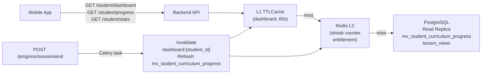

---

## Student Feedback

### Feedback Categories

| Category | Trigger | Examples |
|---|---|---|
| `content` | Button on lesson or quiz screen | "Wrong answer in quiz", "Explanation is confusing" |
| `ux` | Button in Settings or after quiz | "Text is too small", "Button doesn't work" |
| `general` | Dedicated Feedback screen | "I wish there were more examples", "Love the audio!" |

### Feedback Flow

- A **"Give Feedback"** button is accessible from the lesson screen, the result screen, and the Settings screen.
- The feedback form collects: category, optional `unit_id` (auto-filled on lesson/quiz screens), a free-text message (max 500 characters), and an optional rating (1–5 stars for content and UX categories).
- Submitted via `POST /feedback`.
- Feedback is stored in the `feedback` table and surfaced in the Admin Dashboard.
- No student is required to provide feedback; it is always optional.
- Rate-limited to 5 feedback submissions per student per hour to prevent spam.

---

## Teacher & School Reporting

### Overview

Teachers and school admins have access to six report types covering lesson engagement, quiz performance, individual student progress, curriculum quality, content feedback, and usage trends. All reports draw from data already collected by the Progress Service (Phase 3) and Analytics Service (Phase 10).

Reports are available through:
- **Teacher Dashboard** — always-on web views with filtering and drill-down
- **Weekly Email Digest** — opt-in summary of the past 7 days; configurable
- **CSV Export** — any report table can be exported to a spreadsheet
- **Threshold Alerts** — email + in-dashboard notifications when key metrics cross configured thresholds

```mermaid
graph TD
    subgraph DATA_SOURCES["Data Sources (collected in Phases 3 + 10)"]
        LV["lesson_views\nstart · end · duration\naudio_played · experiment_viewed"]
        SES["sessions\nattempt_number · score\npassed · duration_s"]
        PA["progress_answers\ncorrect/incorrect · ms_taken"]
        FB["feedback\ncategory · rating · message"]
    end

    subgraph AGGREGATION["Aggregation Layer (Celery Beat + Materialized Views)"]
        MV1["mv_unit_struggle\npass rate · avg attempts · avg score\nRefreshed nightly"]
        MV2["mv_class_summary\nper (school_id, curriculum_id, unit_id)\nlesson views · quiz attempts · engagement\nRefreshed nightly"]
        MV3["mv_student_progress\nper (student_id, curriculum_id)\ncompletion · scores · time\nRefreshed nightly"]
    end

    subgraph REPORTS["Report Endpoints (Teacher Dashboard)"]
        R1["Class Overview\nGET /reports/school/{id}/overview"]
        R2["Unit Performance\nGET /reports/school/{id}/unit/{unit_id}"]
        R3["Student Progress\nGET /reports/school/{id}/student/{student_id}"]
        R4["Curriculum Health\nGET /reports/school/{id}/curriculum-health"]
        R5["Feedback Report\nGET /reports/school/{id}/feedback"]
        R6["Trend Report\nGET /reports/school/{id}/trends?period=4w"]
    end

    subgraph DELIVERY["Delivery"]
        DASH["Teacher Dashboard\nFilters · Drill-down\nSort · Paginate"]
        EMAIL["Weekly Digest\nOpt-in · Configurable\nSent Monday 08:00 local"]
        CSV["CSV Export\nPOST /reports/school/{id}/export"]
        ALERT["Threshold Alerts\nEmail + Dashboard badge"]
    end

    DATA_SOURCES --> AGGREGATION
    AGGREGATION --> REPORTS
    REPORTS --> DELIVERY
```

---

### Report 1 — Class Overview

**Endpoint:** `GET /reports/school/{school_id}/overview?period=7d|30d|term`

A single-screen summary of the class's activity and health for the selected period. This is the default landing page of the Teacher Dashboard.

| Field | Description |
|---|---|
| `enrolled_students` | Total students on the school roster |
| `active_students_period` | Students who viewed at least one lesson in the period |
| `active_pct` | `active_students / enrolled × 100` |
| `lessons_viewed` | Total lesson view events in the period |
| `quiz_attempts` | Total quiz sessions in the period |
| `class_avg_score_pct` | Mean score across all quiz sessions in the period |
| `first_attempt_pass_rate_pct` | % of first-attempt quiz sessions with `passed = true` |
| `audio_play_rate_pct` | % of lesson views where `audio_played = true` |
| `units_with_struggles` | Unit IDs where `first_attempt_pass_rate < 50%` OR `avg_attempts_to_pass > 2` |
| `units_no_activity` | Unit IDs in the curriculum with zero lesson views |
| `unreviewed_feedback_count` | Open feedback items for this school's curriculum |

---

### Report 2 — Unit Performance

**Endpoint:** `GET /reports/school/{school_id}/unit/{unit_id}?period=7d|30d|term`

A deep-dive into one unit. Answers: are students engaging with this lesson? Are they passing the quiz? Is the content too hard or too easy?

| Field | Description |
|---|---|
| `students_viewed_lesson` | Unique students who opened the lesson |
| `lesson_view_pct` | `students_viewed / enrolled × 100` |
| `avg_lesson_duration_s` | Mean time students spent on the lesson screen |
| `audio_play_rate_pct` | % of lesson views with audio played |
| `experiment_view_pct` | % of lesson views where experiment was opened (null if no lab) |
| `total_quiz_attempts` | Total quiz sessions for this unit |
| `unique_students_attempted` | Distinct students who attempted the quiz |
| `first_attempt_pass_rate_pct` | % of first attempts that passed |
| `avg_score_pct` | Mean score across all attempts |
| `avg_attempts_to_pass` | Mean attempt count for students who passed |
| `score_distribution` | `{1-2: N, 3-4: N, 5-6: N, 7-8: N}` (buckets out of 8) |
| `attempt_distribution` | `{1: N, 2: N, 3: N, "4+": N}` students per attempt count |
| `struggle_flag` | `true` if pass rate < 50% OR avg_attempts > 2 |
| `feedback_count` | Feedback submissions for this unit |
| `avg_rating` | Mean rating (1–5) from feedback |
| `feedback_summary` | Top 3 most recent feedback messages |

---

### Report 3 — Student Progress

**Endpoint:** `GET /reports/school/{school_id}/student/{student_id}`

A per-student report card. Useful when a teacher wants to check on a struggling student or prepare a parent-teacher meeting.

| Field | Description |
|---|---|
| `student_name` | Student's name |
| `grade` | Enrolled grade |
| `last_active` | Timestamp of most recent lesson view or quiz attempt |
| `units_completed` | Count of units where `passed = true` (at least once) |
| `units_in_progress` | Count of units: lesson viewed but quiz not yet passed |
| `units_not_started` | Count of units with no lesson view |
| `completion_pct` | `units_completed / total_units × 100` |
| `overall_avg_score_pct` | Mean score across all passed quiz sessions |
| `total_time_spent_s` | Sum of lesson view durations + quiz session durations |
| `per_unit` | Array: `{unit_id, unit_name, subject, lesson_viewed, quiz_attempts, best_score, passed, avg_duration_s}` |
| `strongest_subject` | Subject with highest avg score |
| `needs_attention_subject` | Subject with lowest avg score or most attempts |

---

### Report 4 — Curriculum Health

**Endpoint:** `GET /reports/school/{school_id}/curriculum-health`

An overview of all units ranked by how well students are doing. Helps the teacher identify which units may need enrichment, extra class time, or a content quality report to the platform.

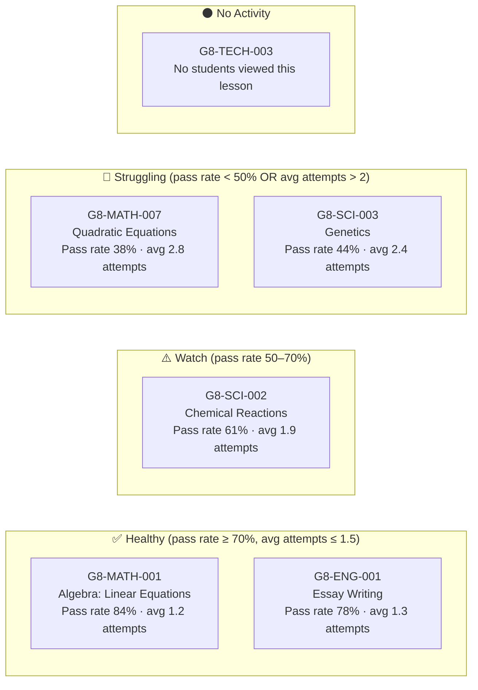

| Health tier | Criteria |
|---|---|
| Healthy | First-attempt pass rate ≥ 70% AND avg attempts to pass ≤ 1.5 |
| Watch | First-attempt pass rate 50–70% OR avg attempts 1.5–2.0 |
| Struggling | First-attempt pass rate < 50% OR avg attempts > 2.0 |
| No Activity | Zero lesson views from enrolled students |

Each unit entry also shows: `feedback_count`, `avg_rating`, and a `recommended_action` field with one of: `none | review_content | add_class_time | report_to_admin`.

---

### Report 5 — Feedback Report

**Endpoint:** `GET /reports/school/{school_id}/feedback?unit_id=&category=&reviewed=&sort=recent|volume`

All student feedback for the school's curriculum, grouped by unit. Gives the teacher visibility into what students are saying about the content.

| Field | Description |
|---|---|
| `total_feedback_count` | Total feedback items for this curriculum |
| `unreviewed_count` | Items not yet marked reviewed |
| `avg_rating_overall` | Mean rating across all rated feedback |
| `by_unit` | Array of unit summaries (see below) |

Per unit:
| Field | Description |
|---|---|
| `unit_id`, `unit_name` | Identifies the unit |
| `feedback_count` | Total feedback for this unit |
| `avg_rating` | Mean rating (null if no ratings) |
| `category_breakdown` | `{content: N, ux: N, general: N}` |
| `trending` | `true` if > 3 feedback items in the last 7 days |
| `feedback_items` | Paginated list: `{feedback_id, category, rating, message, submitted_at, reviewed}` |

Teachers can mark individual feedback items as reviewed directly from this report. Reviewed items are hidden by default (toggle to show).

---

### Report 6 — Trend Report

**Endpoint:** `GET /reports/school/{school_id}/trends?period=4w|12w|term`

Week-over-week engagement and performance trends. Helps the teacher see if the class is improving over time or if attention has dropped.

| Metric | Chart type | Description |
|---|---|---|
| Active students | Line chart | Unique students per week |
| Lessons viewed | Bar chart | Total lesson views per week |
| Quiz attempts | Bar chart | Total quiz sessions per week |
| Class avg score | Line chart | Mean score per week across all units |
| Pass rate | Line chart | First-attempt pass rate per week |
| Audio play rate | Line chart | % of lesson views with audio per week |
| Feedback volume | Bar chart | Feedback submissions per week |

---

### Alert System

Teachers can configure threshold alerts that trigger an email notification and a badge in the Teacher Dashboard.

| Alert | Default threshold | Configurable |
|---|---|---|
| Unit pass rate drops below threshold | 50% | Yes |
| Unit receives N+ feedback items in 7 days | 3 | Yes |
| Student has not logged in for N days | 14 | Yes |
| Class average score drops > 10% week-over-week | 10% | Yes |
| New unreviewed feedback waiting | Immediate | On/Off |

Alert settings stored per school in `report_alert_settings`. Alerts evaluated by Celery Beat daily at 06:00 UTC.

---

### Weekly Email Digest

Opt-in. Sent Monday 08:00 in the teacher's local timezone. Covers the past 7 days.

Contents:
1. Active students this week vs last week
2. Top 3 most-engaged units (highest lesson view count)
3. Units flagged as struggling (if any new ones appeared this week)
4. New feedback items count + link to Feedback Report
5. Any students not active for 14+ days (engagement alert)
6. Link to full Teacher Dashboard

**Endpoint:** `POST /reports/school/{school_id}/digest/subscribe` — `{email, timezone, enabled}`

---

### Aggregation Strategy

Report data is served from materialized views, not from raw event tables. This keeps report queries fast and does not touch the write path.

```
mv_class_summary        — per (school_id, curriculum_id, unit_id)
                          lesson views · quiz attempts · pass rates · avg scores
                          Refreshed: nightly 02:00 UTC by Celery Beat

mv_student_progress     — per (student_id, curriculum_id)
                          completed units · scores · time · attempt counts
                          Refreshed: nightly 02:00 UTC

mv_unit_struggle        — per (unit_id, curriculum_id)
                          pass rate · avg attempts · avg score
                          Refreshed: nightly 02:00 UTC (already defined)

mv_feedback_summary     — per (curriculum_id, unit_id)
                          feedback count · avg rating · category breakdown
                          Refreshed: hourly (feedback is time-sensitive)
```

For the Teacher Dashboard, data may be up to 24 hours stale (nightly refresh). A "Last updated" timestamp is shown on every report. On-demand refresh available for school_admin role (triggers immediate Celery task).

---

## Technology Stack

| Layer | Technology | Rationale |
|---|---|---|
| Mobile app | Python + Kivy (existing) | Reuse Free edition codebase; one tree → Android + iOS |
| Backend API | FastAPI + uvicorn (Python) | Same language as app; async-native; auto-generates OpenAPI docs |
| Process manager | gunicorn | Manages uvicorn worker processes; graceful reload |
| Database | PostgreSQL | Relational; good for progress/session/subscription queries |
| Async PostgreSQL driver | asyncpg | Fastest Python PostgreSQL driver; native async; replaces synchronous ORM for hot paths |
| Connection pooler | PgBouncer | Transaction-mode pooling in front of PostgreSQL; prevents connection exhaustion |
| Content Store | Filesystem (Phase 1–3), S3 (Phase 4+) | Start simple; migrate to S3 for scale |
| CDN | CloudFront / Cloudflare | Sits in front of S3; serves audio MP3s and large JSON at edge; no API server bandwidth cost |
| Cache | Redis | JWT token store; hot content cache; entitlement cache; Celery broker |
| In-process cache | cachetools TTLCache | Zero-cost LRU+TTL per worker; no network hop for curriculum tree and JWT keys |
| Background tasks | Celery + Redis broker | Mature; retry/backoff; task routing; Beat scheduler for nightly jobs |
| Circuit breaker | circuitbreaker library | Wraps all external API calls (Stripe, Anthropic, TTS, SES) |
| Content pipeline | Python CLI scripts | Runs Claude API calls offline; same prompts.py as Free edition |
| Auth | JWT (python-jose) | Stateless; works offline between refreshes |
| Payments | Stripe | Industry standard; hosted checkout removes PCI scope |
| TTS | Amazon Polly / Google Cloud TTS | Both support en/fr/es; pre-generate at pipeline time |
| i18n (UI strings) | Static dict bundled in app | No runtime API; offline; simple to maintain |
| Deployment | Docker Compose (dev) / ECS or K8s (prod) | Reproducible environments; horizontal scaling in production |
| CI | GitHub Actions | Tests + lint on push; pipeline dry-run on PR |

---

## Phased Implementation Plan

### Phase 1 — Backend Foundation
**Goal:** Students can register via Auth0 and browse the curriculum. Internal team can log in locally.

- FastAPI project skeleton with health check
- PostgreSQL schema: `students`, `teachers`, `admin_users`, `sessions`
- Auth0 tenant configured; JWKS endpoint cached in L1 TTLCache
- `POST /auth/exchange` (student token exchange), `POST /auth/teacher/exchange`
- `POST /auth/refresh` (internal JWT refresh; no Auth0 call)
- `POST /auth/forgot-password` (delegates to Auth0 Management API)
- `POST /admin/auth/login`, `POST /admin/auth/forgot-password`, `POST /admin/auth/reset-password`
- Account management endpoints: status PATCH for students, teachers, schools
- `account_status` check in JWT auth middleware (Redis `suspended:{id}` set)
- Auth0 sync on suspension via Celery task
- `GET /curriculum`, `GET /curriculum/{grade}` (serves existing JSON files)
- Mobile: Auth0 SDK integration; JWT stored securely; locale from internal JWT
- Configure PgBouncer in Docker Compose; asyncpg + aioredis pools in lifespan context

**Milestone:** Student logs in via Auth0, browses curriculum. Admin suspends a student account; student JWT is rejected immediately. Internal team logs in with local credentials.

---

### Phase 2 — Content Pipeline + Delivery (English)
**Goal:** Lessons and quizzes load instantly from pre-generated English content, gated behind the review workflow.

- Content generation CLI: `build-grade --grade N --lang en` iterates all units, calls Claude, stores JSON
- AlexJS runs after each unit is generated; results written to `alex_report.json`
- `content_subject_versions` record created per subject in `ready_for_review` or `needs_review` state
- PostgreSQL schema: `content_subject_versions`, `content_reviews`, `content_annotations`, `content_blocks`, `student_content_feedback`
- `REVIEW_AUTO_APPROVE=true` in dev `.env` bypasses the review gate for local development
- `GET /content/{unit_id}/lesson`, `GET /content/{unit_id}/quiz`
- Content endpoint guard: serve only if `content_subject_version.status = 'published'` AND no active block
- Content Store: local filesystem (easily swapped to S3)
- Mobile app: SubjectScreen and QuizScreen call content endpoints instead of Claude directly
- Local SQLite cache on device: cache content by `unit_id + content_version + lang`
- Entitlement middleware: track `lessons_accessed`; return HTTP 402 after 2 for free-tier students
- `SubscriptionScreen` stub (no real payment yet — shows "Coming soon" or manual activation)
- Set up Redis L2 caching for entitlement and content; nginx rate limiting
- In-process L1 TTLCache for curriculum tree and JWT keys (cachetools)

**Milestone:** Full lesson + quiz flow with instant English content. No Anthropic API key required by student. Content gated by review status (auto-approved in dev).

---

### Phase 3 — Progress Tracking
**Goal:** All quiz activity is recorded server-side; students have a self-service progress view.

- Progress Service: session, answer, session/end endpoints
- Mobile app: post progress events after each answer and on session end
- `GET /progress/student` — raw answer history
- `GET /student/dashboard` — aggregated summary card (streak, completion %, next unit)
- `GET /student/progress` — curriculum map with per-unit status badges
- `GET /student/stats?period=7d|30d|all` — usage statistics with daily activity
- Streak counter in Redis (`streak:{student_id}`); updated by Celery on first daily activity
- Materialized view `mv_student_curriculum_progress` populated on first session end
- Mobile: `ProgressDashboardScreen`, `CurriculumMapScreen`, `StatsScreen`
- Result screen shows backend-confirmed score

**Milestone:** A student can reinstall the app, see their full quiz history, and know exactly which topics to tackle next.

---

### Phase 4 — Offline Sync + Multi-language + TTS
**Goal:** App works on spotty connections; French and Spanish content available; lessons read aloud.

- Local SQLite progress event queue on device
- Sync manager: flush queue on app foreground / network restore
- Content freshness check: compare `content_version + lang` in cache vs. backend; re-download if stale
- Pipeline extended: `--lang fr,es` generates French and Spanish content alongside English
- Mobile: Settings screen adds language picker; switches locale and clears content cache
- TTS pipeline step: generate `lesson_{lang}.mp3` for each lesson
- `GET /content/{unit_id}/lesson/audio` endpoint
- Mobile: "🔊 Listen" button on SubjectScreen; downloads and plays MP3; cached for offline
- Configure CloudFront CDN in front of S3; pre-signed URL generation for audio
- Cache-Control headers set on S3 objects (lesson JSON: 1 hr, MP3: 24 hr)

**Milestone:** Student can switch to French or Spanish and hear lessons read aloud, even offline after first download.

---

### Phase 5 — Subscription + Payments
**Goal:** Revenue model live; students can upgrade to paid plan.

- PostgreSQL `subscriptions` table
- `POST /subscription/checkout` — creates Stripe Checkout Session
- `POST /subscription/webhook` — handles Stripe lifecycle events
- `GET /subscription/status` — returns plan + entitlement state
- Mobile: `SubscriptionScreen` with plan cards, Stripe checkout in-app browser, confirmation screen
- Entitlement cache in Redis: subscription status cached per student for 5 minutes

**Milestone:** Student on free tier hits the paywall, subscribes via Stripe, and immediately accesses all content.

---

### Phase 6 — Experiment Visualization
**Goal:** Lab-bearing units show an interactive experiment guide.

- Pipeline: detect `assessments.labs` in curriculum JSON; generate `experiment_{lang}.json` for those units
- `GET /content/{unit_id}/experiment` endpoint (404 if no lab)
- Mobile: `ExperimentScreen` — step-by-step card layout with diagram hints
- "🔬 Experiment" button on SubjectScreen, visible only when experiment content exists
- Experiment content cached alongside lesson JSON

**Milestone:** A Grade 8 Science student can walk through a guided density experiment with step-by-step instructions.

---

### Phase 7 — Admin Dashboard + Analytics + Content Review UI
**Goal:** Operator and teachers can manage content, review and approve subject versions, and see student activity.

- Admin API: content build status, regenerate single unit/language, list students, view aggregate scores
- **RBAC enforcement:** `require_permission()` dependency wired to all admin and review endpoints
- **Content review queue UI:** list subject versions by status; open review session; annotate words/phrases
- **Dictionary/thesaurus integration:** `GET /admin/content/dictionary` backed by Datamuse + Merriam-Webster
- **Rating submission:** language appropriateness (1–5) + content appropriateness (1–5) per version
- **Approve / reject / regenerate workflow** — rejection with `regenerate=true` dispatches Celery pipeline task
- **Publish + version history:** `POST /admin/content/versions/{version_id}/publish`; version list with rollback button
- **Access block UI:** block/unblock any subject at school or platform level
- **Student marked-text feedback list:** reviewers see student-flagged passages in context
- Subscription analytics: MRR, churn, conversion rate (free → paid)
- Identify high-struggle units across all students (questions with >60% wrong rate)
- Simple web dashboard (FastAPI + Jinja2 templates or React)

**Milestone:** Product admin can review AlexJS-flagged content, annotate with word suggestions, approve and publish a subject version. Teacher/school_admin can block content access for their school. Students can access only published, unblocked content.

---

### Phase 8 — School & Teacher Registration + Curriculum Upload
**Goal:** A school or teacher can register, upload their own STEM curriculum, and trigger content generation for it.

- PostgreSQL schema: `schools`, `teachers`, `school_enrolments`, `curricula`, `curriculum_units`
- `POST /schools/register` — school creates account; auto-approve in Phase 8
- Teacher auth: separate JWT with `role` and `school_id`; reuse password reset + invite flow
- XLSX template download: `GET /curriculum/template`
- XLSX upload: `POST /curriculum/upload` — parse, validate, store as `curriculum_units` rows; return errors per row
- UI form upload: same endpoint with JSON body
- `POST /curriculum/pipeline/trigger` — kicks off content generation for a custom curriculum
- Pipeline extended: accepts `curriculum_id` parameter; reads units from DB instead of local JSON file
- Content Store path: `{curriculum_id}/{unit_id}/…` (same layout as default)
- `GET /curriculum/pipeline/{job_id}/status` — polling endpoint for pipeline progress

**Milestone:** A teacher can register, upload a Grade 8 STEM syllabus via XLSX, trigger generation, and receive an email when content is ready.

---

### Phase 9 — Student–School Association + Curriculum Routing
**Goal:** Enrolled students see their school's curriculum; all others see the default.

- `POST /schools/{school_id}/enrolment` — teacher uploads student email roster
- Student registration: if email matches a `pending` enrolment record → auto-link to school; set `student.school_id`
- Student registration: optional `enrolment_code` field for student-led join
- Curriculum resolver middleware: on every `/content/*` request, resolve `curriculum_id` from (student.school_id, grade, year) or fall back to default
- `restrict_access` enforcement: HTTP 403 if school curriculum has `restrict_access = true` and student is not enrolled
- `PUT /curriculum/{curriculum_id}/activate` — activates curriculum, archives previous active one
- Mobile: Settings screen shows enrolled school name; "Leave school" option

**Milestone:** Enrolled students see their school's units. Unenrolled students see the default. A teacher can confirm which students have joined.

---

### Phase 10 — Extended Analytics + Student Feedback
**Goal:** Detailed time-on-topic and attempt tracking; student feedback collected and visible to teachers and admins.

- PostgreSQL schema: `lesson_views`, `feedback`
- Add `attempt_number`, `curriculum_id`, `passed` to `sessions` table (Alembic migration)
- `POST /analytics/lesson/start` and `POST /analytics/lesson/end` — record lesson view duration
- `GET /analytics/student/me` — student's own metrics (scores, time, attempt counts, improvement)
- `GET /analytics/school/{school_id}/class` — teacher's class aggregate per unit
- `GET /analytics/unit/{unit_id}/summary` — platform-wide metrics (admin only)
- Struggle flag: surface units where mean-attempts-to-pass > 2 or pass-rate < 50%
- `POST /feedback` — rate-limited to 5/student/hour
- `GET /admin/feedback` — paginated + filterable by category, unit, date
- Mobile: "Give Feedback" button on lesson, result, and Settings screens
- Mobile: Progress screen shows student's own analytics (time spent, attempts, scores)
- Admin Dashboard: feedback review panel + analytics visualisations

**Milestone:** A teacher can see which units their class is struggling with and how long students are spending. Students can report content issues. Admin can review and act on feedback.

---

### Phase 11 — Teacher & School Reporting Dashboard
**Goal:** Teachers can see lesson engagement, quiz performance, student progress, curriculum quality, and student feedback — all in one dashboard, with weekly email digests and threshold alerts.

- PostgreSQL schema: `report_alert_settings`, `digest_subscriptions` (Alembic migration)
- Materialized views: `mv_class_summary`, `mv_student_progress`, `mv_feedback_summary` (add to Celery Beat nightly refresh)
- All 6 report endpoints: overview · unit · student · curriculum-health · feedback · trends
- `POST /reports/school/{id}/export` — CSV generation (async Celery task, returns download URL)
- `PUT /reports/school/{id}/alerts/settings` — save threshold configuration
- Alert evaluation Celery Beat task: runs daily 06:00 UTC, sends email on threshold breach
- `POST /reports/school/{id}/digest/subscribe` — subscribe teacher to weekly digest
- Weekly digest Celery Beat task: runs Monday 08:00 per timezone; renders and sends email
- `POST /reports/school/{id}/refresh` — on-demand materialized view refresh for school_admin
- Teacher Dashboard: Report landing page, unit drill-down, student report card, curriculum health view with tier badges, feedback review panel
- All report endpoints route to PostgreSQL read replica; never touch primary
- "Last updated" timestamp shown on all report pages (materialized view refresh time)

**Milestone:** A teacher can open the dashboard on Monday morning and immediately see which units the class struggled with last week, which students haven't logged in, and what feedback has been submitted — without writing a single query.

---

## Improvements Over the Original Proposal

The following were added beyond the initial specification:

1. **3 quiz sets per unit** — prevents identical questions on retake; rotated randomly
2. **Content versioning** (`meta.json`) — allows selective regeneration without disrupting in-progress students
3. **Offline-first sync** — progress events queued locally, flushed on reconnect
4. **Per-answer logging** — enables adaptive difficulty and struggle analytics in Phase 7
5. **Grade gating** — backend controls which grades are visible per student; natural upgrade path
6. **JWT refresh** — sessions stay alive across days without re-login
7. **Shared `prompts.py`** — content pipeline reuses the same grade-aware prompt builders as the Free edition
8. **Subscription service** — freemium model: 2 free lessons, then monthly/annual paid via Stripe
9. **Multi-language** — English, French, Spanish; pre-generated per language at pipeline time; locale in JWT
10. **Text-to-speech** — lesson audio pre-generated (Amazon Polly / Google TTS); offline playback
11. **Experiment visualization** — lab units get an interactive step-by-step experiment guide

---

## UX Comparison

| Experience | Free Edition | OnDemand Edition |
|---|---|---|
| Registration | Name + Anthropic API key | Name + email + password + language |
| Lesson load time | 5–10 s (live Claude call) | Instant (pre-generated cache) |
| Quiz load time | 5–10 s + truncation risk | Instant |
| Offline use | None | Full lesson + quiz + audio from local cache |
| Progress after reinstall | Lost | Restored from backend |
| Cost to student | Pay-per-token to Anthropic | 2 free lessons, then subscription |
| Multi-device | Not supported | Supported (progress syncs) |
| Languages | English only | English, French, Spanish |
| Lessons read aloud | No | Yes (TTS audio, offline after download) |
| Lab experiments | Not supported | Interactive experiment guide for lab units |
| Teacher/parent visibility | None | Available in Phase 7 |
