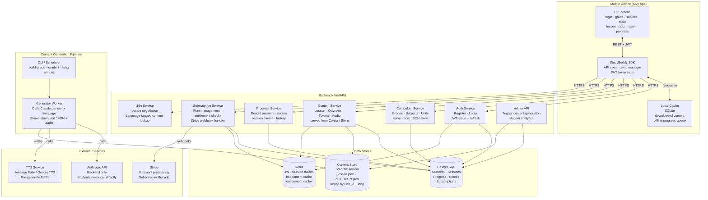
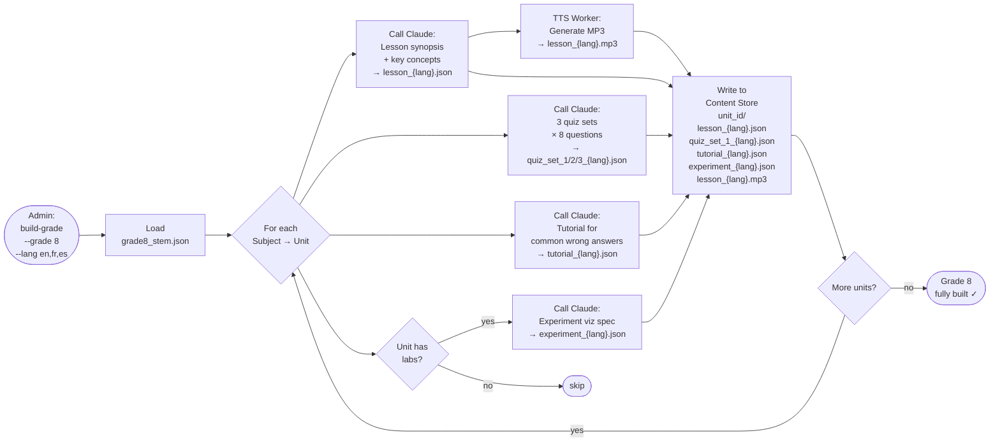
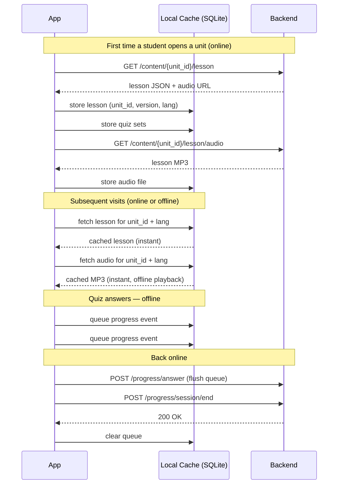

# StudyBuddy OnDemand — Architecture

**Version:** 0.2.0 (Design Phase — Feature Expansion)
**Last updated:** 2026-03-23

---

## Background & Motivation

The Free edition (studybuddy_free) validated the product concept but exposed two architectural limits:

- **Performance** — every lesson and quiz is generated live on the device via the Anthropic API. On a mobile connection this takes 5–10 seconds per request and is prone to timeouts for longer responses.
- **Value to the student** — requiring the student to supply and manage their own Anthropic API key creates a registration barrier that most students cannot clear.

The OnDemand architecture eliminates both by moving all AI interaction to a backend pipeline and delivering pre-generated content to the app.

---

## System Overview



---

## Content Generation Pipeline

This is the cornerstone of the OnDemand architecture. All Claude API calls happen here — offline, before students use the app — so students receive instant content.



**Why 3 quiz sets per unit?** A student who retakes a topic after review sees a different set of questions. Sets rotate randomly on each attempt.

**When to run the pipeline:**
- At initial deployment for all supported grades × all supported languages
- When curriculum JSON files are updated
- When Claude prompt quality is improved (regenerate selectively by grade/unit/language)
- When a new language is added (regenerate only the new language column)

---

## Subscription Model

### Tiers

| Tier | Access | Price |
|---|---|---|
| Free | 2 lessons (any unit, any subject) | $0 |
| Monthly | All lessons + quizzes, all grades | TBD |
| Annual | Same as Monthly + priority support | TBD (discounted) |

### Free Tier Gating Rules

- **Entitlement check happens on the backend**, not on the mobile app. The mobile app never decides access on its own.
- A student's `lessons_accessed` count is tracked in PostgreSQL per student.
- After 2 distinct lesson views, `GET /content/{unit_id}/lesson` returns HTTP 402 with a `SUBSCRIPTION_REQUIRED` payload.
- Quiz access follows lesson access: a student can take the quiz for a unit they have viewed.
- The mobile app listens for HTTP 402 and transitions to `SubscriptionScreen`.
- Free lesson count resets never — the 2 lessons are a permanent trial, not a daily/weekly limit.

### Subscription Flow


### Payment Integration (Stripe)

- **Checkout:** `POST /subscription/checkout` creates a Stripe Checkout Session; returns a URL. Mobile opens URL in an in-app browser or system browser.
- **Webhook:** Stripe sends events to `POST /subscription/webhook`. Backend validates signature, updates `subscriptions` table.
- **Events handled:** `checkout.session.completed`, `customer.subscription.updated`, `customer.subscription.deleted`, `invoice.payment_failed`.
- The Stripe secret key and webhook signing secret live only in backend environment variables.

---

## Multi-Language Support

### Supported Languages

| Code | Language |
|---|---|
| `en` | English |
| `fr` | French |
| `es` | Spanish |

### Architecture Decisions

- **Content is pre-generated per language.** The pipeline calls Claude once per language per unit. There is no runtime translation.
- **Content Store keys include language:** `{unit_id}/lesson_en.json`, `{unit_id}/lesson_fr.json`, `{unit_id}/lesson_es.json`.
- **Locale is set at registration** and stored in the student profile. Students can change it in Settings.
- **The backend negotiates locale:** `GET /content/{unit_id}/lesson` reads the student's locale from the JWT payload and serves the matching file. If a language file is missing, falls back to `en`.
- **UI strings are separate from content.** App UI labels (button text, navigation, error messages) are translated via a static `i18n/` dictionary bundled in the app — not generated by Claude.
- **Quiz questions and answers are language-matched.** Each `quiz_set_N_{lang}.json` contains questions, answer choices, and explanations in the target language.

### Locale in JWT

JWT payload includes `locale`:
```json
{"student_id": "uuid", "grade": 8, "locale": "fr", "exp": 1234567890}
```

The pipeline prompt builders receive a `lang` parameter and instruct Claude to respond entirely in that language at the student's grade level.

---

## Text-to-Speech (Lessons Read Aloud)

### Design

- **Pre-generated audio, not runtime TTS.** The pipeline generates an MP3 file for each lesson in each language. Students tap a play button to stream or play the cached file.
- **TTS provider:** Amazon Polly (primary) or Google Cloud TTS — both support English, French, and Spanish at educational reading pace. Provider is configurable via `TTS_PROVIDER` in pipeline `config.py`.
- **Audio stored in Content Store** alongside lesson JSON: `{unit_id}/lesson_{lang}.mp3`.
- **Mobile playback:** Kivy's `SoundLoader` can play MP3s. The audio file is downloaded to local SQLite cache alongside lesson JSON. Once cached, playback is offline.
- **Backend delivery:** `GET /content/{unit_id}/lesson/audio` returns a signed URL (S3) or a streaming response (filesystem). The mobile app downloads to the local cache directory.

### Pipeline Step

```python
# pipeline/build_unit.py (sketch)
text = lesson_data["synopsis"] + " " + " ".join(lesson_data["key_concepts"])
audio_bytes = tts_client.synthesize(text, lang=lang, voice=TTS_VOICES[lang])
content_store.write(f"{unit_id}/lesson_{lang}.mp3", audio_bytes)
```

### TTS Voice Configuration

| Language | Amazon Polly Voice | Google TTS Voice |
|---|---|---|
| English | Joanna (female) | en-US-Standard-C |
| French | Céline | fr-FR-Standard-C |
| Spanish | Penélope | es-ES-Standard-A |

Voices are configurable in `pipeline/config.py`. Educational reading rate: 90% of default speed.

---

## Experiment Visualization

### Purpose

Some curriculum units include hands-on laboratory experiments (e.g. `G8-SCI-001` — Integrated Science). For these units, the app displays an interactive experiment guide that walks the student through the procedure with step-by-step visual aids.

### Detection

The pipeline checks the `assessments.labs` field in the grade curriculum JSON:
```json
{
  "unit_id": "G8-SCI-001",
  "assessments": {
    "labs": ["Measuring density of solids and liquids"]
  }
}
```
If `assessments.labs` is non-empty, the pipeline generates `experiment_{lang}.json`.

### Experiment JSON Schema

```json
{
  "unit_id": "G8-SCI-001",
  "experiment_title": "Measuring Density of Solids and Liquids",
  "materials": ["Graduated cylinder", "Balance scale", "Water", "Rock sample"],
  "safety_notes": ["Wear safety goggles", "Handle glass carefully"],
  "steps": [
    {
      "step_number": 1,
      "instruction": "Fill the graduated cylinder to the 50 mL mark with water.",
      "diagram_hint": "graduated cylinder with water level at 50 mL line",
      "expected_observation": "Meniscus curves downward at exactly 50 mL"
    }
  ],
  "questions": [
    {
      "question": "What happens to the water level when you add the rock?",
      "answer": "The water level rises by a volume equal to the volume of the rock."
    }
  ],
  "conclusion_prompt": "Calculate the density using mass ÷ volume. What did you find?"
}
```

### Visualization Component (Mobile)

- `ExperimentScreen` renders the experiment guide as a vertical step-by-step card list.
- Each step card shows: instruction text, a `diagram_hint` rendered as an SVG or ASCII diagram, and an `expected_observation` shown after student confirms they are ready.
- Navigation: Previous / Next step buttons + progress indicator.
- Accessed from `SubjectScreen` via an "🔬 Experiment" button (only shown when `experiment_{lang}.json` exists for the unit).
- Fully offline after first download — experiment JSON is cached alongside lesson JSON.

### Pipeline Prompt

The experiment visualization prompt instructs Claude to:
1. Extract the lab procedure from the curriculum context.
2. Break it into discrete, observable steps (5–10 steps).
3. Provide a `diagram_hint` string describing a simple diagram for each step (rendered client-side or as ASCII art).
4. Generate 2–3 comprehension questions at the end.

---

## Student Flow (Updated)


---

## Offline Strategy



---

## API Design

All endpoints require `Authorization: Bearer <jwt>` except `/auth/*` and `/subscription/webhook`.

### Auth

| Method | Endpoint | Body | Returns |
|---|---|---|---|
| POST | `/auth/register` | `{name, email, password, grade, locale}` | `{token, student_id}` |
| POST | `/auth/login` | `{email, password}` | `{token, student_id}` |
| POST | `/auth/refresh` | — | `{token}` |

### Curriculum

| Method | Endpoint | Returns |
|---|---|---|
| GET | `/curriculum` | List of available grades with subject counts |
| GET | `/curriculum/{grade}` | Full subject + unit tree for grade |

### Content

| Method | Endpoint | Returns |
|---|---|---|
| GET | `/content/{unit_id}/lesson` | Synopsis + key concepts JSON (locale from JWT) |
| GET | `/content/{unit_id}/lesson/audio` | Signed URL or stream of lesson MP3 |
| GET | `/content/{unit_id}/quiz` | One quiz set (8 questions, rotated, locale from JWT) |
| GET | `/content/{unit_id}/practice` | Practice test set (locale from JWT) |
| GET | `/content/{unit_id}/tutorial` | Remediation content (locale from JWT) |
| GET | `/content/{unit_id}/experiment` | Experiment visualization JSON (locale from JWT; 404 if no lab) |

### Progress

| Method | Endpoint | Body | Returns |
|---|---|---|---|
| POST | `/progress/session` | `{unit_id, grade, subject}` | `{session_id}` |
| POST | `/progress/answer` | `{session_id, question_id, answer, correct, ms_taken}` | `200` |
| POST | `/progress/session/end` | `{session_id, score, duration_s, completed}` | `200` |
| GET | `/progress/student` | — | Full history + scores |
| GET | `/progress/unit/{unit_id}` | — | Attempts + best score for unit |

### Subscription

| Method | Endpoint | Body | Returns |
|---|---|---|---|
| GET | `/subscription/status` | — | `{plan, valid_until, lessons_accessed}` |
| POST | `/subscription/checkout` | `{plan: "monthly"\|"annual"}` | `{checkout_url}` |
| POST | `/subscription/webhook` | Stripe event body | `200` |
| DELETE | `/subscription` | — | `200` (cancel at period end) |

---

## Data Models

### Student
```json
{
  "student_id": "uuid",
  "name": "string",
  "email": "string",
  "grade": 8,
  "locale": "en",
  "created_at": "ISO8601",
  "subscription": "free | monthly | annual",
  "lessons_accessed": 0
}
```

### Subscription
```json
{
  "subscription_id": "uuid",
  "student_id": "uuid",
  "plan": "monthly | annual",
  "status": "active | cancelled | past_due",
  "stripe_customer_id": "cus_xxx",
  "stripe_subscription_id": "sub_xxx",
  "current_period_end": "ISO8601"
}
```

### Session
```json
{
  "session_id": "uuid",
  "student_id": "uuid",
  "unit_id": "G8-MATH-001",
  "grade": 8,
  "subject": "Mathematics",
  "started_at": "ISO8601",
  "ended_at": "ISO8601",
  "score": 7,
  "total_questions": 8,
  "completed": true
}
```

### Progress Answer
```json
{
  "answer_id": "uuid",
  "session_id": "uuid",
  "question_id": "string",
  "student_answer": 2,
  "correct_answer": 1,
  "correct": false,
  "ms_taken": 12400
}
```

### Content (stored in Content Store, keyed by unit_id)
```
{unit_id}/
  lesson_en.json          ← synopsis + key concepts (English)
  lesson_fr.json          ← synopsis + key concepts (French)
  lesson_es.json          ← synopsis + key concepts (Spanish)
  lesson_en.mp3           ← TTS audio (English)
  lesson_fr.mp3           ← TTS audio (French)
  lesson_es.mp3           ← TTS audio (Spanish)
  quiz_set_1_en.json      ← 8 questions, set 1 (English)
  quiz_set_1_fr.json      ← 8 questions, set 1 (French)
  quiz_set_1_es.json      ← 8 questions, set 1 (Spanish)
  quiz_set_2_{lang}.json
  quiz_set_3_{lang}.json
  tutorial_{lang}.json    ← remediation content
  experiment_{lang}.json  ← experiment guide (only if unit has labs)
  meta.json               ← generated_at, model_version, content_version, langs_built
```

---

## Technology Stack

| Layer | Technology | Rationale |
|---|---|---|
| Mobile app | Python + Kivy (existing) | Reuse Free edition codebase; one tree → Android + iOS |
| Backend API | FastAPI (Python) | Same language as app; async; auto-generates OpenAPI docs |
| Database | PostgreSQL | Relational; good for progress/session/subscription queries |
| Content Store | Filesystem (Phase 1–3), S3 (Phase 4+) | Start simple; migrate to S3 for scale |
| Cache | Redis | JWT token store; hot content cache; entitlement cache |
| Content pipeline | Python CLI scripts | Runs Claude API calls offline; same prompts.py as Free edition |
| Auth | JWT (python-jose) | Stateless; works offline between refreshes |
| Payments | Stripe | Industry standard; hosted checkout removes PCI scope |
| TTS | Amazon Polly / Google Cloud TTS | Both support en/fr/es; pre-generate at pipeline time |
| i18n (UI strings) | Static dict bundled in app | No runtime API; offline; simple to maintain |
| CI | GitHub Actions | Tests + lint on push; pipeline dry-run on PR |

---

## Phased Implementation Plan

### Phase 1 — Backend Foundation
**Goal:** Students can register and browse the curriculum without any Claude API calls on-device.

- FastAPI project skeleton with health check
- PostgreSQL schema: `students`, `sessions`
- `POST /auth/register` (includes `locale` field), `POST /auth/login`, `POST /auth/refresh`
- `GET /curriculum`, `GET /curriculum/{grade}` (serves existing JSON files)
- Mobile app: replace local registration flow with backend auth; include language selection at registration
- JWT storage on device (keystore / secure file); locale included in JWT payload

**Milestone:** Student registers with language preference, logs in, and browses grade/subject/topic — all served from backend, no Anthropic calls.

---

### Phase 2 — Content Pipeline + Delivery (English)
**Goal:** Lessons and quizzes load instantly from pre-generated English content.

- Content generation CLI: `build-grade --grade N --lang en` iterates all units, calls Claude, stores JSON
- `GET /content/{unit_id}/lesson`, `GET /content/{unit_id}/quiz`
- Content Store: local filesystem (easily swapped to S3)
- Mobile app: SubjectScreen and QuizScreen call content endpoints instead of Claude directly
- Local SQLite cache on device: cache content by `unit_id + content_version + lang`
- Entitlement middleware: track `lessons_accessed`; return HTTP 402 after 2 for free-tier students
- `SubscriptionScreen` stub (no real payment yet — shows "Coming soon" or manual activation)

**Milestone:** Full lesson + quiz flow with instant English content. No Anthropic API key required by student.

---

### Phase 3 — Progress Tracking
**Goal:** All quiz activity is recorded server-side.

- Progress Service: session, answer, session/end endpoints
- Mobile app: post progress events after each answer and on session end
- `GET /progress/student` — student can see their own history
- Result screen shows backend-confirmed score

**Milestone:** A student can reinstall the app and see their full quiz history.

---

### Phase 4 — Offline Sync + Multi-language + TTS
**Goal:** App works on spotty connections; French and Spanish content available; lessons read aloud.

- Local SQLite progress event queue on device
- Sync manager: flush queue on app foreground / network restore
- Content freshness check: compare `content_version + lang` in cache vs. backend; re-download if stale
- Pipeline extended: `--lang fr,es` generates French and Spanish content alongside English
- Mobile: Settings screen adds language picker; switches locale and clears content cache
- TTS pipeline step: generate `lesson_{lang}.mp3` for each lesson
- `GET /content/{unit_id}/lesson/audio` endpoint
- Mobile: "🔊 Listen" button on SubjectScreen; downloads and plays MP3; cached for offline

**Milestone:** Student can switch to French or Spanish and hear lessons read aloud, even offline after first download.

---

### Phase 5 — Subscription + Payments
**Goal:** Revenue model live; students can upgrade to paid plan.

- PostgreSQL `subscriptions` table
- `POST /subscription/checkout` — creates Stripe Checkout Session
- `POST /subscription/webhook` — handles Stripe lifecycle events
- `GET /subscription/status` — returns plan + entitlement state
- Mobile: `SubscriptionScreen` with plan cards, Stripe checkout in-app browser, confirmation screen
- Entitlement cache in Redis: subscription status cached per student for 5 minutes

**Milestone:** Student on free tier hits the paywall, subscribes via Stripe, and immediately accesses all content.

---

### Phase 6 — Experiment Visualization
**Goal:** Lab-bearing units show an interactive experiment guide.

- Pipeline: detect `assessments.labs` in curriculum JSON; generate `experiment_{lang}.json` for those units
- `GET /content/{unit_id}/experiment` endpoint (404 if no lab)
- Mobile: `ExperimentScreen` — step-by-step card layout with diagram hints
- "🔬 Experiment" button on SubjectScreen, visible only when experiment content exists
- Experiment content cached alongside lesson JSON

**Milestone:** A Grade 8 Science student can walk through a guided density experiment with step-by-step instructions.

---

### Phase 7 — Admin Dashboard + Analytics
**Goal:** Operator can manage content and see student activity.

- Admin API: content build status, regenerate single unit/language, list students, view aggregate scores
- Subscription analytics: MRR, churn, conversion rate (free → paid)
- Identify high-struggle units across all students (questions with >60% wrong rate)
- Simple web dashboard (FastAPI + Jinja2 templates or React)

**Milestone:** Operator can see which topics students struggle with most, which language content is missing, and trigger targeted content regeneration.

---

## Improvements Over the Original Proposal

The following were added beyond the initial specification:

1. **3 quiz sets per unit** — prevents identical questions on retake; rotated randomly
2. **Content versioning** (`meta.json`) — allows selective regeneration without disrupting in-progress students
3. **Offline-first sync** — progress events queued locally, flushed on reconnect
4. **Per-answer logging** — enables adaptive difficulty and struggle analytics in Phase 7
5. **Grade gating** — backend controls which grades are visible per student; natural upgrade path
6. **JWT refresh** — sessions stay alive across days without re-login
7. **Shared `prompts.py`** — content pipeline reuses the same grade-aware prompt builders as the Free edition
8. **Subscription service** — freemium model: 2 free lessons, then monthly/annual paid via Stripe
9. **Multi-language** — English, French, Spanish; pre-generated per language at pipeline time; locale in JWT
10. **Text-to-speech** — lesson audio pre-generated (Amazon Polly / Google TTS); offline playback
11. **Experiment visualization** — lab units get an interactive step-by-step experiment guide

---

## UX Comparison

| Experience | Free Edition | OnDemand Edition |
|---|---|---|
| Registration | Name + Anthropic API key | Name + email + password + language |
| Lesson load time | 5–10 s (live Claude call) | Instant (pre-generated cache) |
| Quiz load time | 5–10 s + truncation risk | Instant |
| Offline use | None | Full lesson + quiz + audio from local cache |
| Progress after reinstall | Lost | Restored from backend |
| Cost to student | Pay-per-token to Anthropic | 2 free lessons, then subscription |
| Multi-device | Not supported | Supported (progress syncs) |
| Languages | English only | English, French, Spanish |
| Lessons read aloud | No | Yes (TTS audio, offline after download) |
| Lab experiments | Not supported | Interactive experiment guide for lab units |
| Teacher/parent visibility | None | Available in Phase 7 |
