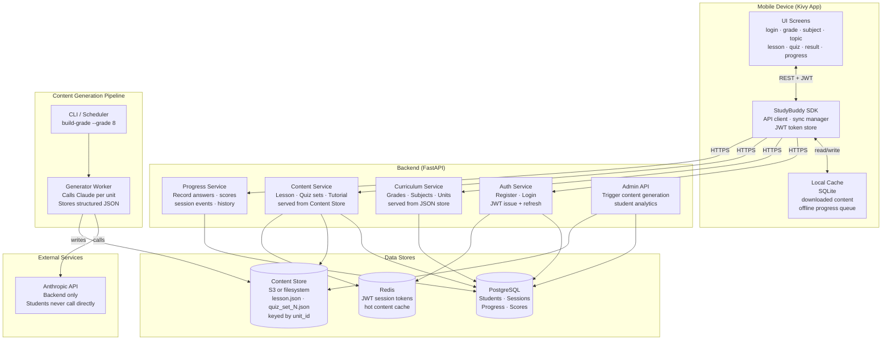
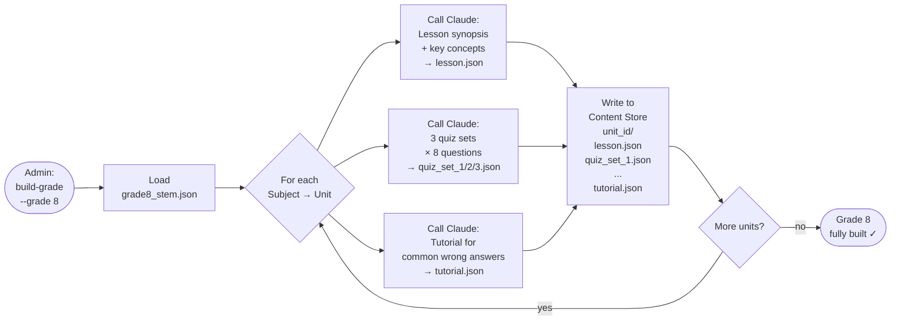
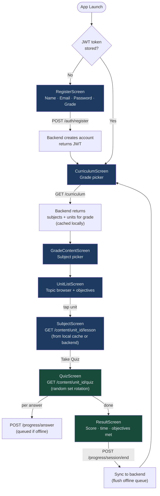
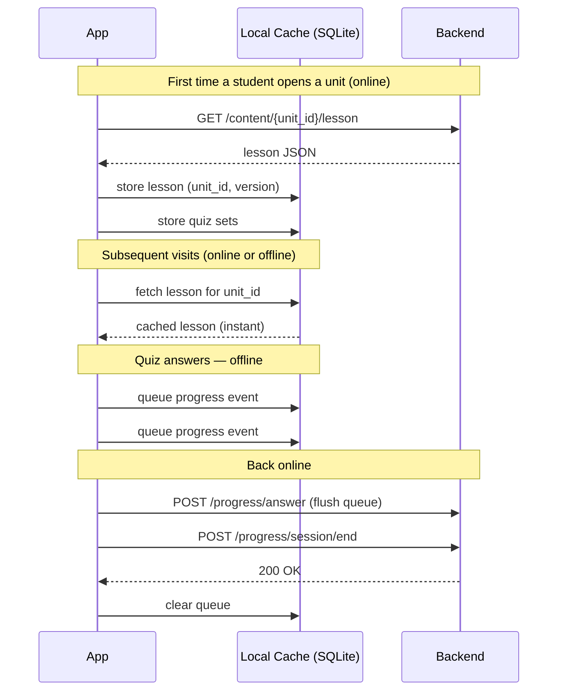

# StudyBuddy OnDemand — Architecture

**Version:** 0.1.0 (Design Phase)
**Last updated:** 2026-03-23

---

## Background & Motivation

The Free edition (studybuddy_free) validated the product concept but exposed two architectural limits:

- **Performance** — every lesson and quiz is generated live on the device via the Anthropic API. On a mobile connection this takes 5–10 seconds per request and is prone to timeouts for longer responses.
- **Value to the student** — requiring the student to supply and manage their own Anthropic API key creates a registration barrier that most students cannot clear.

The OnDemand architecture eliminates both by moving all AI interaction to a backend pipeline and delivering pre-generated content to the app.

---

## System Overview



---

## Content Generation Pipeline

This is the cornerstone of the OnDemand architecture. All Claude API calls happen here — offline, before students use the app — so students receive instant content.



**Why 3 quiz sets per unit?** A student who retakes a topic after review sees a different set of questions. Sets rotate randomly on each attempt.

**When to run the pipeline:**
- At initial deployment for all supported grades
- When curriculum JSON files are updated
- When Claude prompt quality is improved (regenerate selectively by grade/unit)

---

## Student Flow



---

## Offline Strategy



---

## API Design

All endpoints require `Authorization: Bearer <jwt>` except `/auth/*`.

### Auth

| Method | Endpoint | Body | Returns |
|---|---|---|---|
| POST | `/auth/register` | `{name, email, password, grade}` | `{token, student_id}` |
| POST | `/auth/login` | `{email, password}` | `{token, student_id}` |
| POST | `/auth/refresh` | — | `{token}` |

### Curriculum

| Method | Endpoint | Returns |
|---|---|---|
| GET | `/curriculum` | List of available grades with subject counts |
| GET | `/curriculum/{grade}` | Full subject + unit tree for grade |

### Content

| Method | Endpoint | Returns |
|---|---|---|
| GET | `/content/{unit_id}/lesson` | Synopsis + key concepts JSON |
| GET | `/content/{unit_id}/quiz` | One quiz set (8 questions, rotated) |
| GET | `/content/{unit_id}/practice` | Practice test set |
| GET | `/content/{unit_id}/tutorial` | Remediation content |

### Progress

| Method | Endpoint | Body | Returns |
|---|---|---|---|
| POST | `/progress/session` | `{unit_id, grade, subject}` | `{session_id}` |
| POST | `/progress/answer` | `{session_id, question_id, answer, correct, ms_taken}` | `200` |
| POST | `/progress/session/end` | `{session_id, score, duration_s, completed}` | `200` |
| GET | `/progress/student` | — | Full history + scores |
| GET | `/progress/unit/{unit_id}` | — | Attempts + best score for unit |

---

## Data Models

### Student
```json
{
  "student_id": "uuid",
  "name": "string",
  "email": "string",
  "grade": 8,
  "created_at": "ISO8601",
  "subscription": "free"
}
```

### Session
```json
{
  "session_id": "uuid",
  "student_id": "uuid",
  "unit_id": "G8-MATH-001",
  "grade": 8,
  "subject": "Mathematics",
  "started_at": "ISO8601",
  "ended_at": "ISO8601",
  "score": 7,
  "total_questions": 8,
  "completed": true
}
```

### Progress Answer
```json
{
  "answer_id": "uuid",
  "session_id": "uuid",
  "question_id": "string",
  "student_answer": 2,
  "correct_answer": 1,
  "correct": false,
  "ms_taken": 12400
}
```

### Content (stored in Content Store, keyed by unit_id)
```
{unit_id}/
  lesson.json          ← synopsis + key concepts
  quiz_set_1.json      ← 8 questions, set 1
  quiz_set_2.json      ← 8 questions, set 2
  quiz_set_3.json      ← 8 questions, set 3
  tutorial.json        ← remediation content
  meta.json            ← generated_at, model_version, content_version
```

---

## Technology Stack

| Layer | Technology | Rationale |
|---|---|---|
| Mobile app | Python + Kivy (existing) | Reuse Free edition codebase; one tree → Android + iOS |
| Backend API | FastAPI (Python) | Same language as app; async; auto-generates OpenAPI docs |
| Database | PostgreSQL | Relational; good for progress/session queries |
| Content Store | Filesystem (Phase 1–3), S3 (Phase 4+) | Start simple; migrate to S3 for scale |
| Cache | Redis | JWT token store; hot content cache |
| Content pipeline | Python CLI scripts | Runs Claude API calls offline; same prompts.py as Free edition |
| Auth | JWT (python-jose) | Stateless; works offline between refreshes |
| CI | GitHub Actions | Tests + lint on push; pipeline dry-run on PR |

---

## Phased Implementation Plan

### Phase 1 — Backend Foundation
**Goal:** Students can register and browse the curriculum without any Claude API calls on-device.

- FastAPI project skeleton with health check
- PostgreSQL schema: students, sessions
- `POST /auth/register`, `POST /auth/login`, `POST /auth/refresh`
- `GET /curriculum`, `GET /curriculum/{grade}` (serves existing JSON files)
- Mobile app: replace local registration flow with backend auth; replace curriculum loader with API call
- JWT storage on device (keystore / secure file)

**Milestone:** Student registers, logs in, and browses grade/subject/topic — all served from backend, no Anthropic calls.

---

### Phase 2 — Content Pipeline + Delivery
**Goal:** Lessons and quizzes load instantly from pre-generated content.

- Content generation CLI: `build-grade --grade N` iterates all units, calls Claude, stores JSON
- `GET /content/{unit_id}/lesson`, `GET /content/{unit_id}/quiz`
- Content Store: local filesystem (easily swapped to S3)
- Mobile app: SubjectScreen and QuizScreen call content endpoints instead of Claude directly
- Local SQLite cache on device: cache content by `unit_id + content_version`

**Milestone:** Full lesson + quiz flow with instant content. No Anthropic API key required by student.

---

### Phase 3 — Progress Tracking
**Goal:** All quiz activity is recorded server-side.

- Progress Service: session, answer, session/end endpoints
- Mobile app: post progress events after each answer and on session end
- `GET /progress/student` — student can see their own history
- Result screen shows backend-confirmed score

**Milestone:** A student can reinstall the app and see their full quiz history.

---

### Phase 4 — Offline Sync
**Goal:** App works on spotty connections; no data is lost.

- Local SQLite progress event queue on device
- Sync manager: flush queue on app foreground / network restore
- Content freshness check: compare `content_version` in cache vs. backend; re-download if stale
- Conflict resolution: last-write-wins for progress events (with server timestamp)

**Milestone:** Student completes a quiz on a plane with no signal; scores appear in history when they reconnect.

---

### Phase 5 — Admin Dashboard + Analytics
**Goal:** Operator can manage content and see student activity.

- Admin API: content build status, regenerate single unit, list students, view aggregate scores
- Identify high-struggle units across all students (questions with >60% wrong rate)
- Simple web dashboard (can be separate React app or FastAPI + Jinja2 templates)

**Milestone:** Operator can see which topics students struggle with most and trigger targeted content regeneration.

---

## Improvements Over the Original Proposal

The following were added beyond the initial specification:

1. **3 quiz sets per unit** — prevents identical questions on retake; rotated randomly
2. **Content versioning** (`meta.json`) — allows selective regeneration without disrupting in-progress students
3. **Offline-first sync** — progress events queued locally, flushed on reconnect
4. **Per-answer logging** — enables adaptive difficulty and struggle analytics in Phase 5
5. **Grade gating** — backend controls which grades are visible per student; natural upgrade path
6. **JWT refresh** — sessions stay alive across days without re-login
7. **Shared `prompts.py`** — content pipeline reuses the same grade-aware prompt builders as the Free edition

---

## UX Comparison

| Experience | Free Edition | OnDemand Edition |
|---|---|---|
| Registration | Name + Anthropic API key | Name + email + password |
| Lesson load time | 5–10 s (live Claude call) | Instant (pre-generated cache) |
| Quiz load time | 5–10 s + truncation risk | Instant |
| Offline use | None | Full lesson + quiz from local cache |
| Progress after reinstall | Lost | Restored from backend |
| Cost to student | Pay-per-token to Anthropic | None (or subscription) |
| Multi-device | Not supported | Supported (progress syncs) |
| Teacher/parent visibility | None | Available in Phase 5 |
