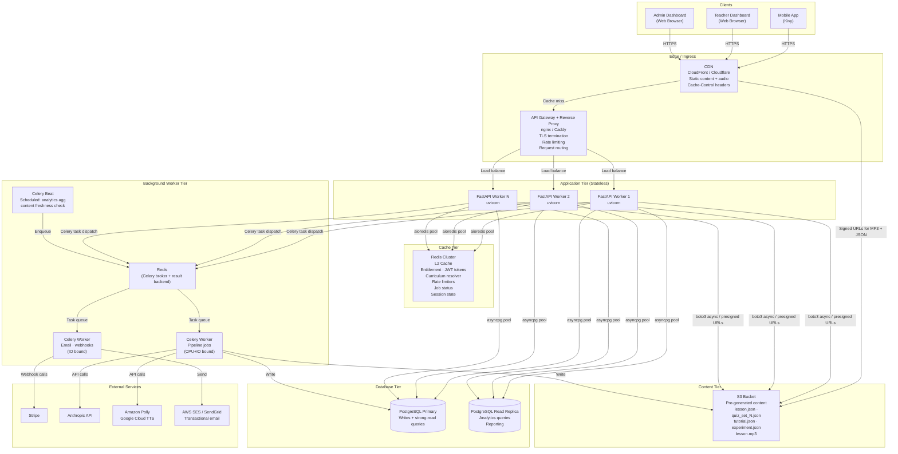
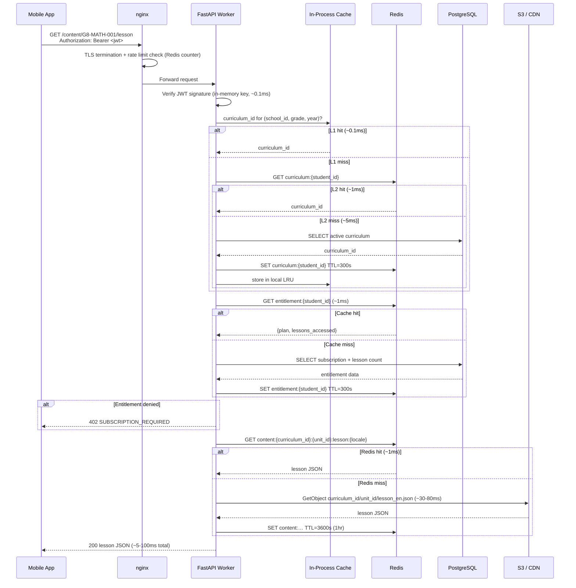
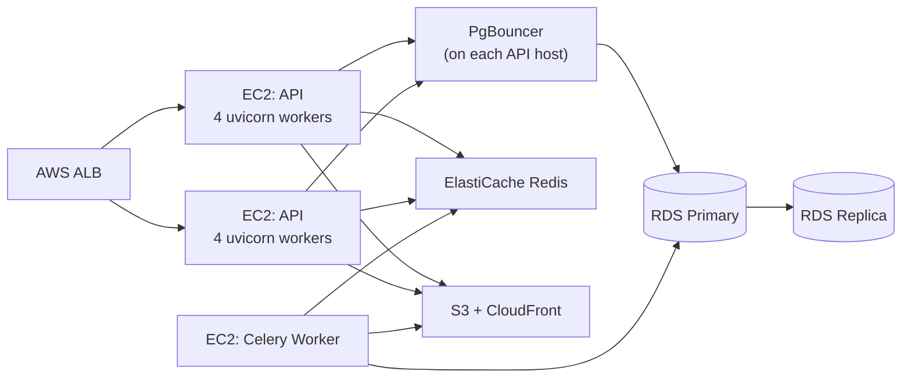

# StudyBuddy OnDemand — Backend Architecture

**Version:** 1.0.0
**Last updated:** 2026-03-23
**Companion docs:** [ARCHITECTURE.md](ARCHITECTURE.md) · [REQUIREMENTS.md](REQUIREMENTS.md)

---

## Design Principle

The backend has two fundamentally different traffic patterns that must be optimised independently:

| Path | Characteristics | Target |
|---|---|---|
| **Hot read path** | Student fetches lesson/quiz content | p95 < 50 ms (cache hit), < 200 ms (miss) |
| **Write path** | Progress events, analytics events | Fire-and-forget; async; never blocks the student |
| **Auth path** | Login, register, token refresh | p95 < 500 ms (bcrypt-bound) |
| **Admin / pipeline** | Content generation, analytics | Latency-insensitive; async jobs |

Every architectural decision below derives from this separation. The hot read path must be optimised end-to-end. Writes must never block reads.

---

## System Topology



---

## Hot Read Path — End-to-End

This is the most critical path: a student opens a lesson or starts a quiz.



**Key optimisation:** the common case (enrolled student, valid subscription, lesson in Redis) executes zero database queries.

---

## Caching Architecture

### Three Cache Levels

| Level | Store | Scope | Purpose |
|---|---|---|---|
| L1 | In-process (per worker) | Per-process, ephemeral | JWT keys, curriculum tree, grade JSON |
| L2 | Redis | Shared across all workers | Entitlement, curriculum resolver, content, rate limits, sessions |
| L3 | CDN (CloudFront) | Global edge | Audio MP3s, large static JSON files |

### L1 — In-Process Cache

Implemented with `cachetools.TTLCache` (thread-safe LRU+TTL). Stored in a module-level singleton — survives within a worker process but is lost on restart.

```python
# backend/src/core/cache.py
from cachetools import TTLCache
import threading

_lock = threading.Lock()

L1_CURRICULUM_TREE = TTLCache(maxsize=50, ttl=300)     # grade trees rarely change
L1_JWT_KEYS        = TTLCache(maxsize=10, ttl=3600)    # signing key by kid
L1_APP_CONFIG      = TTLCache(maxsize=100, ttl=60)     # feature flags, thresholds
```

Never store per-student data in L1 — the LRU would fill up and evict useful entries.

### L2 — Redis Key Schema

All keys are namespaced to avoid collisions. TTLs are set at write time.

| Key pattern | Value | TTL | Invalidation trigger |
|---|---|---|---|
| `ent:{student_id}` | `{plan, lessons_accessed, valid_until}` JSON | 300 s | Subscription change, lesson view |
| `cur:{student_id}` | `curriculum_id` string | 300 s | School transfer, curriculum activation |
| `content:{curriculum_id}:{unit_id}:{type}:{locale}` | Lesson/quiz JSON string | 3600 s | Content version bump |
| `jwt_refresh:{token_hash}` | `student_id` | Token TTL | Logout, rotation |
| `rl:auth:{ip}` | Request counter | 60 s | Rolling window |
| `rl:content:{student_id}` | Request counter | 60 s | Rolling window |
| `rl:feedback:{student_id}` | Submission counter | 3600 s | Rolling window |
| `job:{job_id}` | `{status, progress, errors}` JSON | 86400 s | Pipeline completion |
| `quiz_set:{student_id}:{unit_id}` | `1\|2\|3` (last set used) | 30 days | — |

**Redis configuration for production:**

```
maxmemory 2gb
maxmemory-policy allkeys-lru
appendonly yes                  # AOF persistence — survive restart
appendfsync everysec
requirepass <strong-password>
```

### L3 — CDN

CloudFront (or Cloudflare) sits in front of S3. The mobile app fetches audio and large JSON directly from the CDN URL — not through the FastAPI servers — reducing backend load.

| Asset type | Cache-Control | CDN TTL | Invalidation |
|---|---|---|---|
| `lesson_{lang}.json` | `public, max-age=3600` | 1 hour | `content_version` bump → CDN invalidation |
| `quiz_set_{N}_{lang}.json` | `public, max-age=3600` | 1 hour | Same |
| `lesson_{lang}.mp3` | `public, max-age=86400` | 24 hours | Rarely changes |
| Signed URLs (private) | `private, no-store` | N/A | Expiry in URL |

**Content delivery flow for audio:**
1. `GET /content/{unit_id}/lesson/audio` → API generates a pre-signed S3 URL (TTL 1 hour)
2. Mobile app fetches MP3 directly from CloudFront using the signed URL
3. FastAPI server never proxies audio bytes — no memory or bandwidth cost

---

## Application Server

### Process Model

```
gunicorn (process manager)
  ├── uvicorn worker 1  (async event loop)
  ├── uvicorn worker 2
  ├── uvicorn worker 3
  └── uvicorn worker N   (N = 2 × vCPU + 1)
```

Each uvicorn worker is a single-threaded async event loop. All I/O (DB, Redis, S3) is non-blocking. CPU-bound work (bcrypt, JWT sign) is offloaded to a thread pool executor.

```python
# backend/main.py
import asyncio
from contextlib import asynccontextmanager
import asyncpg
import aioredis
from fastapi import FastAPI

@asynccontextmanager
async def lifespan(app: FastAPI):
    # Create connection pools once per worker process at startup
    app.state.db_pool = await asyncpg.create_pool(
        dsn=settings.DATABASE_URL,
        min_size=5,
        max_size=20,
        command_timeout=10,
        server_settings={"application_name": "studybuddy-api"},
    )
    app.state.redis = aioredis.from_url(
        settings.REDIS_URL,
        encoding="utf-8",
        decode_responses=True,
        max_connections=10,
    )
    yield
    await app.state.db_pool.close()
    await app.state.redis.close()

app = FastAPI(lifespan=lifespan)
```

### Connection Pool Sizing

| Resource | Pool size per worker | Workers | Max total connections |
|---|---|---|---|
| PostgreSQL primary | min 5, max 20 | 4 | 80 |
| PostgreSQL replica | min 2, max 10 | 4 | 40 |
| Redis | max 10 | 4 | 40 |

PostgreSQL `max_connections` should be set to ≥ 200 (leaving headroom for migrations, admin queries, and Celery workers).

Use **PgBouncer** in transaction-pooling mode in front of PostgreSQL to reduce connection overhead at scale.

```
                  ┌─────────────────┐
  API workers ───►│   PgBouncer     │───► PostgreSQL
  Celery workers ►│  pool_size=50   │     max_connections=200
                  └─────────────────┘
```

### Async Throughout

Every database operation uses `asyncpg` (async-native). Every Redis operation uses `aioredis`. External HTTP calls (Stripe, Anthropic, TTS) use `httpx.AsyncClient`. bcrypt runs in `asyncio.get_event_loop().run_in_executor(None, ...)`.

Nothing blocks the event loop.

---

## Database Architecture

### Primary vs Read Replica

| Query type | Route to | Reason |
|---|---|---|
| Student auth, writes (INSERT/UPDATE) | Primary | Consistency required |
| Content entitlement check (SELECT) | Primary | Must be current |
| Analytics aggregations (`GET /analytics/…`) | Replica | Expensive; eventual consistency acceptable |
| Admin reporting | Replica | Same reason |
| Progress history `GET /progress/student` | Replica | Acceptable 1–2s lag |

The routing is encapsulated in a dependency:

```python
async def get_db(request: Request):
    return request.app.state.db_pool          # primary

async def get_read_db(request: Request):
    return request.app.state.db_replica_pool  # replica
```

### Critical Indexes

These are the indexes that make hot-path queries fast. All must be created in the initial migration.

```sql
-- Curriculum resolver: (school, grade, year) → active curriculum_id
CREATE INDEX idx_curricula_resolver
    ON curricula (school_id, grade, year, status)
    WHERE status = 'active';

-- Entitlement: count distinct lesson views per free-tier student
CREATE INDEX idx_lesson_views_student
    ON lesson_views (student_id, curriculum_id);

-- Subscription lookup by student
CREATE INDEX idx_subscriptions_student
    ON subscriptions (student_id)
    WHERE status = 'active';

-- Attempt number: count prior attempts for a student × unit × curriculum
CREATE INDEX idx_sessions_attempt_count
    ON sessions (student_id, unit_id, curriculum_id);

-- Progress history ordered by time
CREATE INDEX idx_sessions_student_time
    ON sessions (student_id, started_at DESC);

-- Enrolment lookup on student registration (email match)
CREATE INDEX idx_enrolments_email
    ON school_enrolments (student_email)
    WHERE status = 'pending';

-- Stripe event deduplication
CREATE UNIQUE INDEX idx_stripe_events_id
    ON stripe_events (stripe_event_id);

-- Content reports by unit (for admin review queue)
CREATE INDEX idx_content_reports_unit
    ON content_reports (unit_id, reviewed)
    WHERE reviewed = false;

-- Feedback by category + reviewed
CREATE INDEX idx_feedback_admin
    ON feedback (category, reviewed, submitted_at DESC)
    WHERE reviewed = false;
```

### Materialized Views for Analytics

Heavy analytics queries run on the replica against pre-aggregated materialized views, refreshed by Celery Beat nightly.

```sql
-- Struggle analysis: units with low pass rate or high attempt count
CREATE MATERIALIZED VIEW mv_unit_struggle AS
SELECT
    unit_id,
    curriculum_id,
    COUNT(*)                                         AS total_attempts,
    COUNT(*) FILTER (WHERE attempt_number = 1)       AS first_attempts,
    COUNT(*) FILTER (WHERE passed AND attempt_number = 1) AS first_attempt_passes,
    AVG(attempt_number) FILTER (WHERE passed)        AS avg_attempts_to_pass,
    AVG(score::float / total_questions)              AS avg_score,
    ROUND(
        100.0 * COUNT(*) FILTER (WHERE passed AND attempt_number = 1)
        / NULLIF(COUNT(*) FILTER (WHERE attempt_number = 1), 0), 1
    )                                                AS first_attempt_pass_rate_pct
FROM sessions
WHERE completed = true
GROUP BY unit_id, curriculum_id;

CREATE UNIQUE INDEX ON mv_unit_struggle (unit_id, curriculum_id);

-- Refresh nightly at 02:00 UTC (Celery Beat task)
```

---

## Background Worker Architecture

### Celery Topology

```
Redis (broker)
  ├── Queue: pipeline      → CeleryWorker[pipeline] (2-4 workers, high CPU/IO)
  ├── Queue: email         → CeleryWorker[io]       (2 workers, light IO)
  ├── Queue: analytics     → CeleryWorker[io]       (shared with email)
  └── Queue: default       → CeleryWorker[io]       (misc tasks)

Celery Beat (scheduler)
  ├── Every night 02:00 UTC: refresh_materialized_views
  ├── Every hour:            check_content_freshness
  └── Every 5 min:           flush_stuck_progress_events  (safety net)
```

### Pipeline Task Design

The pipeline for a custom curriculum is an async Celery chain:

```
validate_curriculum(curriculum_id)
  → build_units.chunks(unit_list, chunk_size=5)   # 5 units in parallel
      → [build_unit(unit_id, lang) for each unit]
          → generate_lesson → validate → write
          → generate_quizzes (3) → validate → write
          → generate_tutorial → validate → write
          → generate_experiment (if lab) → validate → write
          → generate_tts → write mp3
  → finalize_curriculum(curriculum_id)             # set status=active, notify teacher
```

Parallelism within a grade: process 5 units concurrently (limited by Anthropic API rate limits). Each unit's assets are generated sequentially within that unit (lesson → quiz → tutorial → experiment → TTS) because each depends on the lesson content.

### Progress Event Flush

Progress events arrive from mobile clients in the offline queue. A lightweight Celery task deduplicates and bulk-inserts them:

```python
@app.task(queue="default", acks_late=True)
async def flush_progress_events(student_id: str, events: list[dict]):
    """
    Bulk-insert progress events. Deduplicate by event_id.
    acks_late=True: message stays in queue until task completes.
    """
    async with db_pool.acquire() as conn:
        await conn.executemany(
            """
            INSERT INTO progress_answers (event_id, session_id, ...)
            VALUES ($1, $2, ...)
            ON CONFLICT (event_id) DO NOTHING
            """,
            [(e["event_id"], ...) for e in events],
        )
```

---

## API Gateway (nginx)

nginx sits in front of all FastAPI workers, handling:
- TLS termination (Let's Encrypt / ACM certificate)
- HTTP → HTTPS redirect
- Rate limiting (leaky bucket, backed by shared memory zone)
- Request routing (API vs static assets vs webhooks)
- Compression (gzip for JSON responses > 1 KB)
- Keep-alive connections to upstream workers

```nginx
upstream studybuddy_api {
    least_conn;
    server 127.0.0.1:8001;
    server 127.0.0.1:8002;
    server 127.0.0.1:8003;
    server 127.0.0.1:8004;
    keepalive 32;
}

limit_req_zone $binary_remote_addr zone=auth_limit:10m rate=10r/m;
limit_req_zone $http_authorization  zone=api_limit:20m  rate=100r/m;

server {
    listen 443 ssl http2;
    ssl_certificate     /etc/letsencrypt/live/api.studybuddy.app/fullchain.pem;
    ssl_certificate_key /etc/letsencrypt/live/api.studybuddy.app/privkey.pem;
    ssl_protocols TLSv1.2 TLSv1.3;
    ssl_session_cache shared:SSL:10m;
    ssl_session_timeout 10m;

    gzip on;
    gzip_types application/json text/plain;
    gzip_min_length 1024;

    # Auth endpoints — strict rate limit
    location ~ ^/auth/(login|register|forgot-password) {
        limit_req zone=auth_limit burst=5 nodelay;
        proxy_pass http://studybuddy_api;
        proxy_http_version 1.1;
        proxy_set_header Connection "";
    }

    # Stripe webhook — no rate limit, IP allowlist
    location /subscription/webhook {
        allow 54.187.174.169;   # Stripe IP range (maintain full list)
        deny all;
        proxy_pass http://studybuddy_api;
    }

    # General API
    location / {
        limit_req zone=api_limit burst=20 nodelay;
        proxy_pass http://studybuddy_api;
        proxy_http_version 1.1;
        proxy_set_header Connection "";
        proxy_set_header X-Real-IP $remote_addr;
        proxy_read_timeout 30s;
        proxy_connect_timeout 5s;
    }
}

server {
    listen 80;
    return 301 https://$host$request_uri;
}
```

---

## Write Path Optimisation

Progress events and analytics events are high-frequency writes that must not slow down the student experience.

### Fire-and-Forget Pattern

`POST /progress/answer` and `POST /analytics/lesson/end` return `200 OK` immediately after:
1. Validating the JWT (< 1 ms)
2. Validating the request body (Pydantic, < 1 ms)
3. Dispatching a Celery task (Redis publish, < 2 ms)

The actual database write happens asynchronously in a Celery worker. The student is never waiting for a database round-trip.

```python
@router.post("/progress/answer", status_code=200)
async def record_answer(
    body: AnswerEvent,
    student: Student = Depends(get_current_student),
    celery: Celery = Depends(get_celery),
):
    # Validate event_id format only — no DB touch
    celery.send_task(
        "tasks.flush_progress_events",
        args=[student.id, [body.dict()]],
        queue="default",
    )
    return {"ok": True}
```

### Bulk Writes

Events from the same student's offline queue flush arrive together. The Celery task receives a list and bulk-inserts with `executemany`, then deduplicates with `ON CONFLICT (event_id) DO NOTHING`.

---

## Circuit Breakers & Resilience

External service calls (Stripe, Anthropic, TTS, SES) are wrapped in circuit breakers to prevent cascading failures.

```python
# backend/src/core/circuit_breaker.py
from circuitbreaker import circuit

@circuit(failure_threshold=5, recovery_timeout=30, expected_exception=httpx.HTTPError)
async def call_stripe(method, **kwargs):
    ...

@circuit(failure_threshold=3, recovery_timeout=60, expected_exception=Exception)
async def call_anthropic(prompt, **kwargs):
    ...
```

If Stripe is down, `POST /subscription/checkout` returns HTTP 503 — the mobile app shows a "Try again later" message. The student's lesson access is unaffected (entitlement is cached in Redis).

If Anthropic is down during a pipeline run, the circuit opens after 3 failures. The pipeline task catches `CircuitBreakerError`, marks the unit as failed, and continues to the next unit. Failed units are reported to the teacher.

---

## Deployment Topologies

### Development (Docker Compose)

Everything on one machine. Good for Phase 1–3 development.

```yaml
# docker-compose.yml (abbreviated)
services:
  api:
    build: ./backend
    command: uvicorn main:app --reload --host 0.0.0.0 --port 8000
    environment:
      DATABASE_URL: postgresql+asyncpg://user:pass@db/studybuddy
      REDIS_URL: redis://redis:6379/0
    depends_on: [db, redis]

  worker:
    build: ./backend
    command: celery -A tasks worker -Q pipeline,default --concurrency=2
    depends_on: [db, redis]

  beat:
    build: ./backend
    command: celery -A tasks beat --scheduler django_celery_beat.schedulers:DatabaseScheduler
    depends_on: [db, redis]

  db:
    image: postgres:16
    volumes: [postgres_data:/var/lib/postgresql/data]

  redis:
    image: redis:7-alpine
    command: redis-server --appendonly yes

  nginx:
    image: nginx:alpine
    volumes: [./nginx.conf:/etc/nginx/nginx.conf:ro]
    ports: ["443:443", "80:80"]
```

### Production — Small Scale (Phases 2–6, up to ~10k students)

| Component | Service | Sizing |
|---|---|---|
| API servers | 2× EC2 `t3.medium` (2 vCPU, 4 GB) or equivalent | 4 uvicorn workers each |
| Database | AWS RDS PostgreSQL `db.t3.medium` Multi-AZ | 1 primary + 1 replica |
| Cache | AWS ElastiCache Redis `cache.t3.micro` | Single node + AOF |
| PgBouncer | Runs on API server instances | transaction pooling |
| Content Store | S3 + CloudFront distribution | Standard |
| Workers | 1× EC2 `t3.small` running Celery | 2 pipeline + 2 IO workers |
| Load balancer | AWS ALB | Health check on `/health` |
| Email | AWS SES or SendGrid | Per-use |



### Production — Scaled (Phase 7+, >50k students)

Auto-scaling group for API servers behind ALB. ElastiCache cluster (3-node). RDS Multi-AZ with 2 read replicas (one for analytics, one for app reads). S3 + CloudFront with multi-region edge.

| Component | Service | Notes |
|---|---|---|
| API tier | Auto-Scaling Group: 2–8× `t3.large` | Scale on CPU >60% or request latency >300ms |
| Database | RDS `db.r6g.xlarge` Multi-AZ + 2 replicas | One replica for app, one for analytics |
| Cache | ElastiCache Redis Cluster 3 nodes | Sharding by key prefix |
| PgBouncer | Sidecar on each API instance | Transaction pooling |
| Workers | Auto-Scaling Group: 2–4× `t3.medium` | Scale on Celery queue depth |
| CDN | CloudFront with S3 origin | Cache content files at edge globally |

---

## Performance Targets (SLOs)

| Endpoint | p50 | p95 | p99 | Notes |
|---|---|---|---|---|
| `GET /content/{unit_id}/lesson` (cache hit) | < 10 ms | < 50 ms | < 100 ms | Redis L2 hit |
| `GET /content/{unit_id}/lesson` (cache miss) | < 50 ms | < 200 ms | < 400 ms | S3 read |
| `GET /content/{unit_id}/quiz` | < 10 ms | < 50 ms | < 100 ms | Same as lesson |
| `POST /auth/login` | < 200 ms | < 500 ms | < 800 ms | bcrypt bound |
| `POST /auth/register` | < 200 ms | < 500 ms | < 800 ms | bcrypt bound |
| `POST /progress/answer` | < 5 ms | < 20 ms | < 50 ms | Fire-and-forget |
| `POST /analytics/lesson/end` | < 5 ms | < 20 ms | < 50 ms | Fire-and-forget |
| `GET /curriculum/{grade}` | < 10 ms | < 50 ms | < 100 ms | L1 cache hit |
| `GET /analytics/school/{id}/class` | < 200 ms | < 1 s | < 3 s | Replica + mat. view |

Uptime target: **99.9%** (≤ 8.7 hours downtime per year).

---

## Technology Stack Summary

| Concern | Choice | Reason |
|---|---|---|
| ASGI framework | FastAPI + uvicorn | Async-native; Pydantic validation; OpenAPI docs |
| Process manager | gunicorn | Manages uvicorn worker processes; graceful reload |
| Reverse proxy | nginx | TLS termination; rate limiting; keep-alive pooling |
| Async PostgreSQL | asyncpg | Fastest Python PostgreSQL driver; native async |
| Connection pooler | PgBouncer | Transaction-mode pooling; reduces DB connection overhead |
| Async Redis | aioredis / redis-py async | Non-blocking; matches FastAPI async model |
| Background tasks | Celery + Redis broker | Mature; retry/backoff; task routing; Beat scheduler |
| In-process cache | cachetools TTLCache | Zero-cost LRU+TTL; no network hop |
| Circuit breaker | `circuitbreaker` library | Wrap all external API calls |
| Migrations | Alembic | Schema versioning; automated apply on deploy |
| Content delivery | S3 + CloudFront | Pre-signed URLs; global CDN; no API server bandwidth |
| Monitoring | Prometheus + Grafana (or Datadog) | Request metrics, cache hit rates, queue depths |
| Error tracking | Sentry | Unhandled exceptions with request context |
| Deployment | Docker + Docker Compose (dev) / ECS or K8s (prod) | Reproducible; horizontal scaling |

---

## Key Rules (Do Not Break)

1. **The hot read path never touches PostgreSQL when the student has a valid cached entitlement.** If entitlement is in Redis, that is the only source of truth for that request.
2. **The FastAPI event loop never blocks.** bcrypt → thread pool. S3 → async SDK. DB → asyncpg. Any synchronous library call must be wrapped in `run_in_executor`.
3. **Audio files are never proxied through the API server.** The API issues a pre-signed URL; the client downloads directly from CloudFront.
4. **Progress writes never delay the client response.** Use the fire-and-forget Celery task pattern. The 200 OK is returned before the DB write occurs.
5. **Redis must survive a restart.** AOF persistence is mandatory in production. A Redis restart without persistence logs out every student and resets all rate limit counters.
6. **PgBouncer sits in front of PostgreSQL.** API workers create many short-lived async connections; without pooling, PostgreSQL will hit `max_connections` under moderate load.
7. **Content version bumps invalidate both Redis L2 and CDN.** Stale content in either layer means students see outdated material. On pipeline completion, call CloudFront `create_invalidation` for the affected `curriculum_id/*` paths.
