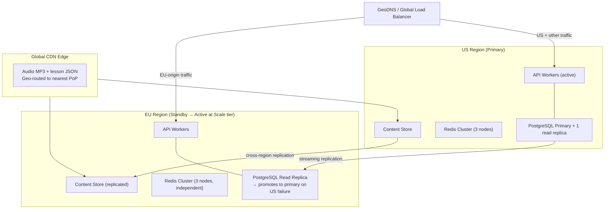

# StudyBuddy OnDemand — Scalability

Architecture decisions and procedures for scaling from launch to global traffic.

**Companion docs:** [ARCHITECTURE.md](ARCHITECTURE.md) · [BACKEND_ARCHITECTURE.md](BACKEND_ARCHITECTURE.md) · [OPERATIONS.md](OPERATIONS.md)

---

## Capacity Planning Model

### Growth Tiers

| Tier | Students | Daily Active | Peak Concurrent | Infrastructure Profile |
|---|---|---|---|---|
| **Launch** | 0 – 10k | ≤ 500 | ≤ 100 | 2× API (t3.medium), 1× DB primary + 1 replica, Redis Sentinel |
| **Growth** | 10k – 100k | ≤ 5,000 | ≤ 1,000 | Auto-scaling API group, DB r6g.xlarge + 2 replicas, Redis Cluster (3 nodes) |
| **Scale** | 100k – 1M | ≤ 50,000 | ≤ 10,000 | Multi-region active/standby, partitioned DB tables, Redis Cluster (6 nodes), CDN edge warming |
| **Global** | 1M+ | ≤ 200,000 | ≤ 40,000 | Multi-region active/active, per-region read replicas, dedicated pipeline infra per region |

### Request Volume Estimates

Baseline: 5% daily active rate; each active student: 3 content reads, 1 quiz session (8 answers), 1 lesson view; L1+L2 cache hit rate 95%.

| Metric | 10k students | 100k students | 1M students |
|---|---|---|---|
| Content requests / day | 1,500 | 15,000 | 150,000 |
| Content req / sec (peak 2 hr) | 0.2 | 2 | 20 |
| DB hits after cache miss (5%) | 0.01 / s | 0.1 / s | 1 / s |
| Progress writes / day (Celery async) | 4,000 | 40,000 | 400,000 |
| Auth exchanges / day | 500 | 5,000 | 50,000 |

**Key insight:** the 3-level caching architecture sustains up to ~1M students on modest infrastructure as long as the cache hit rate stays above 90%. The binding constraints at scale are **write throughput** (progress events, Celery queue depth) and **auth latency** (bcrypt CPU-bound).

### Infrastructure Scaling Triggers

| Metric | Threshold | Action |
|---|---|---|
| API p95 latency | > 100 ms sustained 10 min | Add 1 API worker container |
| API CPU | > 70% sustained 5 min | Add 1 API worker container |
| `sb_db_pool_connections{state="waiting"}` | > 3 | Add 1 read replica or increase PgBouncer `default_pool_size` |
| Redis `used_memory` | > 70% of `maxmemory` | Add Redis node or increase `maxmemory` |
| Celery `io` queue depth | > 200 | Add 1 Celery io worker |
| Celery `pipeline` queue depth | > 50 sustained 10 min | Add 1 Celery pipeline worker |
| Auth endpoint p95 | > 800 ms | Increase thread pool size (`run_in_executor`) or add API workers |

---

## Multi-Region Deployment

### Topology



### Data Residency

| Data type | US storage | EU storage | Rule |
|---|---|---|---|
| Student progress, sessions | US primary (writes) | EU replica (reads) | At Scale tier: EU-origin writes go to EU primary |
| Content Store (JSON, MP3) | US + replicated to EU | EU + replicated to US | Same content globally |
| Redis (sessions, entitlement, rate limits) | US cluster | EU cluster — **not replicated** | Region-local; students re-auth on region switch |
| Audit log | US primary | EU replica (read-only) | Writes always to US primary |

**EU activation trigger:** when EU-origin student registrations exceed 20% of total, activate EU API workers and a dedicated EU PostgreSQL primary for EU-origin writes.

**GDPR implication:** EU student PII must not leave the EU region once EU writes are activated. Route EU-origin traffic exclusively to the EU API + EU DB primary at that point.

### CDN Cache Warming

Run **before** issuing CDN invalidation when publishing a new content version:

```bash
# Pre-warm new content files across CDN edge nodes
python pipeline/warm_cdn.py --curriculum-id default-2027-g8 --lang en

# This script fetches each lesson_{lang}.json and quiz_set_*_{lang}.json
# via the CDN origin-pull URL, forcing edge nodes to cache before student traffic.

# Only after warming completes:
python pipeline/invalidate_cdn.py --prefix curricula/default-2027-g8/
```

CDN cache hit rate should return to > 90% within 15 minutes of warming. Monitor via CDN metrics dashboard.

### Regional Failover (US Primary Fails)

```
GeoDNS detects US unhealthy (3 consecutive failures, 60-second TTL)
        │
        ▼
All traffic routed to EU API workers
        │
        ▼
EU PostgreSQL replica promoted: pg_ctl promote (or RDS console)
        │
        ▼
EU Redis cluster is now sole session store
(US sessions lost — students re-authenticate; expected; communicate via status page)
        │
        ▼
Update DATABASE_URL in EU environment → EU workers now write to promoted EU primary
        │
        ▼
Estimated RTO: 15 minutes
```

---

## Database Scaling

### Table Partitioning

Range-partition by month on `started_at` when any table exceeds ~50M rows.

**Priority order (fastest-growing tables):**

| Table | Partition key | ~Row count trigger |
|---|---|---|
| `progress_sessions` | `started_at` monthly | 50M rows |
| `lesson_views` | `started_at` monthly | 50M rows |
| `progress_answers` | Inherit from parent session partition | 400M rows |
| `audit_log` | `created_at` monthly | 10M rows |

**Partition migration pattern (zero-downtime, two-phase):**

```sql
-- Phase A: create partitioned shadow table
CREATE TABLE progress_sessions_p (
    LIKE progress_sessions INCLUDING ALL
) PARTITION BY RANGE (started_at);

CREATE TABLE progress_sessions_p_2026_01
    PARTITION OF progress_sessions_p
    FOR VALUES FROM ('2026-01-01') TO ('2026-02-01');
-- (one partition per month, going back to earliest data)

-- Copy data in batches during off-peak hours
INSERT INTO progress_sessions_p SELECT * FROM progress_sessions
  WHERE started_at >= '2026-01-01' AND started_at < '2026-02-01';

-- Phase B (next release): swap table names; update all FK references
```

**New monthly partitions** created automatically by a Celery Beat task on the 25th of each month for the next month.

### Read Replica Routing

```python
# backend/src/core/database.py

async def get_db():
    """Write path — primary only."""
    async with app.state.db_pool.acquire() as conn:
        yield conn

async def get_read_db():
    """Read path — replica preferred, primary fallback."""
    async with app.state.db_read_pool.acquire() as conn:
        yield conn
```

| Endpoint type | Pool |
|---|---|
| `GET /content/*`, `GET /curriculum/*` | Read replica |
| `GET /student/dashboard`, `/student/progress`, `/student/stats` | Read replica |
| `GET /reports/*`, `GET /admin/content/review/*` | Read replica |
| `POST /auth/exchange`, `PATCH /admin/accounts/*` | Primary |
| All `POST /progress/*`, `POST /analytics/*` | Primary (via Celery, fire-and-forget) |
| All Celery DB tasks | Primary |

### Critical Indexes at Scale

```sql
-- progress_sessions (each partition)
CREATE INDEX CONCURRENTLY ON progress_sessions_YYYY_MM (student_id, started_at DESC);
CREATE INDEX CONCURRENTLY ON progress_sessions_YYYY_MM (unit_id, curriculum_id);

-- lesson_views (each partition)
CREATE INDEX CONCURRENTLY ON lesson_views_YYYY_MM (student_id, started_at DESC);
CREATE INDEX CONCURRENTLY ON lesson_views_YYYY_MM (curriculum_id, unit_id);

-- content_subject_versions — queried on every content request
CREATE INDEX IF NOT EXISTS idx_csv_curriculum_subject_status
    ON content_subject_versions (curriculum_id, subject, status);
```

Use `CREATE INDEX CONCURRENTLY` in production — avoids table lock. Never create indexes without `CONCURRENTLY` on live tables.

---

## Redis Scaling

### Sentinel vs Cluster

| Mode | Use when | Failover time | Ops complexity |
|---|---|---|---|
| **Sentinel** (1 primary + 2 replicas + 3 sentinels) | < 100k students; data fits in single-node memory | ~30 seconds | Low |
| **Cluster** (3 primary shards + 3 replicas) | > 100k students or dataset > 4 GB | ~10 seconds | Medium |

**Migration trigger:** move to Cluster when total keys exceed 5M or memory usage exceeds 4 GB.

### Memory Budget

| Key pattern | Count at 100k students | Avg size | Total |
|---|---|---|---|
| `ent:{student_id}` | 100,000 | 200 B | 20 MB |
| `streak:{student_id}` | 100,000 | 100 B | 10 MB |
| `cur:{student_id}` | 100,000 | 100 B | 10 MB |
| `refresh:{token}` | 100,000 | 200 B | 20 MB |
| `suspended:{id}` | < 1,000 | 10 B | < 1 MB |
| `rate:{ip}` / `rate:{student_id}` | 50,000 | 50 B | 2.5 MB |
| `content:{unit}:{lang}` (L2 cache) | 30,000 (10k units × 3 langs) | 8 KB avg | 240 MB |
| **Total** | | | **~305 MB** |

Provision **1 GB minimum** per Redis node at 100k students (2× headroom). At 1M students, scale to 3 GB per shard (Cluster mode).

### Hot Key Mitigation

`cur:default-2026-g8` (default curriculum tree) is read by every unaffiliated student on every content request. At 10,000 concurrent users this key receives ~1,000 reads/second.

**Mitigation:** L1 in-process `TTLCache` (per API worker, 60-second TTL) absorbs this — the Redis key is read at most once per worker per TTL window. Ensure `CURRICULUM_L1_TTL` ≥ 60 seconds in config.

---

## Load Testing Strategy

### Tools

| Tool | Use |
|---|---|
| **k6** | Primary — scripted API load tests; Prometheus output; CI-integrated |
| **locust** | Exploratory spike testing — Python, easy to extend |
| **pgbench** | DB-layer throughput testing (independent of application) |

### Test Scenarios

| Scenario | Virtual users | Duration | Endpoint mix | Pass criterion |
|---|---|---|---|---|
| Baseline | 100 | 10 min | Proportional realistic mix | All SLOs met |
| Content spike (warm cache) | 2,000 | 5 min | 80% `/content/*`, 20% `/curriculum/*` | p95 ≤ 50 ms |
| Content spike (cold cache) | 500 | 5 min | 80% `/content/*` | p95 ≤ 200 ms |
| Auth storm | 200 | 5 min | 100% `/auth/exchange` | p95 ≤ 500 ms |
| Progress write storm | 1,000 | 5 min | 100% `/progress/answer` | p95 ≤ 20 ms; Celery queue drains within 60 s |
| Sustained load | 500 | 60 min | Realistic mix | No latency drift; no memory leak |
| Soak test | 200 | 8 hours | Realistic mix | No degradation over time |

### Pre-Release Gate

Load tests are **required** before every production deployment touching:
- Any content serving or curriculum endpoint
- Any auth endpoint
- Any progress or session endpoint
- Any change to PgBouncer, asyncpg pool configuration, or Redis connection handling

```bash
# Run in CI against staging
k6 run --vus 500 --duration 10m load_tests/content_warm.js \
  -e BASE_URL=$STAGING_URL -e JWT=$STAGING_SMOKE_JWT \
  --out json=results.json

# Parse results — deployment blocked if any SLO breached
python load_tests/check_results.py results.json
```

Failing a load test gate is a **deploy blocker** — not a warning.

### Baseline and Regression

Run the baseline scenario weekly in staging (automated via CI schedule). Compare against the previous week:
- Latency regression > 20% at p95 → file SEV-4; investigate before next deploy
- Memory leak (RSS grows > 5% over 60-minute soak) → file SEV-3; block next deploy

---

## Multi-Tenancy Quotas and Fair Use

### Pipeline Quotas

School pipeline jobs share a finite Celery worker pool. Without quotas, one school uploading a 500-unit curriculum can saturate the pipeline for hours.

| Quota | Default | Override by |
|---|---|---|
| Pipeline runs per school per day | 3 | `super_admin` (per-school override) |
| Max units per pipeline run | 200 | `super_admin` |
| Platform-wide concurrent pipeline jobs | 5 | Config (`MAX_PIPELINE_CONCURRENCY`) |
| Spend cap per run | $50 (tokens × unit cost) | `super_admin` (per-school override) |

Quota check in `POST /curriculum/pipeline/trigger`:

```python
daily_runs = await count_today_pipeline_runs(db, school_id)
if daily_runs >= school.pipeline_quota:
    raise HTTPException(429, detail="Daily pipeline quota exceeded. Try again tomorrow.")
```

### Priority Queue

| Priority | Who | Celery queue |
|---|---|---|
| High | Default curriculum (platform operator) | `pipeline.high` |
| Normal | School-triggered curriculum builds | `pipeline.normal` |
| Low | Regeneration retries after review rejection | `pipeline.low` |

Celery pipeline workers drain `pipeline.high` before `pipeline.normal`, and so on.

### Content API Rate Limits per School

A school with 10,000 enrolled students generates 10× the API traffic of a school with 1,000 students. Rate limits scale proportionally:

```
Per-school content rate limit = max(100 req/min, 10 × enrolled_student_count req/min)
```

Enforced in Redis: `rate:school:{school_id}:content` sliding window key alongside the per-student JWT rate limit.

### Isolation Thresholds

| Students enrolled | Isolation level |
|---|---|
| < 1,000 | Shared infrastructure; school-scoped DB rows |
| 1,000 – 10,000 | Dedicated read replica routing recommended |
| > 10,000 | Dedicated pipeline worker queue; consider schema-level isolation |
| > 50,000 | Evaluate dedicated DB schema or tenant-isolated cluster |

No automated migration between levels — ops decision made at each threshold.

---

## Academic Year Transitions

### Year Model

Default curricula: `default-{year}-g{grade}`. A new year's content is generated and reviewed **before** the academic year starts.

**Academic year start dates (configurable):**

| Region | Start date | Config key |
|---|---|---|
| Northern Hemisphere (default) | September 1 | `ACADEMIC_YEAR_START_NH` |
| Southern Hemisphere | February 1 | `ACADEMIC_YEAR_START_SH` |
| School override | Set by `school_admin` | `schools.academic_year_start` |

### Grade Promotion

On the academic year boundary, Celery Beat fires `promote_student_grades`:

```python
@celery.task
def promote_student_grades():
    """
    Runs at 00:00 UTC on academic year start date.
    Increments grade for all active students.
    Students at grade 12 are marked graduated.
    Invalidates cur:{student_id} Redis cache for all affected students.
    """
```

- School-enrolled students: `school_admin` can block or override auto-promotion for individual students via `PATCH /schools/{school_id}/students/{student_id}/grade`
- Progress history: retained across years, linked to the `curriculum_id` of the year it was completed (not the student's current grade)

### Content Transition Window

Students are never cut off abruptly at year boundaries:

| Date | Action |
|---|---|
| August 1 | Run `seed_default.py --year 2027`; new curricula created in DB |
| August 1 – August 31 | Generate, review, and publish all `default-2027-g*` content |
| September 1 | Academic year transition; `promote_student_grades` fires |
| September 1 – October 1 | Old year (`default-2026-g*`) still accessible (30-day grace period) |
| October 1 | Old year's subject versions set to `archived`; CDN invalidation issued |

### Pipeline Timing Checklist (Annual)

- [ ] August 1: `python pipeline/seed_default.py --year {NEXT_YEAR}` — creates curriculum + unit records
- [ ] August 1–31: `python pipeline/build_grade.py --grade N --lang en,fr,es` for grades 5–12
- [ ] August 31: All `default-{next_year}-g*` subject versions reviewed and published
- [ ] September 1: `promote_student_grades` Celery task fires automatically (Celery Beat schedule)
- [ ] October 1: `python pipeline/archive_year.py --year {CURRENT_YEAR}` — archives old subject versions

---

## API Versioning Strategy

### Scheme

URL path versioning: `/api/v1/`, `/api/v2/`, etc.

All current endpoints are implicitly `v1`. No `/api/v1/` prefix is required until a second version is introduced — at that point, `v1` routes are aliased with the prefix for backward compatibility.

### Backward Compatibility Rules

| Change type | Classification | Handling |
|---|---|---|
| New field in response body | Non-breaking | Add freely — clients ignore unknown fields |
| New optional request field | Non-breaking | Old clients send without it; backend uses default |
| New endpoint | Non-breaking | Old clients don't call it |
| Removing a response field | **Breaking** | New API version required |
| Renaming a field | **Breaking** | New API version required |
| Changing a field type | **Breaking** | New API version required |
| Removing an endpoint | **Breaking** | Deprecation + sunset required |
| Changing HTTP method | **Breaking** | New API version required |

### Deprecation Lifecycle

1. **Deprecation notice:** `Deprecation: date=<ISO8601>` header added to affected endpoints
2. **Sunset notice:** `Sunset: <ISO8601>` header (minimum 6 months before removal)
3. **Version banner:** `GET /app/version` returns `deprecated_api_versions: ["v1"]` during sunset window
4. **Sunset:** endpoint returns `410 Gone` with `{"error": "api_version_sunset", "migrate_to": "/api/v2/..."}`

### Mobile Client Handling

Mobile clients (Android) cannot be force-updated instantly. The `GET /app/version` response controls access:

| Field | Meaning |
|---|---|
| `min_version` | Minimum version to use the app; below this, a "Please update" prompt is shown |
| `hard_min_version` | Below this version, all content access is blocked until the app is updated |
| `deprecated_api_versions` | List of API versions entering the sunset window |
| `maintenance_message` | If set, shown as a banner in the app (used during incidents and migrations) |

---

## Push Notifications

### Service

- **Android:** Firebase Cloud Messaging (FCM) via `firebase-admin` Python SDK
- **iOS (future phase):** Apple Push Notification Service (APNs) via same `firebase-admin` SDK (FCM proxies APNs)
- All notifications dispatched as **Celery tasks** — never inline on the request path

### Schema

```sql
CREATE TABLE push_tokens (
    token_id       uuid PRIMARY KEY DEFAULT gen_random_uuid(),
    student_id     uuid NOT NULL REFERENCES students(student_id) ON DELETE CASCADE,
    platform       text NOT NULL CHECK (platform IN ('android', 'ios')),
    fcm_token      text NOT NULL UNIQUE,
    created_at     timestamptz NOT NULL DEFAULT NOW(),
    last_active_at timestamptz NOT NULL DEFAULT NOW()
);

CREATE TABLE notification_preferences (
    student_id        uuid PRIMARY KEY REFERENCES students(student_id) ON DELETE CASCADE,
    streak_reminders  bool NOT NULL DEFAULT true,
    content_alerts    bool NOT NULL DEFAULT true,
    quiz_nudges       bool NOT NULL DEFAULT true,
    quiet_hours_start time NOT NULL DEFAULT '22:00',
    quiet_hours_end   time NOT NULL DEFAULT '08:00',
    timezone          text NOT NULL DEFAULT 'UTC'
);
```

### Notification Events

| Event | Trigger | Frequency cap |
|---|---|---|
| Streak at risk | No lesson or quiz activity for 22 hours (student has an active streak ≥ 3 days) | 1 per student per day |
| New content available | Subject version published for student's active curriculum | 1 per subject per student per release |
| Quiz nudge | Lesson viewed but quiz not attempted within 24 hours | 1 per unit per student per week |
| Weekly summary | Sunday 09:00 in student's timezone | 1 per student per week |

**Global rate limit:** maximum 2 push notifications per student per calendar day across all types. Quiet hours are always respected (no delivery between `quiet_hours_start` and `quiet_hours_end` in student's timezone).

### Celery Tasks

```python
# Celery Beat schedule: streak reminder check runs hourly
@celery.task
def check_streak_reminders():
    """
    Query: students with streak > 0 and last_active_date = yesterday.
    Filter: streak_reminders = true, not in quiet hours.
    Respect global daily cap (max 2 pushes/student/day tracked in Redis).
    Dispatch: send_push_notification.apply_async() per eligible student.
    """

@celery.task
def send_push_notification(student_id: str, title: str, body: str, data: dict):
    token = get_fcm_token(student_id)
    if not token:
        return  # student has no registered device; silently skip
    firebase_admin.messaging.send(
        firebase_admin.messaging.Message(
            notification=firebase_admin.messaging.Notification(title=title, body=body),
            data=data,
            token=token,
        )
    )
```

### API Endpoints (Phase 7+)

| Method | Endpoint | Body | Permission |
|---|---|---|---|
| POST | `/student/push-token` | `{platform, fcm_token}` | `content:read` |
| DELETE | `/student/push-token` | `{fcm_token}` | `content:read` |
| GET | `/student/notification-preferences` | — | `content:read` |
| PATCH | `/student/notification-preferences` | `{streak_reminders?, content_alerts?, quiz_nudges?, quiet_hours_start?, quiet_hours_end?, timezone?}` | `content:read` |
