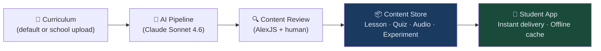
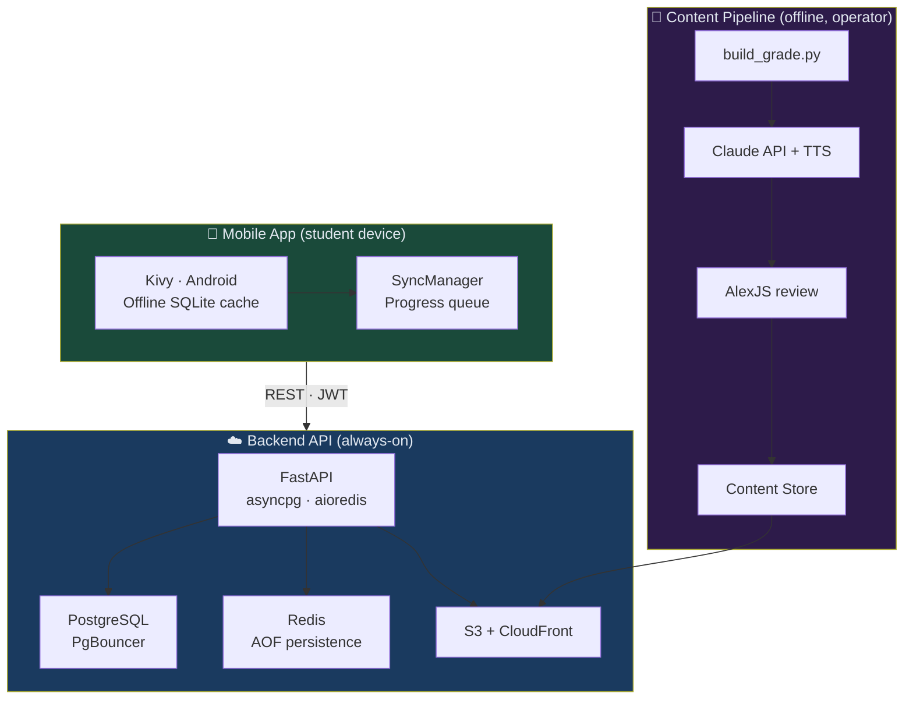
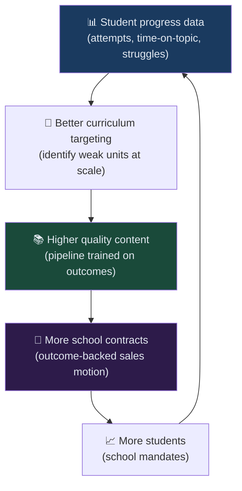

# StudyBuddy OnDemand
## Instant AI Tutoring for Every Student, Everywhere

**STEM Learning Platform · Grades 5–12**
Investor Deck · Confidential

---

# The Problem

**A great tutor costs $60–$120/hr. Most families can't afford one.**

- 1.5 billion K-12 students globally; fewer than 5% have access to personalised tutoring
- School budgets are shrinking — teacher-to-student ratios are getting worse, not better
- Existing AI tools require a live API call per student: slow (5–10 sec wait), expensive, and banned in many school networks
- Schools that upload custom curricula get zero AI support for their own content
- No compliant, affordable AI tutor exists for students under 13

---

# The Inflection Point

Three forces converged in 2024–2025:

| Force | What changed |
|---|---|
| **LLM quality** | Claude Sonnet / GPT-4-class models produce lesson-quality content reliably |
| **Cost curve** | Generating one lesson costs < $0.02 — viable at pipeline time, not per student |
| **Regulatory pressure** | COPPA, FERPA, and school district AI policies demand on-premise or pre-approved content |

> The window to build the compliant, affordable, school-safe AI tutor is open **right now**.

---

# The Solution

## StudyBuddy OnDemand

A subscription platform that delivers instant, pre-generated AI lessons, quizzes, audio, and experiments to students on Android and Chrome — with no live AI call on the student's device.

```
Content Pipeline (offline, operator-run)
  Claude Sonnet → Lessons + Quizzes + Audio
         ↓  (pre-generated, reviewed, published)
Backend API  ←→  Student Mobile App
  FastAPI          Kivy / Android / Chrome
  PostgreSQL        Offline-capable SQLite cache
  Redis             JWT auth · progress sync
```

**Students get instant AI content. No API key. No wait time. No per-student AI cost.**

---

# How It Works — The Pre-Generation Advantage



**Key insight:** Generating content once for a grade costs ~$40.
Serving it to 10,000 students adds zero marginal AI cost.

---

# Product — What Students Get

| Feature | Description |
|---|---|
| **Instant lessons** | AI-written lessons at 1–2 grade levels below actual grade for comprehension |
| **Adaptive quizzes** | 3 quiz sets per unit rotated per attempt — prevents answer sharing |
| **Audio lessons** | Pre-generated TTS (English, French, Spanish) — plays offline |
| **Lab experiments** | Step-by-step experiment guides for science units |
| **Progress dashboard** | Streak counter, curriculum map, attempt history, improvement trends |
| **Offline mode** | Full lesson + quiz experience with no network connection |

---

# Product — What Schools Get

| Feature | Description |
|---|---|
| **Custom curriculum upload** | Teachers upload their XLSX syllabus → AI content generated within hours |
| **Content review workflow** | AlexJS automated review + human approval before students see any content |
| **Teacher reporting dashboard** | 6 report types: unit performance, student cards, curriculum health, feedback, trends |
| **Roster management** | Enrolment codes or email roster import; restrict access to enrolled students only |
| **Content blocks** | School admin can block any subject at school level; platform admins block platform-wide |
| **Weekly digest** | Teachers receive Monday email digest: struggles, non-logins, new feedback |

---

# Compliance — The School Sales Unlock

Most AI tools are blocked by school districts. We are not.

| Standard | How we comply |
|---|---|
| **COPPA** | Verifiable parental consent gate for under-13; no tracking, no location, no fingerprinting |
| **FERPA** | Student records scoped to owning institution; third-party sharing prohibited by design |
| **WCAG 2.1 AA** | 4.5:1 contrast, 44×44 dp touch targets, full screen reader support (TalkBack/VoiceOver) |
| **Data minimisation** | Only name, email, grade, locale collected; no device ID or behavioural fingerprint |
| **No vendor lock-in** | Cloud-agnostic architecture; content store abstracted behind an interface |

> Compliance is not a checkbox — it is the reason a school district procurement officer signs the contract.

---

# Technology — Built for Scale

| Layer | Technology | Why |
|---|---|---|
| Backend API | FastAPI + asyncpg + Redis | Zero DB queries on cache-warm reads; < 50 ms p95 |
| Database | PostgreSQL + PgBouncer | Transaction pooling; horizontal worker scale |
| Cache | L1 TTLCache → L2 Redis → L3 CloudFront | Hot path never touches DB |
| Content delivery | S3 + CloudFront CDN | Audio never proxied through API; pre-signed URLs |
| Background work | Celery + Redis broker | Fire-and-forget progress writes; pipeline jobs |
| AI pipeline | Claude Sonnet 4.6 (pinned) | Schema-validated output; AlexJS safety gate; idempotent |
| Mobile | Kivy / Python → Android + Chrome | One codebase; offline-first; SQLite event queue |
| Auth | Auth0 (students/teachers) + local bcrypt (admins) | COPPA age-gate; no password storage for students |

---

# Architecture — Three Independent Runtimes



---

# Market Opportunity

## TAM — Global K-12 EdTech
**$340B (2025) → $700B+ by 2032**
(UNESCO: 1.5B K-12 students; $227/student/yr addressable spend)

## SAM — AI-Powered K-12 Tutoring + School SaaS
**$28B–$55B** (English-speaking markets + EU + LATAM: ~120M students with disposable digital spend)

## SOM — First 5 Years: English Canada, US, UK, Australia
**$800M–$2.5B** at $8–$25/student/month with school licensing at $3–$8/student/month

---

# Competitive Landscape

| | Khan Academy | IXL | Duolingo (math) | Chegg / Tutors | **StudyBuddy** |
|---|---|---|---|---|---|
| AI-generated lessons | ⚠️ (Khanmigo, US only) | ❌ | ❌ | ❌ | ✅ |
| School custom curriculum | ❌ | ❌ | ❌ | ❌ | ✅ |
| Offline capable | ❌ | ❌ | ⚠️ | ❌ | ✅ |
| COPPA + FERPA compliant | ✅ | ✅ | ❌ | ❌ | ✅ |
| Multi-language AI content | ❌ | ❌ | ✅ (limited) | ❌ | ✅ |
| No per-student AI cost | N/A | N/A | N/A | N/A | ✅ |
| School reporting dashboard | ❌ | ⚠️ | ❌ | ❌ | ✅ |

---

# Competitive Moat



Data from millions of quiz attempts identifies exactly which units, which question types, and which explanations produce the best learning outcomes — feeding back into the next content generation cycle.

---

# Business Model

## Student Subscriptions
| Tier | Price | Limits |
|---|---|---|
| **Free** | $0 | 2 lessons/month (default curriculum only) |
| **Student** | $8/month | Unlimited lessons · all subjects · audio · experiments |
| **Student Annual** | $72/year | Same as Student + offline priority sync |

## School Licensing (B2B2C)
| Tier | Price | Includes |
|---|---|---|
| **Classroom** | $3/student/month | Custom curriculum · teacher dashboard · reporting |
| **School** | $5/student/month | All classrooms · admin controls · bulk enrolment |
| **District** | $8/student/month | Multi-school · data residency SLA · dedicated onboarding |

---

# Unit Economics

At **10,000 students** (Year 2 target):

| Metric | Value |
|---|---|
| Blended ARPU (60% school, 40% consumer) | ~$7.20/student/month |
| Monthly Revenue | ~$72,000 |
| AI pipeline cost (one-time per grade/year) | ~$320 total for all grades, all languages |
| Per-student marginal content cost | **< $0.001** |
| CDN + hosting (10k students) | ~$800/month |
| Gross Margin (estimated) | **~85–88%** |

> The pre-generation model means AI cost is a **fixed cost**, not a variable one. Margin expands as students scale.

---

# Traction & Development Status

## Phase 1 — Backend Foundation ✅ Complete
- Auth (Auth0 + local bcrypt), RBAC, account management
- Curriculum API, health/metrics observability
- PostgreSQL schema, asyncpg pool, Redis, PgBouncer
- 37/37 automated tests passing; CI pipeline live
- Mobile Auth0 PKCE client + JWT storage

## Roadmap (2025–2026)
| Quarter | Milestone |
|---|---|
| Q2 2025 | Phase 2: Content pipeline + English delivery (live lessons + quizzes) |
| Q3 2025 | Phase 3–4: Progress tracking, offline sync, French/Spanish, TTS, push notifications |
| Q4 2025 | Phase 5–6: Stripe subscriptions + payments, experiment visualization |
| Q1 2026 | Phase 7–9: Admin dashboard, content review UI, school registration, curriculum upload |
| Q2 2026 | Phase 10–11: Extended analytics, teacher reporting dashboard — **GA launch** |

---

# Go-to-Market

## Stage 1 — Consumer (Months 1–12)
Direct-to-student via app stores (Android first, then iOS). SEO content targeting "free STEM tutor grade 8", "science help Grade 10 Canada". Free tier drives organic acquisition; Student plan converts on first paywall hit.

## Stage 2 — Schools (Months 6–18)
Bottom-up: individual teachers adopt free tier → show outcome data to department head → school license. Target: private schools, international schools, tutoring centres in Canada, US, UK, Australia.

## Stage 3 — Districts (Year 2+)
Outcome data from Stage 2 schools becomes the sales deck. District procurement driven by COPPA/FERPA compliance + cost vs. traditional tutoring. Data residency SLA unlocks EU school markets.

---

# Financial Projections

| Year | Students | ARR | Gross Margin |
|---|---|---|---|
| Y1 (launch) | 2,000 | $115K | 82% |
| Y2 | 10,000 | $580K | 86% |
| Y3 | 40,000 | $2.4M | 88% |
| Y4 | 150,000 | $9.2M | 89% |
| Y5 | 500,000 | $31M | 90% |

*Assumptions: blended ARPU $7.20/month; 35% annual churn (consumer); 15% churn (school). School mix grows from 20% → 60% by Y5.*

---

# The Ask

## Seed Round: $1.2M

| Use of Funds | Allocation |
|---|---|
| Engineering (3 engineers × 18 months) | $720K (60%) |
| Content pipeline build-out + AI costs | $120K (10%) |
| Marketing + school sales (pilot program) | $180K (15%) |
| Operations, legal (COPPA/FERPA audit), infrastructure | $180K (15%) |

**Milestone:** 500 paying students + 3 school pilots with measurable outcome data by Month 18.

---

# Why Now. Why Us.

1. **The compliance window is open.** COPPA/FERPA has scared away most AI EdTech. We designed for it from day one.

2. **Pre-generation is a structural cost advantage.** No competitor currently delivers AI content at < $0.001/student marginal cost.

3. **Schools are desperate.** Post-pandemic learning gaps are measurable; districts have AI budget and political cover to spend it.

4. **The platform is real.** Phase 1 is shipped and tested. This is not a pitch deck in search of a product.

5. **Global from the start.** English, French, Spanish pipeline; GDPR-ready data architecture; multi-region deployment path already designed.

---

# Vision

> Every student on Earth, regardless of income, gets a patient, knowledgeable tutor who speaks their language, knows their curriculum, and is available at 2am before an exam.

StudyBuddy OnDemand is the infrastructure layer that makes that possible — not by putting a live AI on every device, but by putting the right AI content in every classroom and pocket.

**Let's build it.**

---

*StudyBuddy OnDemand · Confidential · 2025*
*Contact: [founder@studybuddy.io]*
