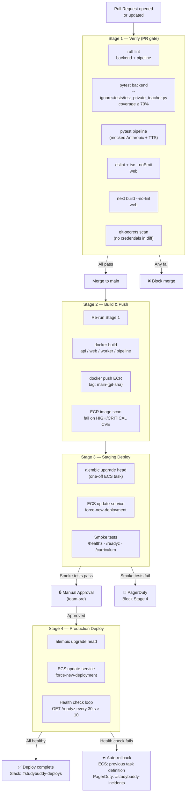

# Diagram 9 — CI/CD Pipeline

> Build stages, quality gates, deployment strategy, and rollback procedure.
> Audience: DevOps, Developers.
> Last updated: 2026-04-05.

---

## Pipeline Overview

```
                    ┌─────────────────────────────────────────────────────┐
  Developer         │  GitHub Actions                                     │
  git push ────────►│                                                     │
                    │  Trigger: pull_request (any branch → main)         │
                    └──────────────────────┬──────────────────────────────┘
                                           │
                    ┌──────────────────────▼──────────────────────────────┐
                    │  Stage 1 — Verify  (every PR)                       │
                    │                                                     │
                    │  ┌──────────┐  ┌──────────┐  ┌──────────────────┐  │
                    │  │ Backend  │  │   Web    │  │    Pipeline CLI  │  │
                    │  │ ruff lint│  │ eslint   │  │  ruff lint       │  │
                    │  │ pytest   │  │ tsc check│  │  pytest (mocked) │  │
                    │  │ coverage │  │ next build│  │                  │  │
                    │  │ ≥70%     │  │ check    │  │                  │  │
                    │  └──────────┘  └──────────┘  └──────────────────┘  │
                    │                                                     │
                    │  Quality Gates (all must pass to merge):            │
                    │  ✓  Backend coverage ≥ 70%                         │
                    │  ✓  Zero ruff errors (E/W/F/B rules)               │
                    │  ✓  TypeScript strict: zero errors                 │
                    │  ✓  Next.js build succeeds (no import errors)      │
                    │  ✓  git-secrets scan: no credentials in diff       │
                    └──────────────────────┬──────────────────────────────┘
                                           │  PR merged to main
                    ┌──────────────────────▼──────────────────────────────┐
                    │  Stage 2 — Build & Push  (on main push)             │
                    │                                                     │
                    │  Run full verify suite (same as Stage 1)            │
                    │                                                     │
                    │  Docker build (multi-platform: linux/amd64):        │
                    │    backend  → ECR: studybuddy/api:main-{sha}        │
                    │    web      → ECR: studybuddy/web:main-{sha}        │
                    │    pipeline → ECR: studybuddy/pipeline:main-{sha}   │
                    │    worker   → ECR: studybuddy/worker:main-{sha}     │
                    │                                                     │
                    │  Image scan: Amazon ECR — fail on HIGH/CRITICAL CVE │
                    └──────────────────────┬──────────────────────────────┘
                                           │  Images pushed to ECR
                    ┌──────────────────────▼──────────────────────────────┐
                    │  Stage 3 — Deploy to Staging                        │
                    │                                                     │
                    │  alembic upgrade head (one-off ECS task)            │
                    │  ECS update-service --force-new-deployment          │
                    │  Wait for service stability (max 10 min)            │
                    │                                                     │
                    │  Smoke tests (httpx against staging URL):           │
                    │    ✓  GET /healthz → 200                            │
                    │    ✓  GET /readyz  → 200                            │
                    │    ✓  POST /admin/auth/login (staging creds) → 200  │
                    │    ✓  GET /curriculum → 200                         │
                    │                                                     │
                    │  Gate: smoke test failure blocks Stage 4            │
                    └──────────────────────┬──────────────────────────────┘
                                           │  Smoke tests pass
                    ┌──────────────────────▼──────────────────────────────┐
                    │  Stage 4 — Production Deploy  (manual approval)     │
                    │                                                     │
                    │  GitHub Actions Environment: production             │
                    │  Required reviewer: any member of team-sre         │
                    │                                                     │
                    │  On approval:                                       │
                    │    alembic upgrade head (one-off ECS task)          │
                    │    ECS update-service --force-new-deployment        │
                    │    Wait for service stability (max 10 min)          │
                    │    GET /readyz every 30 s for 5 min                 │
                    │                                                     │
                    │  On health check failure:                           │
                    │    ECS update-service to previous task definition   │
                    │    PagerDuty alert: #studybuddy-incidents           │
                    └─────────────────────────────────────────────────────┘
```

---

## Mermaid Flow



---

## GitHub Actions Workflow Files

| File | Trigger | Purpose |
|---|---|---|
| `.github/workflows/pr-verify.yml` | `pull_request` | Stage 1 — lint + test + build check |
| `.github/workflows/main-push.yml` | `push: branches: [main]` | Stage 1 + Stage 2 (build + push ECR) |
| `.github/workflows/deploy-staging.yml` | `workflow_run` (after main-push success) | Stage 3 |
| `.github/workflows/deploy-prod.yml` | Manual trigger or `workflow_run` (after deploy-staging) | Stage 4 with approval gate |
| `.github/workflows/pipeline-dry-run.yml` | `pull_request` (paths: pipeline/**) | Dry-run `build_grade.py --dry-run` on PR |
| `.github/workflows/security-scan.yml` | `schedule: weekly` | Dependabot + Bandit + trivy full scan |

---

## Quality Gates Summary

| Gate | Tool | Threshold | Blocks |
|---|---|---|---|
| Python lint | ruff | Zero E/W/B errors | PR merge |
| Python types | pyright (optional) | No type errors on modified files | PR merge |
| Backend tests | pytest | ≥ 70% line coverage | PR merge |
| Pipeline tests | pytest | All pass (mocked Anthropic) | PR merge |
| Web lint | eslint | Zero errors (warnings allowed) | PR merge |
| Web types | tsc --noEmit | Zero errors | PR merge |
| Web build | next build | Build succeeds | PR merge |
| Security scan | git-secrets | No secrets in diff | PR merge |
| Container CVE | ECR image scan | No HIGH/CRITICAL | Stage 2 |
| Smoke tests | httpx scripts | All 4 endpoints return 200 | Stage 4 |
| Health check | GET /readyz | 200 within 5 min | Production rollback trigger |

---

## Rollback Procedure

### Automated Rollback (CI-triggered)

If `/readyz` does not return 200 within 5 minutes of production deploy:

```bash
# CI rollback step (runs automatically)
PREV_TASK_DEF=$(aws ecs describe-services \
  --cluster studybuddy-prod \
  --services api \
  --query 'services[0].deployments[1].taskDefinition' \
  --output text)

aws ecs update-service \
  --cluster studybuddy-prod \
  --service api \
  --task-definition "$PREV_TASK_DEF"
```

### Manual Rollback (SRE-triggered)

```bash
# 1. Identify the last known good task definition
aws ecs list-task-definitions --family-prefix studybuddy-api --sort DESC

# 2. Roll back to it
aws ecs update-service \
  --cluster studybuddy-prod \
  --service api \
  --task-definition studybuddy-api:N   # where N = last good revision

# 3. If migration must also be reversed (rare — prefer forward fixes)
docker compose exec api alembic downgrade -1
```

### Database Migration Rollback

Migrations are designed to be additive. If a migration must be reversed:

1. Deploy the previous `api` image first (schema stays at new version temporarily)
2. Write a new forward migration that undoes the change
3. Deploy the new migration — do not use `alembic downgrade` in production unless unavoidable

---

## Docker Image Tagging Strategy

| Tag | Created by | Used in |
|---|---|---|
| `main-{git-sha}` | `main-push.yml` | Staging + production deploys |
| `pr-{pr-number}` | `pr-verify.yml` | Build check only (not pushed to ECR) |
| `v{semver}` | Manual release | Production only — maps to a `main-{sha}` digest |
| `latest` | Not used | Never tagged `latest` — prevents accidental pulls |
