# Diagram 4 — Deployment

> Kubernetes / ECS namespaces, pods, replicas, HPA, resources, PVCs, and environment progression.
> Audience: DevOps, SRE.
> Last updated: 2026-04-05.

---

## Environment Progression

```
┌────────────────────────────────────────────────────────────────────────────┐
│  Developer Laptop                                                          │
│  docker-compose up  (dev_start.sh)                                        │
│  All services on localhost  ·  Mocked external APIs where possible        │
│  Databases seeded by seed_super_admin.py + seed_demo_test_account.py      │
└─────────────────────────────┬──────────────────────────────────────────────┘
                              │ git push / PR merge
                              ▼
┌────────────────────────────────────────────────────────────────────────────┐
│  CI (GitHub Actions)                                                       │
│  Ephemeral containers  ·  pytest + tsc + ruff  ·  Docker build + push ECR │
│  NO live DB, NO Anthropic calls, NO Stripe live keys                       │
└─────────────────────────────┬──────────────────────────────────────────────┘
                              │ main branch merge
                              ▼
┌────────────────────────────────────────────────────────────────────────────┐
│  Staging  (ECS / K8s  —  reduced replicas)                                 │
│  Connected to staging Stripe webhooks  ·  Auth0 staging tenant            │
│  Real PostgreSQL + Redis  ·  S3 bucket: sb-content-staging                │
│  Smoke tests run post-deploy; gate blocks production promotion on failure  │
└─────────────────────────────┬──────────────────────────────────────────────┘
                              │ Manual approval gate (GitHub Actions environment)
                              ▼
┌────────────────────────────────────────────────────────────────────────────┐
│  Production  (ECS / K8s  —  full replicas + autoscaling)                   │
│  Blue/green deployment via ALB target group swap                           │
│  Auto-rollback if /readyz fails within 5 min of deploy                    │
└────────────────────────────────────────────────────────────────────────────┘
```

---

## Docker Compose (Development)

```
┌─────────────────────────────────────────────────────────────────────────────┐
│  Host: developer laptop  (dev_start.sh)                                     │
│                                                                             │
│  ┌──────────┐  ┌─────────────────┐  ┌─────────────────┐  ┌─────────────┐  │
│  │  nginx   │  │   FastAPI api   │  │  celery-pipeline │  │   web       │  │
│  │ :443/80  │  │   :8000         │  │  (build jobs)   │  │  Next.js    │  │
│  │ TLS term │  │   --reload      │  │  concurrency=2  │  │  :3000      │  │
│  └────┬─────┘  └───────┬─────────┘  └────────┬────────┘  └──────┬──────┘  │
│       │                │                      │                   │         │
│       │    ┌───────────┤  ┌───────────────────┤                   │         │
│       │    │           │  │                   │                   │         │
│  ┌────▼────▼───────────▼──▼───────────────────▼───────────────────▼──────┐  │
│  │                    Docker network: studybuddy_default                  │  │
│  │  ┌────────────────┐   ┌────────────────┐   ┌──────────────────────┐   │  │
│  │  │  postgres :5432 │   │  redis :6379   │   │  celery-beat         │   │  │
│  │  │  postgres:16    │   │  redis:7-alpine│   │  (scheduler)         │   │  │
│  │  │  Volume:        │   │  --appendonly  │   └──────────────────────┘   │  │
│  │  │  postgres_data  │   │  yes           │                              │  │
│  │  └────────────────┘   └────────────────┘                              │  │
│  └────────────────────────────────────────────────────────────────────────┘  │
│                                                                             │
│  migrate service: runs alembic upgrade head before api starts              │
│  Hot-reload on all services; no restart needed for Python/TS code changes  │
└─────────────────────────────────────────────────────────────────────────────┘
```

---

## ECS Production Deployment (Small Scale — up to ~10k students)

```mermaid
graph TB
    subgraph INTERNET["Internet"]
        CLIENTS["Mobile App\nTeacher Dashboard\nAdmin Console"]
    end

    subgraph AWS["AWS  (us-east-1)"]
        subgraph EDGE_P["Edge"]
            CF["CloudFront\nOrigin: sb-content-prod S3\nJSON cache: 1 hr · MP3 cache: 24 hr"]
            ACM["ACM TLS cert\n*.studybuddy.app"]
            R53["Route 53\nstudybuddy.app → ALB\nAsset CDN → CloudFront"]
        end

        subgraph ECS["ECS Cluster: studybuddy-prod"]
            subgraph APITG["Target Group: api"]
                ALB["ALB\nHTTPS :443\nHTTP redirect :80\nHealth: GET /readyz every 30 s\nDeregistration delay: 30 s"]
                subgraph SVC_API["ECS Service: api  (Fargate)"]
                    T_API_A["Task: api — AZ-a\nnginx:alpine + uvicorn\n512 MB / 0.25 vCPU\nTarget group: api"]
                    T_API_B["Task: api — AZ-b\nnginx:alpine + uvicorn\n512 MB / 0.25 vCPU\nTarget group: api"]
                    HPA_API["HPA: min=2 max=8\nScale-out: CPU >60% or p95 latency >300 ms\nScale-in: CPU <30% for 5 min"]
                end
            end

            subgraph SVC_W["ECS Service: worker  (Fargate)"]
                T_WP["Task: celery-pipeline\n1 GB / 0.5 vCPU\nconcurrency=2\nQueue: pipeline"]
                T_WI["Task: celery-io\n512 MB / 0.25 vCPU\nconcurrency=4\nQueue: io,default"]
                T_BEAT["Task: celery-beat\n256 MB / 0.125 vCPU\n(single instance only)"]
                HPA_W["Worker HPA: min=1 max=4 per type\nScale on Celery queue depth > 50"]
            end

            subgraph SVC_WEB["ECS Service: web  (Fargate)"]
                T_WEB["Task: next.js web\n512 MB / 0.25 vCPU\nStatic assets via CloudFront"]
            end
        end

        subgraph DATA_P["Data Layer  (Multi-AZ)"]
            RDS_PRI[("RDS PostgreSQL 16\ndb.t4g.medium\nPrimary — AZ-a\nMulti-AZ standby auto-failover")]
            RDS_REP[("RDS Read Replica\ndb.t4g.small\nAZ-b — analytics + reporting")]
            EC["ElastiCache Redis 7\ncache.t4g.micro\nAOF: appendonly yes\nMax-memory-policy: allkeys-lru"]
        end

        subgraph STORAGE_P["Storage"]
            S3_C["S3: sb-content-prod\nVersioning on\nSSE-AES256\nLifecycle: archive after 1 yr"]
            S3_L["S3: sb-logs-prod\nALB + CloudFront access logs\n90-day retention"]
        end

        subgraph SECRETS["Secrets"]
            SM["AWS Secrets Manager\nJWT_SECRET · ADMIN_JWT_SECRET\nDATABASE_URL · REDIS_URL\nSTRIPE_SECRET_KEY · STRIPE_WEBHOOK_SECRET\nANTHROPIC_API_KEY · AUTH0_*\nINJECTED as env vars at task launch"]
        end

        subgraph OPS_P["Observability"]
            CW["CloudWatch\nLogs: /ecs/studybuddy-*\nMetrics: CPU / memory / ALB latency\nAlarms → SNS → PagerDuty"]
            PROM["Prometheus\nScrapes /metrics on private port\nGrafana dashboard"]
            SENTRY["Sentry\nBackend exceptions\nMobile crash reports"]
        end
    end

    CLIENTS -->|"HTTPS — API calls"| ALB
    CLIENTS -->|"HTTPS — audio + static JSON"| CF
    CF --> S3_C
    ALB --> T_API_A & T_API_B
    T_API_A & T_API_B -->|"aioredis"| EC
    T_API_A & T_API_B -->|"asyncpg → PgBouncer sidecar"| RDS_PRI
    T_API_A & T_API_B -->|"asyncpg (direct)"| RDS_REP
    T_API_A & T_API_B -->|"presigned URL"| S3_C
    T_API_A & T_API_B -->|"Celery LPUSH"| EC
    T_WP & T_WI & T_BEAT -->|"Celery BLPOP"| EC
    T_WP -->|"write content"| S3_C
    T_WP & T_WI --> RDS_PRI
    SM -->|"injected at launch"| T_API_A & T_API_B & T_WP & T_WI & T_BEAT
    RDS_PRI -->|"streaming replication"| RDS_REP
    T_API_A & T_API_B & T_WP & T_WI --> CW & SENTRY & PROM
    ALB --> S3_L
```



---

## Resource Budgets

| Service | Memory | vCPU | Min replicas | Max replicas | Scale trigger |
|---|---|---|---|---|---|
| api (Fargate) | 512 MB | 0.25 | 2 | 8 | CPU >60% or p95 latency >300 ms |
| celery-pipeline | 1 GB | 0.5 | 1 | 4 | Queue depth >50 messages |
| celery-io | 512 MB | 0.25 | 1 | 4 | Queue depth >50 messages |
| celery-beat | 256 MB | 0.125 | 1 | 1 | Never scales (singleton) |
| web (Next.js) | 512 MB | 0.25 | 1 | 4 | CPU >70% |
| PostgreSQL primary | RDS managed | — | 1 | 1 (Multi-AZ standby) | Manual promotion |
| PostgreSQL replica | RDS managed | — | 1 | 2 | Manual |
| Redis | ElastiCache managed | — | 1 | — | Manual upgrade |

---

## Deployment Procedure (Production)

```
1. GitHub Actions publishes tagged Docker images to ECR
2. `ecs update-service --force-new-deployment` triggers rolling update
3. ECS places new tasks before draining old ones (rolling, not blue/green by default)
4. ALB deregisters old tasks only after connections drain (30 s)
5. Health check: GET /readyz every 30 s; 2 consecutive failures = unhealthy
6. If new tasks fail to pass health check within 5 min → ECS rolls back automatically
7. Manual rollback: update ECS service task definition to previous revision
```

### Zero-Downtime Database Migrations

```
1. Never use ALTER TABLE with locks on hot tables during peak hours
2. Additive migrations first (add column nullable → backfill → add NOT NULL constraint)
3. Run alembic upgrade head via one-off ECS task before deploying new api version
4. Verify with alembic current before deploying
5. Keep two consecutive api versions compatible with the same schema
```

---

## Kubernetes Alternative (Phase 7+, >50k students)

For teams already operating K8s, the equivalent topology:

```
Namespace: studybuddy-prod
├── Deployment: api              (2–8 replicas, RollingUpdate)
│   ├── Container: nginx         (sidecar, port 80)
│   └── Container: uvicorn       (port 8000)
├── Deployment: celery-pipeline  (1–4 replicas)
├── Deployment: celery-io        (1–4 replicas)
├── Deployment: celery-beat      (1 replica, recreate strategy)
├── Deployment: web              (1–4 replicas)
│
├── HPA: api            (min=2, max=8, CPU 60%)
├── HPA: celery-pipeline (min=1, max=4, custom metric: celery_queue_length)
│
├── Service: api-svc    (ClusterIP → ALB Ingress Controller)
├── Service: web-svc    (ClusterIP → ALB Ingress Controller)
├── Ingress: studybuddy (ALB, TLS via cert-manager / ACM)
│
├── ConfigMap: app-config       (non-secret env vars)
├── ExternalSecret: app-secrets (AWS Secrets Manager → K8s Secret)
│
└── PodDisruptionBudget: api    (minAvailable=1 during rolling updates)

Namespace: studybuddy-data  (if self-managed; prefer RDS/ElastiCache)
├── StatefulSet: postgres   (1 primary + 1 replica, PVC: gp3 100 GB)
└── StatefulSet: redis      (1 node, PVC: gp3 10 GB, AOF enabled)
```
