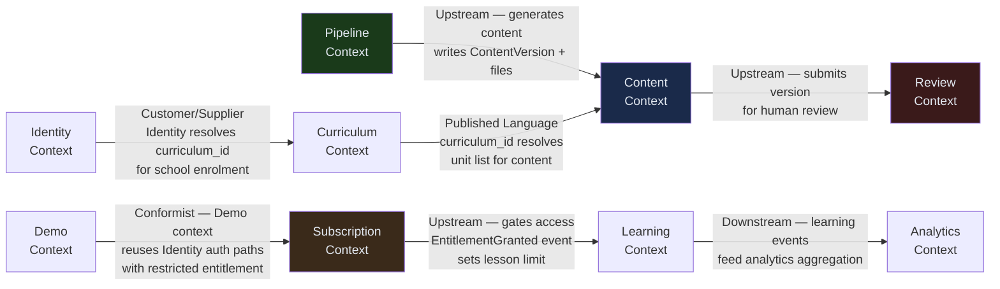

# Diagram 8 — Logical / Domain Model (DDD)

> Bounded contexts, aggregates, domain events, and context map.
> Audience: Architects, Developers.
> Last updated: 2026-04-05.

---

## Bounded Contexts Overview

```
┌─────────────────────────────────────────────────────────────────────────────┐
│                       StudyBuddy OnDemand — Domain                         │
│                                                                             │
│  ┌──────────────┐    ┌──────────────┐    ┌──────────────────────────────┐  │
│  │   IDENTITY   │    │  CURRICULUM  │    │         CONTENT              │  │
│  │  Context     │    │  Context     │    │         Context              │  │
│  │              │    │              │    │                              │  │
│  │  Student     │    │  Grade       │    │  Lesson / Tutorial / Quiz    │  │
│  │  Teacher     │    │  Subject     │    │  Experiment / Audio          │  │
│  │  School      │    │  Unit        │    │  ContentVersion              │  │
│  │  Admin       │    │  Curriculum  │    │  ContentBlock                │  │
│  └──────┬───────┘    └──────┬───────┘    └──────────────┬───────────────┘  │
│         │                   │                            │                  │
│         │  ◄── Conforms ────┤         Upstream ─────────►                  │
│         │                   │                            │                  │
│  ┌──────▼───────┐    ┌──────▼───────┐    ┌─────────────▼───────────────┐  │
│  │ SUBSCRIPTION │    │   LEARNING   │    │         REVIEW               │  │
│  │  Context     │    │  Context     │    │         Context              │  │
│  │              │    │              │    │                              │  │
│  │  Plan        │    │  Session     │    │  ReviewDecision              │  │
│  │  Subscription│    │  Answer      │    │  Annotation                 │  │
│  │  Entitlement │    │  Progress    │    │  VersionDiff                 │  │
│  └──────┬───────┘    └──────┬───────┘    └─────────────────────────────┘  │
│         │                   │                            ▲                  │
│  Gates ─►──────────────────►│     Upstream (generates) ─┤                  │
│                             │                            │                  │
│  ┌──────────────┐    ┌──────▼───────┐    ┌─────────────┴───────────────┐  │
│  │  ANALYTICS   │    │   DEMO       │    │         PIPELINE             │  │
│  │  Context     │◄───│  Context     │    │         Context              │  │
│  │              │    │              │    │                              │  │
│  │  LessonView  │    │  DemoStudent │    │  PipelineJob                 │  │
│  │  Engagement  │    │  DemoTeacher │    │  BuildUnit                   │  │
│  │  ClassMetric │    │  DemoToken   │    │  AlexReport                  │  │
│  └──────────────┘    └──────────────┘    └──────────────────────────────┘  │
└─────────────────────────────────────────────────────────────────────────────┘
```

---

## Context Map



---

## Aggregates & Key Invariants

### Identity Context

```
Student (Aggregate Root)
  ├── id: UUID
  ├── email: str (unique)
  ├── grade: int (5–12)
  ├── locale: str (en | fr | es)
  ├── account_status: active | pending_consent | suspended | deleted
  ├── school_id?: UUID  — null for individual subscribers
  └── Invariants:
        • Under-13 students cannot be active without parental_consent record
        • locale is authoritative from JWT — never from request params
        • suspension sets Redis suspended:{id} immediately

Teacher (Aggregate Root)
  ├── id: UUID
  ├── school_id: UUID
  ├── role: teacher | school_admin
  └── Invariants:
        • teacher JWT uses separate secret from student JWT
        • school_admin role required for curriculum activation + subscription management

School (Aggregate Root)
  ├── id: UUID
  ├── status: active | suspended | inactive
  └── Invariants:
        • Suspending school cascades to all teachers + students via Celery task
        • School JWT scope enforced: teachers cannot cross school boundaries
```

### Curriculum Context

```
Curriculum (Aggregate Root)
  ├── id: UUID  (default-{year}-g{grade} for platform defaults)
  ├── grade: int
  ├── year: int
  ├── status: active | archived | pending
  ├── subjects: [Subject]
  └── Invariants:
        • Only one curriculum may be active per (school_id or null, grade, year)
        • Activating a new curriculum archives the previous active one
        • curriculum_units.unit_name is NOT NULL — pipeline must include it

Unit (Entity within Curriculum)
  ├── unit_id: str  (e.g. G8-MATH-001)
  ├── title: str
  ├── has_lab: bool
  ├── sequence: int
  └── unit_name: str  ← same as title; NOT NULL constraint
```

### Content Context

```
ContentSubjectVersion (Aggregate Root)
  ├── version_id: UUID
  ├── curriculum_id: UUID
  ├── subject: str
  ├── version_number: int (auto-incremented per subject)
  ├── status: pending | approved | published | rejected | archived
  ├── payload_bytes: int  (total content store size)
  └── Invariants:
        • Only one version may be published per (curriculum_id, subject)
        • Publishing archives the previous published version
        • has_content derived at read time by checking Content Store filesystem

ContentUnit (Value Object — lives in Content Store, not DB)
  ├── unit_id: str
  ├── content_type: lesson | quiz_set_N | tutorial | experiment | audio
  ├── lang: en | fr | es
  └── Invariants:
        • max_tokens = 8192 enforced at generation; grade 12 content exceeds 4096
        • Validated against JSON schema before writing to Content Store
        • meta.json per unit: {generated_at, model, content_version, langs_built}
```

### Learning Context

```
LearningSession (Aggregate Root)
  ├── session_id: UUID
  ├── student_id: UUID
  ├── unit_id: str
  ├── curriculum_id: UUID
  ├── attempt_number: int  ← computed server-side, never trusted from client
  ├── answers: [Answer]
  ├── score?: int
  ├── completed: bool
  └── Invariants:
        • attempt_number = COUNT(prior sessions for student+unit+curriculum) + 1
        • Session must be opened before answers can be recorded
        • progress writes are fire-and-forget (Celery); return 200 before DB write
```

### Subscription Context

```
Subscription (Aggregate Root)
  ├── student_id or school_id: UUID
  ├── plan: free | individual_monthly | individual_annual | school
  ├── stripe_subscription_id: str
  ├── valid_until: datetime
  ├── lessons_accessed: int
  └── Invariants:
        • Card data never stored — Stripe is source of truth
        • Entitlement cache (Redis ent:{id}) invalidated on any status change
        • Webhook must verify Stripe signature before processing any event
        • Stripe events deduplicated by stripe_event_id in stripe_events table
```

---

## Domain Events

| Event | Source Context | Consumed By | Delivery |
|---|---|---|---|
| `StudentRegistered` | Identity | Subscription (create free plan) | Celery task |
| `StudentSuspended` | Identity | Identity (Auth0 block sync) | Celery task |
| `SchoolSuspended` | Identity | Identity (cascade teachers + students) | Celery task |
| `CurriculumActivated` | Curriculum | Content (resolve new content path), audit_log | Sync + audit write |
| `ContentVersionPublished` | Content | CDN invalidation (CloudFront) + Redis cache clear | Celery task |
| `ContentVersionRejected` | Review | Pipeline (optional re-trigger) | Celery task |
| `PaymentSucceeded` | Subscription | Subscription (update entitlement), audit_log | Stripe webhook → Celery |
| `PaymentFailed` | Subscription | Subscription (grace period start), email via SES | Stripe webhook → Celery |
| `EntitlementGranted` | Subscription | Learning (allows content access) | Redis write (ent:{id}) |
| `EntitlementRevoked` | Subscription | Learning (blocks content access) | Redis write + CDN invalidation |
| `SessionCompleted` | Learning | Analytics (update class metrics) | Celery fire-and-forget |
| `BuildStarted` | Pipeline | pipeline_jobs table | Sync write |
| `UnitGenerated` | Pipeline | Content (write to Content Store) | Sync write |
| `UnitFailed` | Pipeline | pipeline_jobs table + Slack alert | Sync write |
| `BuildComplete` | Pipeline | Content (mark version ready for review) | Celery task |
| `AlertThresholdExceeded` | Analytics | Teacher (email digest + in-app alert) | Celery Beat |

---

## Anti-Corruption Layer Patterns

| Boundary | Pattern | Notes |
|---|---|---|
| Auth0 → Identity | ACL: `POST /auth/exchange` translates Auth0 id_token → internal JWT | Internal JWT is the only identity token used downstream |
| Stripe → Subscription | ACL: `/subscription/webhook` handler maps Stripe event types to domain events | `stripe_event_id` deduplication prevents double-processing |
| Pipeline → Content | ACL: `meta.json` contract between pipeline and content serving | Pipeline writes; content service reads; no shared code |
| Mobile/Web → API | ACL: Pydantic schemas at every endpoint | Client models can evolve independently of domain models |
