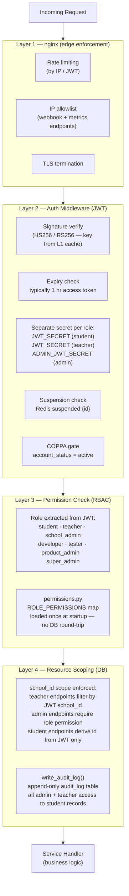

# Diagram 5 — Network & Security

> Security zones, TLS termination, network policies, RBAC layers, and SOC-2 control mapping.
> Audience: Security, Compliance.
> Last updated: 2026-04-05.

---

## Security Zone Diagram

```
╔══════════════════════════════════════════════════════════════════════════════╗
║  PUBLIC INTERNET                                                            ║
║                                                                             ║
║  Mobile App  ──────────►  CloudFront (HTTPS / TLS 1.2+)                    ║
║  Web Browser ──────────►  CloudFront (HTTPS / TLS 1.2+)                    ║
║  Stripe      ──────────►  ALB → nginx (webhook — Stripe IPs only)           ║
╚════════════════════════════════╤═══════════════════════════════════════════╝
                                 │  HTTPS only · HTTP redirected to HTTPS
                                 ▼
╔══════════════════════════════════════════════════════════════════════════════╗
║  EDGE ZONE  (public subnet — no direct DB access)                          ║
║                                                                             ║
║  ┌─────────────────────────────────────────────────────────────────────┐   ║
║  │  CloudFront Distribution                                            │   ║
║  │  • TLS 1.2+ enforced (TLS 1.0/1.1 disabled)                        │   ║
║  │  • HSTS header injected at edge                                     │   ║
║  │  • Origin shield enabled — reduces S3 GET costs                    │   ║
║  │  • Signed URLs for MP3 (TTL = 1 hr)                                │   ║
║  │  • WAF rule set: OWASP core rules + rate limit 1000 req/min per IP  │   ║
║  └──────────────────────────────────────┬──────────────────────────────┘   ║
║                                         │                                  ║
║  ┌──────────────────────────────────────▼──────────────────────────────┐   ║
║  │  Application Load Balancer                                          │   ║
║  │  • Terminates TLS (ACM cert) — backend sees plain HTTP              │   ║
║  │  • Access logs → S3 (90-day retention, SOC-2 evidence)             │   ║
║  │  • Health check: GET /readyz (not /healthz — tests DB + Redis)     │   ║
║  │  • Sticky sessions: disabled (stateless API)                        │   ║
║  └──────────────────────────────────────┬──────────────────────────────┘   ║
╚════════════════════════════════════════╤═══════════════════════════════════╝
                                         │  Internal HTTP only (port 80)
                                         ▼
╔══════════════════════════════════════════════════════════════════════════════╗
║  APPLICATION ZONE  (private subnet — no direct internet access)            ║
║                                                                             ║
║  ┌─────────────────────────────────────────────────────────────────────┐   ║
║  │  nginx (reverse proxy — runs as sidecar in each API task)           │   ║
║  │  • Rate limiting (limit_req_zone by $binary_remote_addr):           │   ║
║  │      /auth/*            10 req/min per IP                           │   ║
║  │      /content/*        100 req/min per student JWT                  │   ║
║  │      /subscription/webhook  — IP allowlist (Stripe CIDRs only)     │   ║
║  │      /metrics           — localhost only (Prometheus scrape only)   │   ║
║  │  • X-Request-ID header injected (correlation ID propagation)        │   ║
║  │  • X-Forwarded-For stripped/rewritten from ALB                     │   ║
║  │  • No direct exposure of uvicorn port 8000 outside this container  │   ║
║  └──────────────────────────────────────┬──────────────────────────────┘   ║
║                                         │                                  ║
║  ┌──────────────────────────────────────▼──────────────────────────────┐   ║
║  │  FastAPI Workers (uvicorn)                                          │   ║
║  │  • Auth middleware runs first:                                      │   ║
║  │      1. JWT signature verify (in-process, L1 JWKS cache)           │   ║
║  │      2. Token expiry check                                          │   ║
║  │      3. Role check: student / teacher / admin JWT secret            │   ║
║  │      4. Redis suspended:{id} check (suspension enforcement)         │   ║
║  │      5. COPPA gating: account_status must be 'active'              │   ║
║  │  • Pydantic validates all request bodies at boundary (Rule 11)      │   ║
║  │  • CORS: explicit allowlist via ALLOWED_ORIGINS env var             │   ║
║  │  • No secrets in response bodies or logs                            │   ║
║  └─────────────────────────────────────────────────────────────────────┘   ║
║                                                                             ║
║  ┌─────────────────────────────────────────────────────────────────────┐   ║
║  │  Celery Workers                                                     │   ║
║  │  • No inbound network traffic — outbound only                       │   ║
║  │  • Connects to Redis (broker) and PostgreSQL (data)                 │   ║
║  │  • Pipeline worker calls Anthropic API + TTS API outbound           │   ║
║  │  • IO worker calls Auth0 Management API + SES + Stripe API outbound │   ║
║  └─────────────────────────────────────────────────────────────────────┘   ║
╚════════════════════════════════════════╤═══════════════════════════════════╝
                                         │  VPC private subnets only
                                         ▼
╔══════════════════════════════════════════════════════════════════════════════╗
║  DATA ZONE  (isolated private subnet — no internet egress)                 ║
║                                                                             ║
║  ┌──────────────────────┐   ┌──────────────────────────────────────────┐   ║
║  │  PostgreSQL (RDS)    │   │  Redis (ElastiCache)                     │   ║
║  │  • Not publicly      │   │  • requirepass enabled                   │   ║
║  │    accessible        │   │  • TLS in-transit enabled                │   ║
║  │  • Multi-AZ failover │   │  • maxmemory-policy allkeys-lru          │   ║
║  │  • Encrypted at rest │   │  • AOF persistence: appendonly yes       │   ║
║  │    (AES-256)         │   │    + appendfsync everysec                │   ║
║  │  • Automated backups │   │  • No raw PII stored — student_id only   │   ║
║  │    7-day retention   │   │  • NOT accessible from public internet   │   ║
║  │  • Audit logging on  │   └──────────────────────────────────────────┘   ║
║  └──────────────────────┘                                                  ║
╚══════════════════════════════════════════════════════════════════════════════╝
```

---

## RBAC Layers



---

## TLS Configuration

| Component | TLS Version | Cipher Policy | Certificate |
|---|---|---|---|
| CloudFront | TLS 1.2+ | TLSv1.2_2021 (AWS managed) | ACM wildcard `*.studybuddy.app` |
| ALB | TLS 1.2+ | ELBSecurityPolicy-TLS13-1-2-2021-06 | ACM wildcard |
| RDS PostgreSQL | TLS 1.2+ | `ssl=require` in connection string | RDS managed |
| ElastiCache Redis | TLS 1.2+ | `ssl=True` in aioredis URL | ElastiCache managed |
| Mobile → API | TLS 1.2+ | System trust store | Certificate pinning: deferred to Phase 12 |

---

## Network Policies (VPC)

| Source | Destination | Ports | Direction | Notes |
|---|---|---|---|---|
| Internet | CloudFront | 443 | Inbound | Only CloudFront; S3 not public |
| Internet | ALB | 443, 80 | Inbound | HTTP redirects to HTTPS |
| ALB | API tasks | 80 | Inbound | Internal only, no TLS hop after ALB |
| API tasks | Redis | 6379 | Outbound | VPC private subnet only |
| API tasks | PostgreSQL | 5432 | Outbound | Via PgBouncer sidecar |
| API tasks | S3 | 443 | Outbound | Via VPC Gateway Endpoint (no internet) |
| Celery tasks | Redis | 6379 | Outbound | Same private subnet |
| Celery tasks | PostgreSQL | 5432 | Outbound | Direct (no PgBouncer for workers) |
| Celery tasks | Anthropic API | 443 | Outbound | NAT Gateway → Internet |
| Celery tasks | TTS API | 443 | Outbound | NAT Gateway → Internet |
| Celery tasks | SES / SendGrid | 443 | Outbound | NAT Gateway → Internet |
| Prometheus | API tasks | 9090 | Inbound | Internal Prometheus scrape only |
| All tasks | Secrets Manager | 443 | Outbound | VPC Interface Endpoint (no internet) |

---

## SOC-2 Control Mapping

| SOC-2 Trust Criteria | Control | Where Implemented |
|---|---|---|
| CC6.1 — Logical access | JWT auth with role separation; Admin/student/teacher JWT secrets | `auth` middleware, `permissions.py` |
| CC6.2 — Removal of access | Redis `suspended:{id}` checked on every request; Auth0 block synced via Celery | Auth middleware, `src/auth/tasks.py` |
| CC6.3 — Least privilege | `ROLE_PERMISSIONS` map; `school_id` scoping on all teacher endpoints | `permissions.py`, all teacher routers |
| CC6.7 — Secrets not exposed | Secrets from AWS Secrets Manager; never logged; fail-fast if missing | `config.py`, structured logging |
| CC7.2 — Security anomaly monitoring | `sb_auth_failures_total` Prometheus counter; CloudWatch alarms; Sentry | `observability.py`, `events.py` |
| CC8.1 — Change management | GitHub PR + CI gate before any deploy; manual approval for prod | `.github/workflows/` |
| A1.2 — Availability monitoring | `/healthz` + `/readyz`; ALB health check; CloudWatch alarms | `observability.py` |
| PI1.2 — Data integrity | Pydantic validation at boundary; SQL parameterized queries only | FastAPI handlers, sqlc/pgx patterns |
| P1 — Privacy notice | COPPA consent + GDPR consent at registration; data-minimisation policy | `src/auth/router.py` |
| P4 — Data retention | GDPR 30-day deletion schedule; progress anonymisation on account delete | `src/auth/tasks.py`, `audit_log` |
