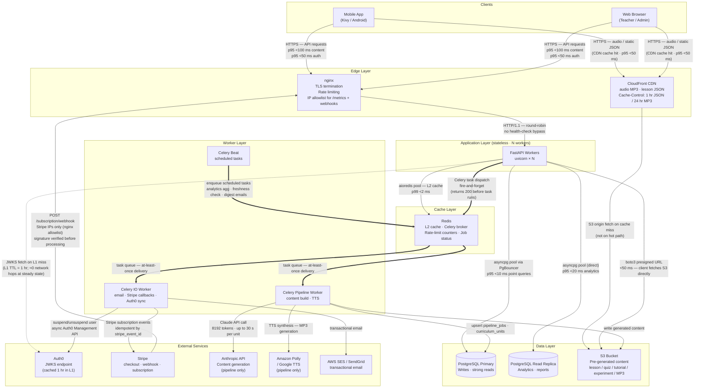

# Diagram 3 — Service Dependencies

> Sync (HTTP) and async (Celery) call graph with per-path SLA targets.
> Audience: Developers, SRE.
> Last updated: 2026-04-05.

---

## Call Graph

---

## SLA Reference

| Path | p50 | p95 | p99 | Notes |
|---|---|---|---|---|
| Client → CDN (audio / JSON cache hit) | <5 ms | <50 ms | <100 ms | CloudFront PoP |
| Client → API (content, cache-warm) | <20 ms | <100 ms | <200 ms | L1/L2 hit; zero DB |
| Client → API (content, cold) | <30 ms | <150 ms | <300 ms | One DB query + Redis SET |
| Client → API (auth token exchange) | <40 ms | <150 ms | <300 ms | Auth0 JWKS L1 hit |
| API → Redis | <0.5 ms | <2 ms | <5 ms | aioredis pool |
| API → PostgreSQL (point query) | <2 ms | <10 ms | <20 ms | PgBouncer + index hit |
| API → PostgreSQL (analytics) | <5 ms | <20 ms | <50 ms | Read replica |
| Celery task enqueue | <1 ms | <3 ms | <10 ms | Redis LPUSH |
| Pipeline: unit generation (Claude) | — | — | <30 s/unit | Best-effort; not user-facing |
| Stripe webhook round-trip | — | <500 ms | <2 s | Stripe retry on non-2xx |

---

## Key Rules

- **FastAPI never calls Anthropic or TTS APIs.** Only Celery pipeline workers make those calls.
- **Auth0 JWKS is never fetched per-request.** L1 TTLCache holds the key set for 1 hour; verified entirely in-process.
- **`POST /subscription/webhook` is not rate-limited** but is allowlisted to Stripe CIDR ranges only in nginx. Signature verification (`construct_event`) is the first line of the handler.
- **Progress and analytics writes are fire-and-forget.** `POST /progress/answer` and `POST /analytics/lesson/end` dispatch a Celery task and return `200 OK` without waiting for a DB write.
- **Audio bytes are never proxied through FastAPI.** The API returns a presigned S3 URL; the client fetches MP3 bytes directly from S3/CDN.
- **Celery delivers at-least-once.** All task handlers must be idempotent (progress events deduplicated by `event_id`, Stripe events by `stripe_event_id`).
